# CTFLearn - Forensics

### I'm a dump
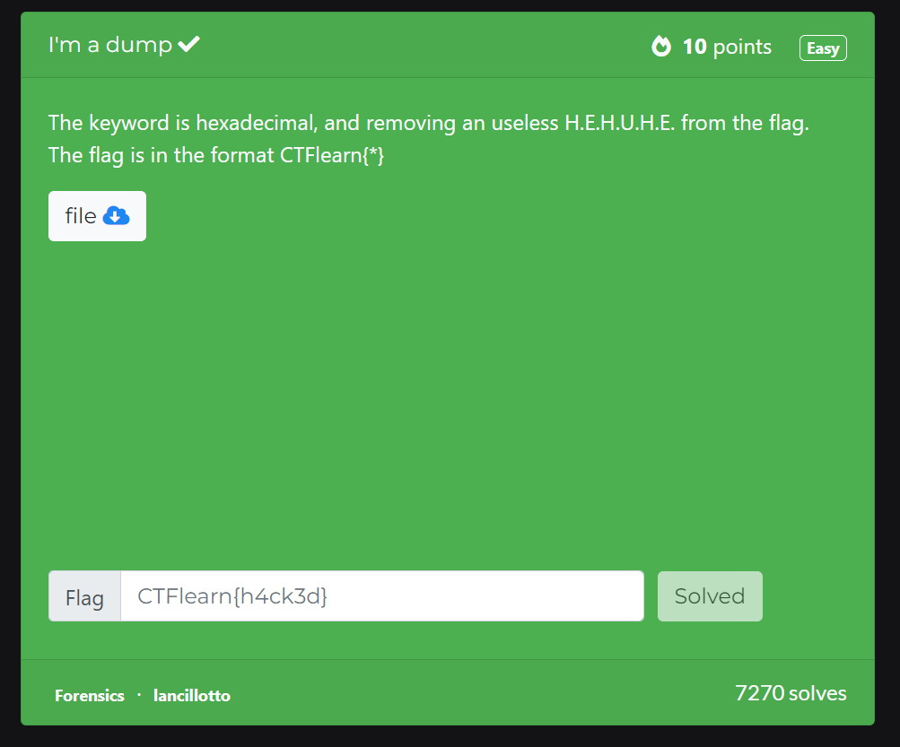

Chall này khi tải về sẽ thu được 1 file rất lạ, mình thử strings thì mình thấy được 3 dòng như thế này

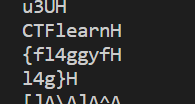

Như đề bài là mình thấy có xóa 3 chữ H, thế nên mình thu được flag

**Flag: CTFlearn{fl4ggyfl4g}**

### PikesPeak
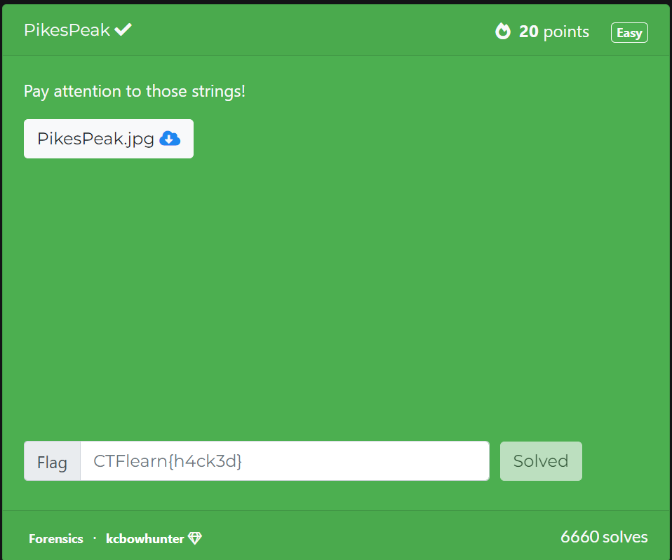

Chall này mình vẫn dùng lệnh strings, thế nhưng khi strings ra thì ra rất nhiều flag kiểu lạ
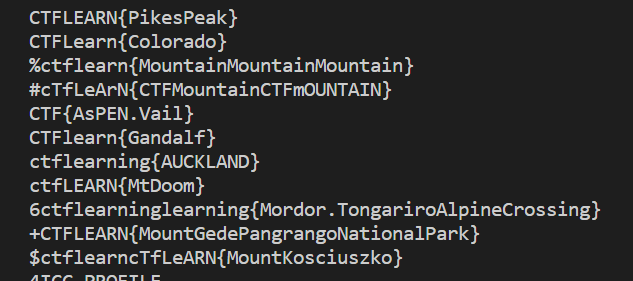
Thế nên mình kẹp với grep và form flag để tìm flag chuẩn
``strings PikesPeak.jpg | grep "CTFlearn{" ``

**Flag: CTFlearn{Gandalf}**

### Milk's Best Friend 


Chall này ta phải xoay bánh nếm kem chấm binwalk để extract các file nhỏ hơn
`` binwalk -D".*" oreo.jpg ``

Sau đó ta thu được 1 folder trong đó có 1 file jpeg và 1 file rar, ta ``unar 252B`` thì ta được 1 folder mới và thấy được 1 ảnh b.jpg như sau


Ta dùng strings để tìm flag

**Flag: flag{eat_more_oreos}**

### A CAPture of a Flag

Chall này đưa ta 1 file .pcap, nhưng mà bài này mình thấy không được hay lắm, mình có dùng gợi ý dưới comment

Mình dùng lệnh sau: ``strings flag.pcap | grep -i "GET /"``

Sau đó mình sẽ tìm thấy 1 dòng này
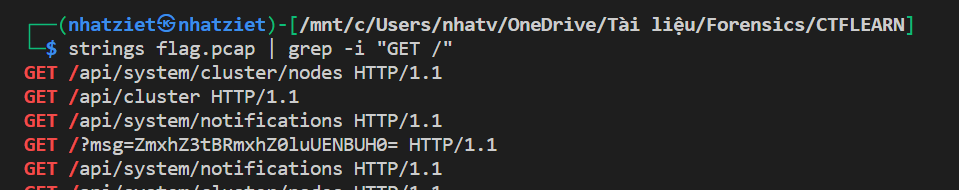
Ngoài ra mình còn tìm thấy ở trong wireshark
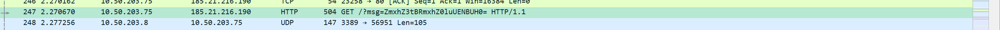
Ta thấy 1 đoạn base64: ``ZmxhZ3tBRmxhZ0luUENBUH0=``, decode ra thì được flag

**Flag: flag{AFlagInPCAP}**

### Chalkboard 
Chall này đưa ta 1 file ảnh, ta dùng strings để tìm các chuỗi trong ảnh, thì ta thu được cái này
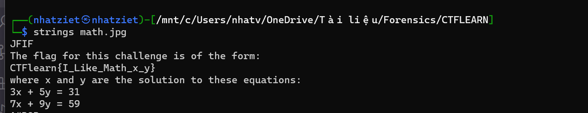

Ta giải hệ phương trình thì được x = 2 và y = 5

**Flag: CTFlearn{I_Like_Math_2_5}**
Really? Again
### Tux!

Chall này đưa ta 1 ảnh, ta dùng strings thì ta thấy 1 đoạn base64 là ``ICAgICAgUGFzc3dvcmQ6IExpbnV4MTIzNDUK``

Decode ra thì thu được ``      Password: Linux12345``

Ta tiếp tục sử dụng binwalk thì thấy có 2 file zip trong ảnh này, ta thử unzip file 1570, nhập mật khẩu thì thu được file flag

**Flag: CTFlearn{Linux_Is_Awesome}**

### Up For A Little Challenge? 
Chall đưa cho ta 1 ảnh, ta dùng strings thì thu được các dữ liệu có ích như sau:
```
https://mega.nz/#!z8hACJbb!vQB569ptyQjNEoxIwHrUhwWu5WCj1JWmU-OFjf90Prg 
Mp real_unlock_key: Nothing Is As It Seems
password: Really? Again
```
Vào link kia thì ta có 1 file zip, unzip thì thu được folder Did i Forget Again, ta ls -al thì thu được như sau

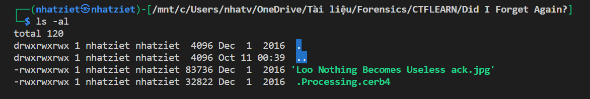

Thử check file .Process.cerb4 thì nó là 1 file zip

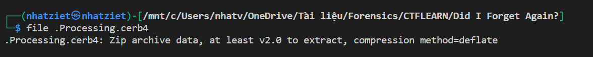

Unzip và nhập pass là ``Nothing Is As It Seems`` thì ta được 1 file ảnh skycoder.jpg

Phóng to ảnh lên thì ta thu được flag

**Flag: flag{hack_complete}**

### Pho is Tasty !!!

Chall này đưa ta 1 file ảnh, ta thử hết strings các thứ rùi mà ko được, ta phải dùng hexedit coi sao

Ta thấy 1 điều lạ:

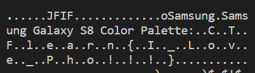

Giờ ta copy đoạn đó lại và code python
```
data = "FF D8 FF E0  00 10 4A 46  49 46 00 01  01 00 00 01  00 01 00 00  FF E3 00 6F  53 61 6D 73  75 6E 67 00  53 61 6D 73  75 6E 67 20  47 61 6C 61  78 79 20 53  38 20 43 6F  6C 6F 72 20  50 61 6C 65  74 74 65 3A  1D 09 43 04  15 54 02 06 46 14 0D 6C  16 0E 65 06  19 61 17 1F  72 1B 18 6E  01 0C 7B 04  07 49 0F 03  5F 02 0E 4C  16 18 6F 1F  04 76 19 0C 65 1F 06 5F  18 01 50 11  10 68 13 14  6F 1A 02 21  04 02 21 13  14 21 0B 14  7D FF DB 00  84 00 08 08  08 08 08 08 "
data = data.replace(' ','')
data = bytes.fromhex(data)
from string import printable
flag = b''
for j in data:
    for i in printable[:-6]:
        if (i.encode() == chr(j).encode()):
            flag = flag + i.encode()
print(flag)
```
**Flag: CTFlearn{I_Love_Pho!!!}**


### Simple Steganography

Chall này đưa ta 1 ảnh và hint là dùng steghide, nhưng trước hết ta cần phải tìm được password thì mới steghide được

Strings file thì ta thấy có 1 đoạn là ``myadmin``, ta lấy nó làm mật khẩu khi dùng lệnh này

`` steghide extract -sf Minions1.jpeg``

Ta thu được 1 file raw, mở ra thì đó là base64, decode thì ta được flag: 
``CTFlearn{this_is_fun}``

**Flag: CTFlearn{this_is_fun}**


### PDF by fdpumyp 
Chall này đưa ta 1 file pdf, ta thử strings thì thấy 1 đoạn base64

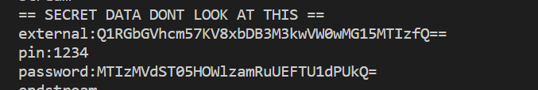

Thử decode đoạn external thì thu được flag =)))
**Flag: CTFlearn{)_1l0w3y0Um00my123}**


### Minions 

Chall này đưa ta 1 file ảnh, ta thử strings thì được như sau

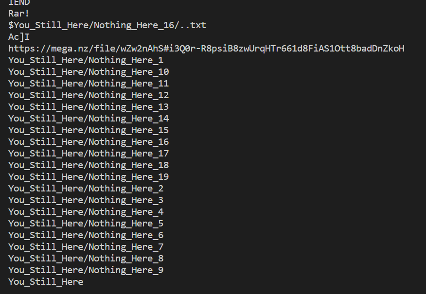

Ta nghĩ ngay dùng binwalk và vào folder 16, ``binwalk -D".*" Hey_You.png``

Vào folder vừa extract, unar file D3EDB, thì ta thu được các file  ``You_Still_Here``, vào file thứ 16 thì thu được link mega, tải về thì lại được 1 ảnh nữa

Tiếp tục strings ảnh Only_Few_Steps.jpg, ta thu được ảnh 

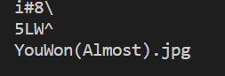

Ta lại dùng binwalk và unar file 22806, thu được file ảnh YouWon(Almost).jpg

Ta dùng ``strings YouWon\(Almost\).jpg | grep "CTF"`` để tìm thì thu được 1 đoạn base64, ta decode nhiều lần thì thu được flag

**Flag: CTF{M1NI0NS_ARE_C00L}**

### GandalfTheWise 

Chall này khi ta dùng strings thì ta thu được 3 đoạn base64, thử decode dòng đầu, ta tưởng là flag nhưng thực ra chỉ là gợi ý thôi, ta phải xor 2 cái base64 thứ 2 và 3 thì sẽ thu được flag
```
from pwn import*
from base64 import*
data = "xD6kfO2UrE5SnLQ6WgESK4kvD/Y/rDJPXNU45k/p"
data2 = "h2riEIj13iAp29VUPmB+TadtZppdw3AuO7JRiDyU"
data = b64decode(data)
data2 = b64decode(data2)   
print(xor(data,data2))    
```

**Flag: CTFlearn{Gandalf.BilboBaggins}**