# Insider Blue Team Challenge

Chall đưa cho ta 1 file ``FirstHack.ad1``
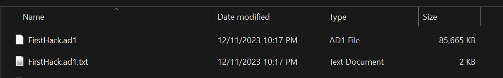

Giờ ta sẽ mở nó bằng ``AccessData FTK Imager`` và được giao diện như này.

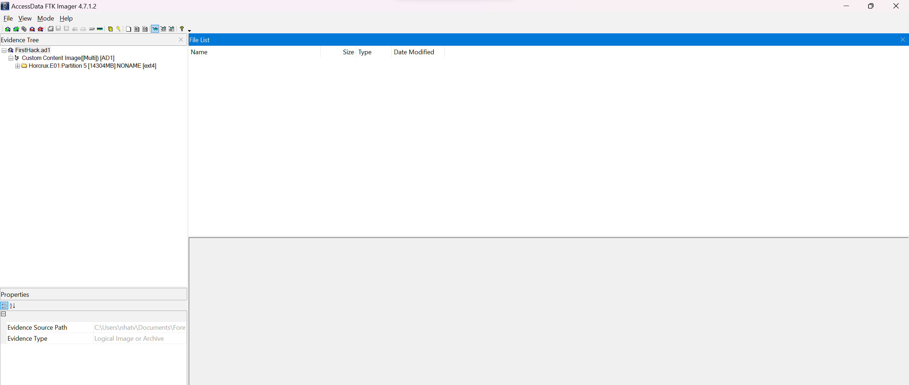

Bắt đầu từng câu nào

###### 1. What distribution of Linux is being used on this machine?

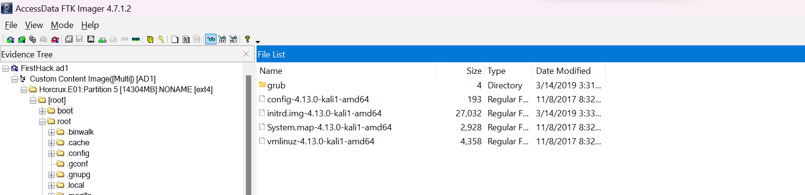

Nhìn là biết máy đang sử dụng bản phân phối nào của Linux nào đúng không.

**> kali**

###### 2. What is the MD5 hash of the apache access.log?

Ta sẽ vào ``var/log/apache2`` thì ta thấy được ``access.log`` cần tìm
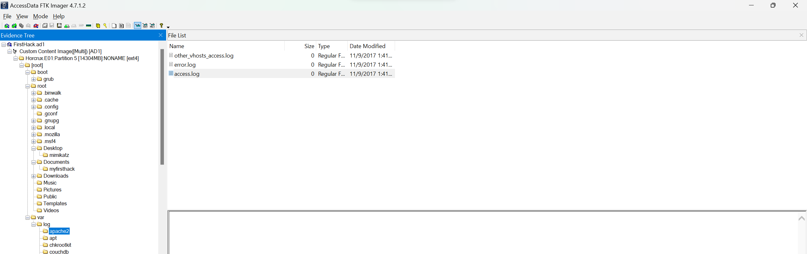

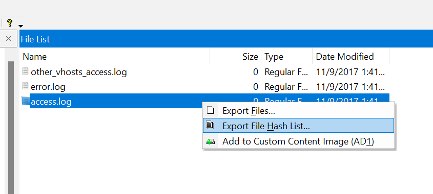

Ta sẽ Export Hash List ra thì sẽ thu được mã hash của file này.
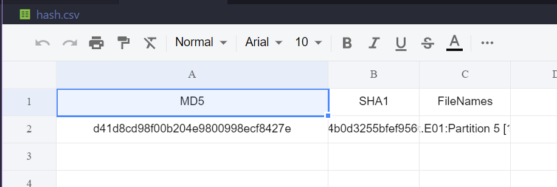

**> d41d8cd98f00b204e9800998ecf8427e**

###### 3. It is believed that a credential dumping tool was downloaded? What is the file name of the download?

Giờ ta sẽ vào mục ``Downloads`` thì ta sẽ thấy được file mà đã tải xuống.

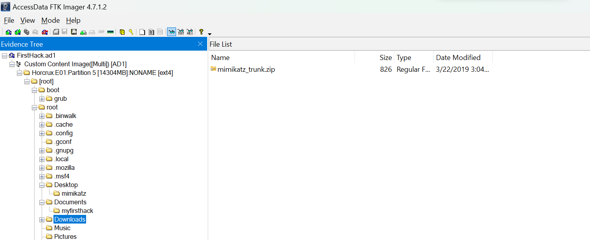

**> mimikatz_trunk.zip**

###### 4. There was a super-secret file created. What is the absolute path?

Ta thấy rằng có 1 tập tin bí mật đã được tạo, mà dùng kali chắc chắn là sẽ sử dụng các câu lệnh, thế nên là mình sẽ vào mục ``root/bash_history`` để coi lịch sử các câu lệnh.

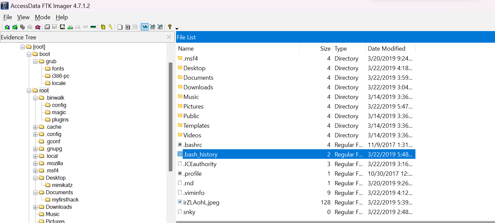

Giờ mình thu được danh sách các câu lệnh như sau:

```
msfconsole
systemctl status postgresql
systemctl enable postgresql
systemctl start postgresql
msfconsole
msfdb init
msfconsole
shutdown now
touch snky snky > /root/Desktop/SuperSecretFile.txt
cat snky snky > /root/Desktop/SuperSecretFile.txt 
msfconsole 
clear
history
clear
history
whoami
hack
do hack
do hack please
i am a hacker
how to hack
pwd
ls
ls -la
touch delete-me.txt
rm delete-me.txt 
ls
cd Documents/
mkdir myfirsthack
cd myfirsthack/
touch hellworld.sh
vim hellworld.sh 
chmod +x hellworld.sh 
./hellworld.sh 
touch firstscript
vim firstscript 
chmod +x firstscript 
./firstscript 
vim firstscript 
cp firstscript firstscript_fixed
ls
vim firstscript
vim firstscript_fixed 
./firstscript_fixed 
flag<this is a flag>
ifconfig
cd ..
cd..
cd ..
cd /var/log/
ls
cd ..
cd ~
ls
pwf
pwd
top
wall -h
wall yolo
ls
pwd
cd ..
ls
cd home/
ls
cd /root
ls
cd ../root
cd ../root/Documents/myfirsthack/../../Desktop/
sl
ls
cd ../Documents/myfirsthack/
netstat
echo bob.txt
touch bob.txt 
echo "If you're still reading this file, scream cake."
echo "Seriously, we'll give you a hint to answer question if you scream cake."
sudo visudo
ls
sudo ifng
ifconfi
apt get moo
sudo apt get moo
sudo apt install moo
sudo apt-install moo
sudo apt-get install moo
lol Castro just failed at all these commands. Someone pat him on the back. 
I tried okay
history > history.txt
binwalk didyouthinkwedmakeiteasy.jpg 
clear
history
exit
touch keys.txt
pwd

```

Ta nhìn kỹ thì có 1 câu lệnh như sau
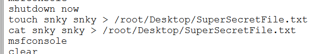

Thế nên ta thu được file bí mật đó là gì
**> /root/Desktop/SuperSecretFile.txt**

###### 5. What program used didyouthinkwedmakeiteasy.jpg during execution?

Dựa vào ``bash_history`` trên, ta cũng sẽ tìm được execution sử dụng file ``didyouthinkwedmakeiteasy.jpg``, đó là ``binwalk didyouthinkwedmakeiteasy.jpg ``

**> binwalk**

###### 6. What is the third goal from the checklist Karen created?

Ta vào ``Desktop``, thì ta sẽ thấy 1 file là ``Checklist``, và mục tiêu thứ 3 của Karen là ``Profit``.
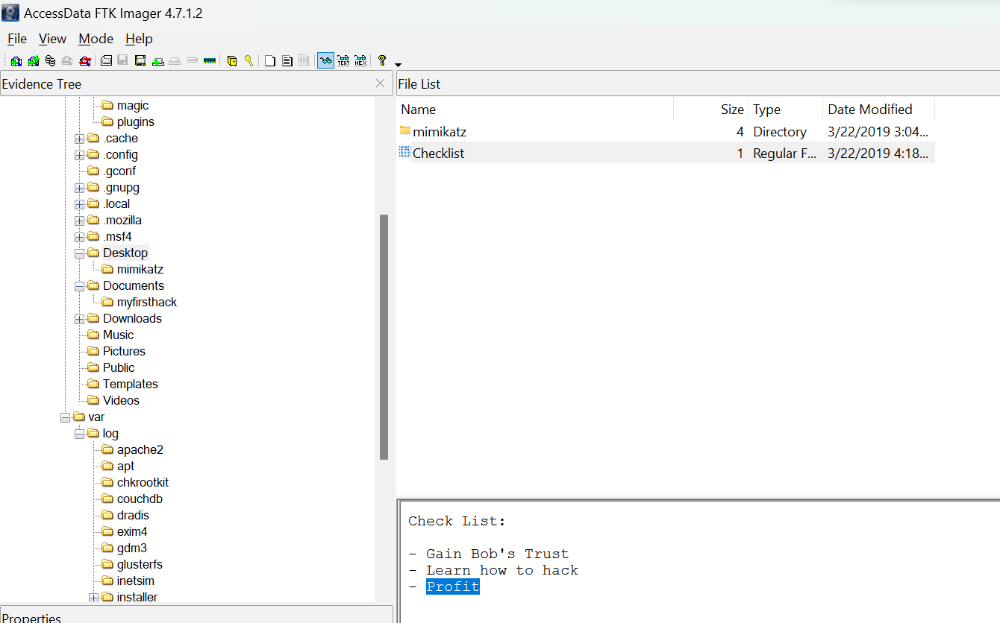

**> profit**

###### 7. How many times was apache run?

Mình lại vào path ``var/log/apache2``, thì ta thấy rằng 3 đều có size = 0


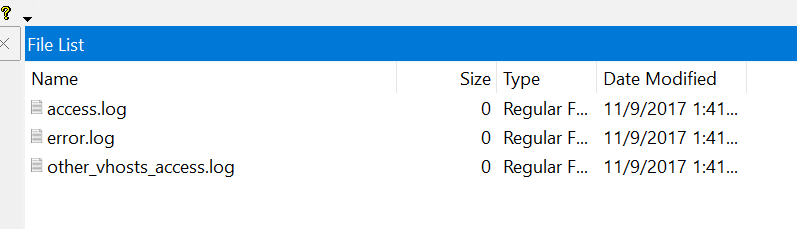


Thế nên là mình nghĩ là chưa chạy 1 lần nào hết.

**> 0**

###### 8. It is believed this machine was used to attack another. What file proves this?

Giờ ta vào phần root, thì thấy 1 ``irZLAohL.jpeg``, mở ra thì thấy 1 máy tính khác đang vào mục admin, thế nên mình tin đây là file chứng minh đã tấn công một máy khác thành công.

**> irZLAohL.jpeg**

###### 9. Within the Documents file path, it is believed that Karen was taunting a fellow computer expert through a bash script. Who was Karen taunting?

Ta vào Document, ta thấy có 5 file như sau:

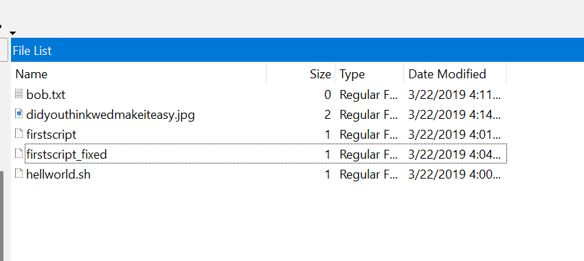
Ban đầu mình tưởng là ``Bob`` thế nhưng mà bị sai thế nên mình vào các file còn lại và thấy được trong file ``firstscript_fixed`` thì được như này
```
echo "Showing you your current path"
pwd
echo "Show my default route"
ip route | grep --color default
echo "Show network connections w/ port 80"
netstat | grep --color 80
echo "Heck yeah! I can write bash too Young"

```

Mình thấy rằng có 1 cái tên là ``Young`` thì đây chính là đáp án

**> Young**

###### 10. A user su'd to root at 11:26 multiple times. Who was it?

Trong ``var/log``, ta thấy 1 file là ``auth.log``, ta tìm lúc ``11:26`` thì ta thấy được đoạn lịch sử như sau

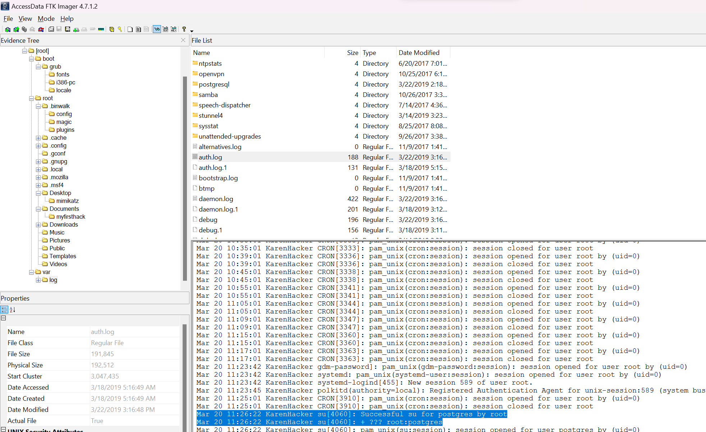

Nhìn vào thì ta thấy được rằng có 1 user là ``postgres`` đang sử dụng

**> postgres**
###### 11. Based on the bash history, what is the current working directory?

Mình vào lại ``bash_history`` thì thấy được người dùng đã cd tới path này 
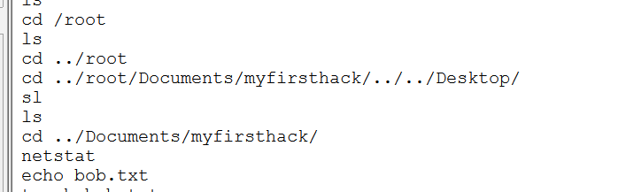

Đây cũng chính là đáp án.

**> /root/Documents/myfirsthack/**
