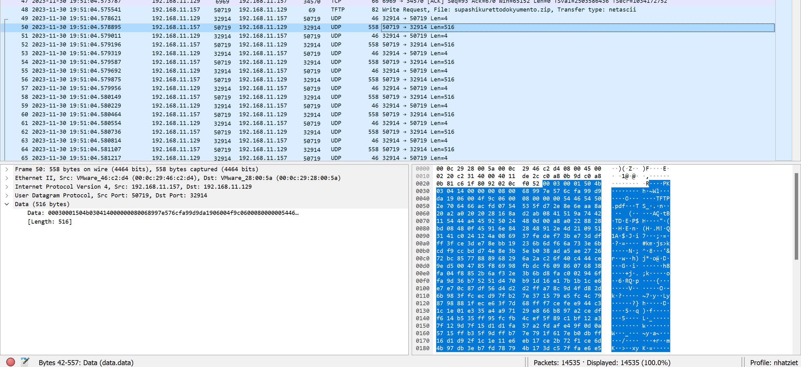

# Esfiltrazione

Mở wireshark thì ta thấy được là có 1 file zip đang được chuyển qua giao thức tftp


Và nhìn packet UDP 50 thì thấy có dữ liệu của 1 file zip



Mà hình như là 4 byte đầu tiên đều không phải là dữ liệu của file zip này thế nên là mình sẽ bỏ 4 byte đầu tiên nha.

Ngoài ra còn có các packet có len = 4, chắc chắn là không phải dữ liệu của data rồi, thế nên mình sẽ lọc filter theo command này ``udp && ip.src == 192.168.11.157``


Giờ mình sẽ dùng script nha.

```
from base64 import*
from scapy.all import *

def process_packet(packet):
    if packet.haslayer(UDP):
        udp_packet = packet.getlayer(UDP)
        if udp_packet.haslayer(Raw) and packet.haslayer(IP) and packet[IP].src == "192.168.11.157":
            return udp_packet.getlayer(Raw).load

packets = rdpcap('Esfiltrazione.pcap')

data = b""

for packet in packets:
    raw_data = process_packet(packet)
    if raw_data is not None:
        data += raw_data[4:]
with open("out.zip", "wb") as file:
    file.write(data)
```

Thế nhưng mình lại không mở được file zip này, chắc chắn có gì đó sai sai, hóa ra là [Giao thức TFTP](https://systemoverlord.com/2021/03/12/bsidessf-2021-ctf-net-matroyshka-author-writeup.html), với các byte 0x00 và 0x0A thì sẽ được trả về là ``\x0d\x00 và \x0d\x0a``

Thế nên mình sẽ sửa code thui

```
from base64 import*
from scapy.all import *

def process_packet(packet):
    if packet.haslayer(UDP):
        udp_packet = packet.getlayer(UDP)
        if udp_packet.haslayer(Raw) and packet.haslayer(IP) and packet[IP].src == "192.168.11.157":
            return udp_packet.getlayer(Raw).load

packets = rdpcap('Esfiltrazione.pcap')

data = b""

for packet in packets:
    raw_data = process_packet(packet)
    if raw_data is not None:
        data += raw_data[4:]
data = data.replace(b"\x0d\x0a", b"\x0a")
data = data.replace(b"\x0d\x00", b"\x0d")

with open("out.zip", "wb") as file:
    file.write(data)

```

Sau khi chạy thì mình mở được file.


Mở file ``dokyomento.pdf`` thì sẽ thu được flag


**Flag: KCSC{exfiltrate_important_data_using_tftp_351362a1}**
