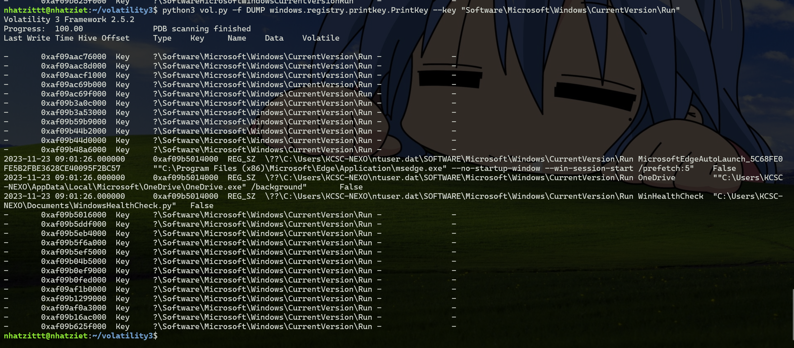

# Physical Hacker

Chall có 8 câu hỏi cần trả lời

Mình dùng cả vol2 và vol3 nha

Profile vol2 là ``Win10x64_19041``


###### Question 1: PID of the process that malware is currently running?

Mình thử pstree thì thấy đang chạy 1 tiến trình ``py.exe``


Mình thử dùng thêm cmdline thì thấy nó đang chạy hộ cái file python ``WindowsHealthCheck.py``


Không nghi ngờ gì nữa, pid của malware là 6636

**> 6636**

###### Question 2: What is the link that downloaded the malware?

Để tải malware về thì chắc chắn là có lịch sử rồi, mình thử dùng plugin history


Nhìn vào thì ta thấy 1 link github là ``https://raw.githubusercontent.com/NVex0/Asset/main/WindowsHealthCheck.py``

Vào thử link thì thấy được như này


Chắc chắn là link tải malware rồi

**> https://raw.githubusercontent.com/NVex0/Asset/main/WindowsHealthCheck.py**


###### Question 3: MD5 hash of the malware?

Giờ mình wget đường link đó rồi md5sum là được thôiii


**> 1b3ded899023095ea5a4b9fb24d0cd7a**

###### Question 4: File name of the malware?

Đơn giản thuii

**> WindowsHealthCheck.py**

###### Question 5: Popular threat label of the malware?

Mình vất lên [Virustotal](https://www.virustotal.com/) là mình sẽ thấy được label của nó nha


**> keylogger/python**

###### Question 6: What is the initial full path of the malware right after downloading?

Mình tìm các plugin thì mãi không thấy gì, thế nhưng mình thử dùng strings kết hợp với grep "WindowsHealthCheck.py" thì mình đã được như này


Nhìn thấy ngay có đường dẫn Downloads

**> C:\Users\KCSC-NEXO\Downloads\WindowsHealthCheck.py**

###### Question 7: Data of the key right above the position of the key that malware writes to in the registry?

Đọc code của malware thì ta thấy được như này
```
def addStartup():
    fp = os.path.dirname(os.path.realpath(__file__))
    file_name = sys.argv[0].split('\\')[-1]

    new_file_path = fp + '\\' + file_name
    keyVal = r'Software\Microsoft\Windows\CurrentVersion\Run'
    key2change = OpenKey(HKEY_CURRENT_USER, keyVal, 0, KEY_ALL_ACCESS)
    if not checkval(keyVal, 'WinHealthCheck'):
        SetValueEx(key2change, 'WinHealthCheck', 0, REG_SZ, new_file_path)

```
Đọc thì ta thấy có key là ``'Software\Microsoft\Windows\CurrentVersion\Run'``, ta sử dụng printkey kèm theo path này sẽ thấy được như này



Ta nhìn thấy có key của malware là ``"C:\Users\KCSC-NEXO\Documents\WindowsHealthCheck.py"``, key trên cái này là ``"C:\Users\KCSC-NEXO\AppData\Local\Microsoft\OneDrive\OneDrive.exe" /background``

**> "C:\Users\KCSC-NEXO\AppData\Local\Microsoft\OneDrive\OneDrive.exe" /background**

###### Question 8: What content has been recorded by the malware?

Mình thấy có chạy notepad, thế nên chắc chắn sẽ có file .txt, thế nên mình sẽ filescan .txt coi sao


Mình thấy có file ``LICENSE.txt``, mình dùng vol3 để dumpfiles vì vol2 mình làm sao sao rồi ý

Giờ mình có địa chỉ rồi, mình dumpfiles thôi

Mình thu được 2 file đó là ``file.0x9d01eb04cb00.0x9d01eb6031d0.DataSectionObject.LICENSE.txt.dat`` và ``file.0x9d01eb04cb00.0x9d01e6ab4d30.SharedCacheMap.LICENSE.txt.vacb``, mở file .dat ra thì được cái này

```
2023-11-23 16:03:09,050: Key.shift
2023-11-23 16:03:09,550: Key.shift
2023-11-23 16:03:09,581: Key.shift
2023-11-23 16:03:09,581: 'I'
2023-11-23 16:03:10,175: 'n'
2023-11-23 16:03:10,488: Key.space
2023-11-23 16:03:10,972: 'c'
2023-11-23 16:03:11,253: 'a'
2023-11-23 16:03:11,597: 'r'
2023-11-23 16:03:12,065: 'n'
2023-11-23 16:03:12,425: 'a'
2023-11-23 16:03:12,644: 'g'
2023-11-23 16:03:12,841: 'e'
2023-11-23 16:03:13,191: ','
2023-11-23 16:03:13,414: Key.space
2023-11-23 16:03:13,756: 'i'
2023-11-23 16:03:14,037: Key.space
2023-11-23 16:03:14,319: 'b'
2023-11-23 16:03:14,620: 'l'
2023-11-23 16:03:14,980: 'o'
2023-11-23 16:03:15,165: 'o'
2023-11-23 16:03:15,503: 'm'
2023-11-23 16:03:16,249: ','
2023-11-23 16:03:16,577: Key.space
2023-11-23 16:03:17,028: 'l'
2023-11-23 16:03:17,334: 'i'
2023-11-23 16:03:17,554: 'k'
2023-11-23 16:03:17,709: 'e'
2023-11-23 16:03:17,908: Key.space
2023-11-23 16:03:18,104: 'a'
2023-11-23 16:03:18,287: Key.space
2023-11-23 16:03:18,509: 'f'
2023-11-23 16:03:18,677: 'l'
2023-11-23 16:03:18,875: 'o'
2023-11-23 16:03:19,009: 'w'
2023-11-23 16:03:19,223: 'e'
2023-11-23 16:03:19,452: 'r'
2023-11-23 16:03:19,619: Key.space
2023-11-23 16:03:19,835: 'i'
2023-11-23 16:03:20,030: 'n'
2023-11-23 16:03:20,204: Key.space
2023-11-23 16:03:20,356: 't'
2023-11-23 16:03:20,496: 'h'
2023-11-23 16:03:20,645: 'e'
2023-11-23 16:03:20,788: Key.space
2023-11-23 16:03:20,957: 'd'
2023-11-23 16:03:21,111: 'a'
2023-11-23 16:03:21,356: 'w'
2023-11-23 16:03:21,569: 'n'
2023-11-23 16:03:21,895: '.'
```

Đọc và ghi lại thì ta được ``In carnage, i bloom, like a flower in the dawn.``

**> In carnage, i bloom, like a flower in the dawn.**