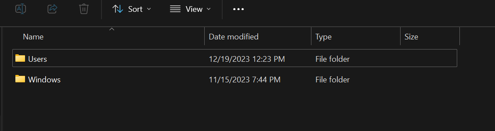
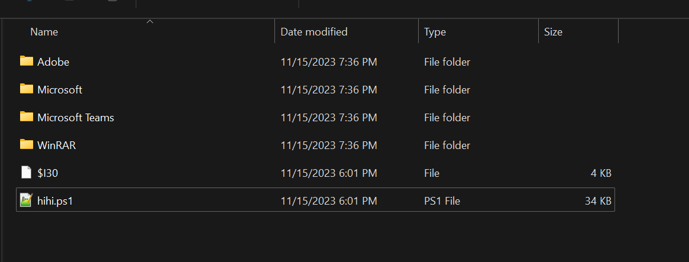
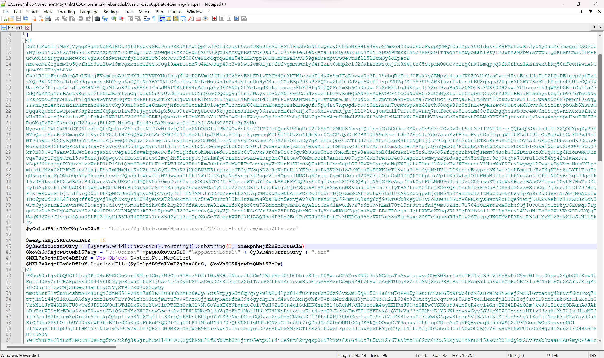
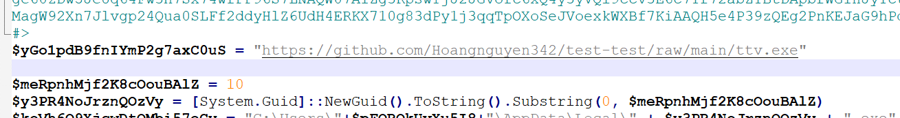
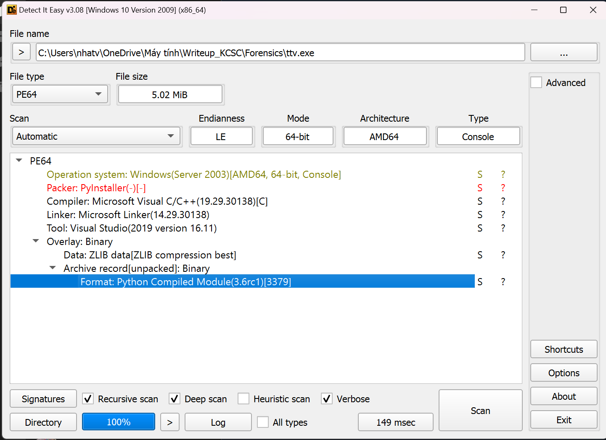
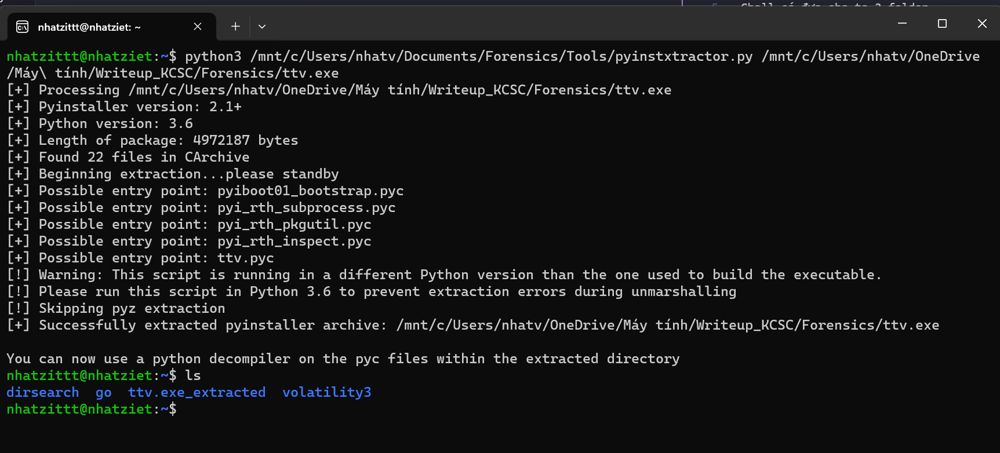
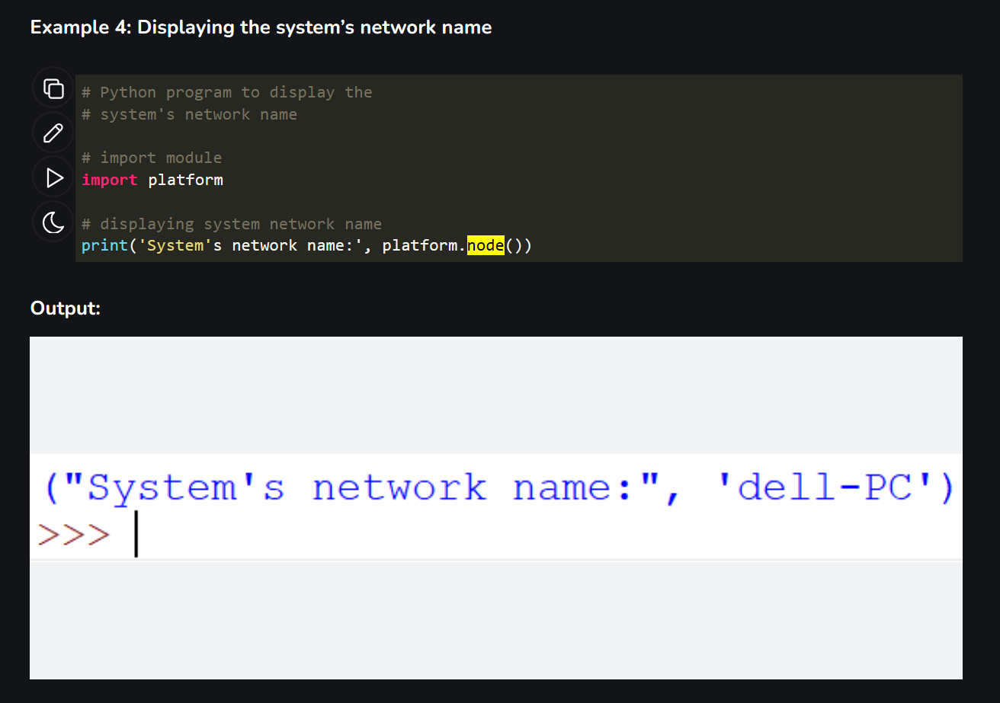
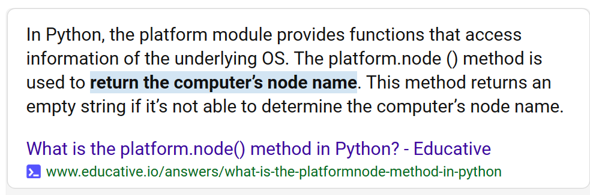
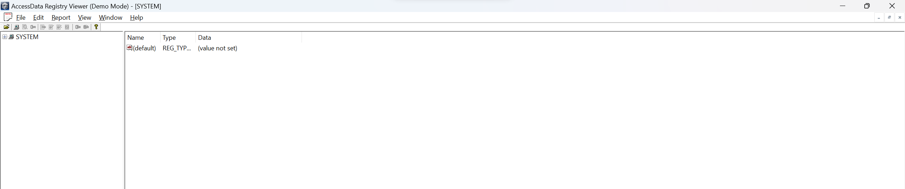
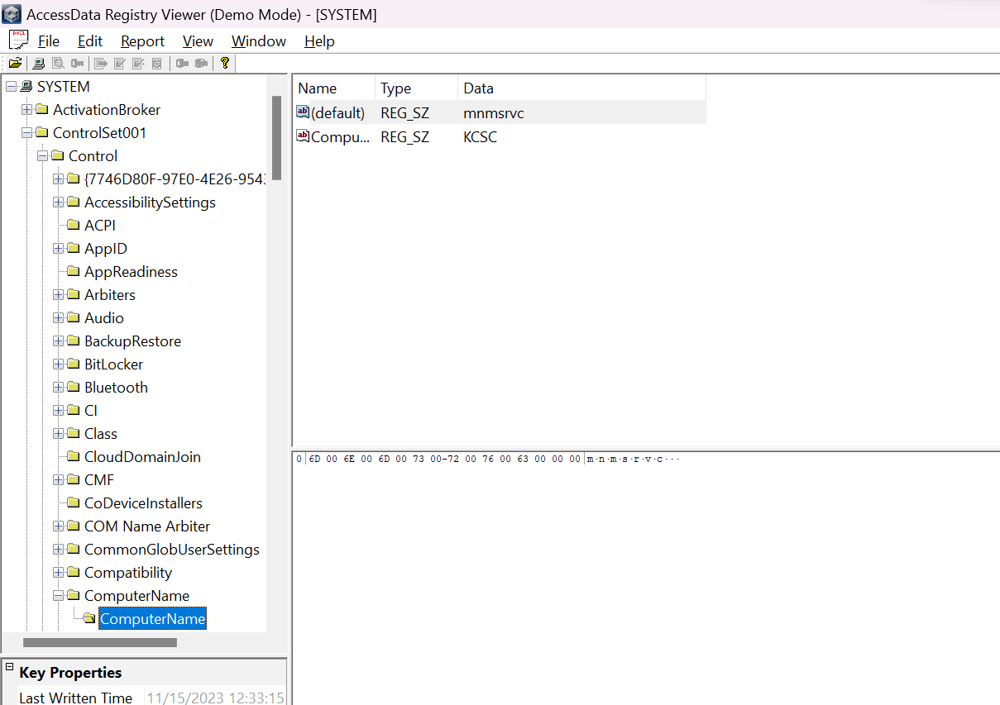

# pre_basic_disk: play a game

Mình có đọc wu của [chị này](https://hackmd.io/@phgvee/Syu9k7hI6#3-pre_basic_disk-play-a-game), chứ bài này mình lúc thi mình hong có biếc làm

Chall có đưa cho ta 2 folder




Mình thấy ở trong ``\Users\kcsc\AppData\Roaming`` có 1 file ``hihi.ps1``




Mở ra thì mình thấy được có 1 đoạn mã như thế này



Thì mình thấy được rằng có 1 đường link này ``https://github.com/Hoangnguyen342/test-test/raw/main/ttv.exe``



Tải về thì là 1 file .exe, mình dùng ``Detect It Easy`` để phân tích file .exe này thì thấy được file được complie bằng python



Thế nên mình sẽ dùng [pyinstxtractor](https://github.com/extremecoders-re/pyinstxtractor/blob/master/pyinstxtractor.py) để decomplie nó lại nha



Giờ mình sẽ convert pyc thành py để mình có thể đọc code nha

Mình sử dụng [tool](https://www.toolnb.com/tools-lang-en/pyc.html) này

Up file .pyc lên thì thu được đoạn code như sau

```
# uncompyle6 version 3.5.0
# Python bytecode 3.6 (3379)
# Decompiled from: Python 3.7.2 (default, Dec 29 2018, 06:19:36) 
# [GCC 7.3.0]
# Embedded file name: ttv.py
import os, sys, random, platform, base64
a = platform.node()
secret = random.randint(10, 20)
print('Random number is between 10 and 20')
print('You can guess 5 times!')
for guessesTaken in range(1, 5):
    print("Please, enter the number you're thinking")
    guess = int(input())
    if guess < secret:
        print('Lower than the number')
    elif guess > secret:
        print('Higher than the number')
    else:
        break

fl4c = base64.b64decode(base64.b64decode('UzBOVFEzcz0=')).decode('utf-8') + a + '_m41_d1nh!!!!' + '}'
if guess == secret:
    print('Good job!')
else:
    print('Chuc may man lan sau')
sys.stdin.read(1)
```

Mình thấy có 1 biến tên là fl4c, decode cái b64 thì thu được ``KCSC{`` và 1 phần flag cuối là ``_m41_d1nh!!!!}``. Thế nhưng còn có 1 biến a ở trong biến này nữa. 

Sau khi đọc code thì ``a = platform.node()``, sau khi mình tìm hiểu thì mình có được một đường link [thông tin 1](https://www.educative.io/answers/what-is-the-platformnode-method-in-python) [thông tin 2](https://www.geeksforgeeks.org/platform-module-in-python/) như sau





Thế nên là biến a đó sẽ là tên của computer, mình tra google thì thu được [bài viết](https://answers.microsoft.com/en-us/windows/forum/all/computer-host-name-via-a-file/bfe2c5b9-834b-44b5-8680-5e4d6ba31f3e) này. Ngoài ra bạn cũng có thể đọc [writeup](https://github.com/trananhnhatviet/Forensics_Train/blob/main/Rootme/Writeup.md) của mình tại bài ``Command & Control - level 2``.

Thì path của Computername sẽ là ``\System32\config\SYSTEM\ControlSet001/Control/ComputerName``

Giờ mình chỉ cần vào System32, tìm file SYSTEM, mở bằng phần mềm ``AccessData_Registry_Viewer``






Mở ra thì là ``KCSC`` =)))

**Flag: KCSC{KCSC_m41_d1nh!!!!}**