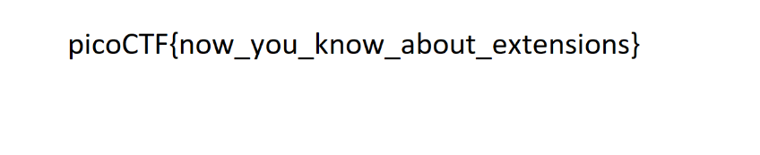

# PicoCTF - Forensics

### information


Chall này ta sử dụng ``exiftool`` để lấy được thông tin của file ảnh cat.jpg


Ta nhìn thấy ở dòng License 1 đoạn mã, đoán là Base64, ta sẽ decode nó và thu được flag
**Flag: picoCTF{the_m3tadata_1s_modified}**


### Matryoshka doll

Chall này ta sẽ sử dụng ``Binwalk`` để phân tích các file con trong file ảnh này
Ta dùng lệnh ``binwalk -D=".* dolls.jpg``
Sau đó ta sẽ thu được 1 folder là ``_doll.jpg.extracted``
Sau đó ta unzip file 0 để tiếp tục tìm được các file con
Sau khi unzip xong thì ta tiếp tục sử dụng lệnh binwalk như trên cho các ảnh tiếp theo rồi sẽ thu được flag
**Flag: picoCTF{96fac089316e094d41ea046900197662}**

### tunn3l v1s10n
Ta mở thử file đó bằng notepad thì thấy nó thuộc dạng .BMP, ta sẽ dùng ``https://www.photopea.com`` để mở file đó.
Mở ra thì ta thấy được hình như này


Ta nhìn thấy ảnh có vẻ chưa được trọn vẹn, ta sử dụng ``https://hexed.it/`` để sửa kích thước của ảnh

Ở dòng thứ 2, byte thứ 3 và thứ 4 là chiều rộng của ảnh, byte thứ 7 và byte thứ 8 là chiều cao của ảnh, ta sẽ chỉnh to lên như này


Sau đó ta lưu về và up lên lại Photopea, ta sẽ thu được flag


**Flag: picoCTF{qu1t3_a_v13w_2020}**

### Glory of the Garden
Chall này sẽ dùng lệnh ``strings`` kết hợp với ``grep`` trên kali để có thể tìm được flag qua hình này
Kết hợp với form flag ta được lệnh như sau: ``strings garden.jpg | grep "picoCTF{"``


**Flag: picoCTF{more_than_m33ts_the_3y33dd2eEF5}**

### Enhance!
Chall này khi ta tải về sẽ thu được 1 file drawing.flag.svg
Ta cat thử file này thì thu được như sau:
```
<?xml version="1.0" encoding="UTF-8" standalone="no"?>
<!-- Created with Inkscape (http://www.inkscape.org/) -->

<svg
   xmlns:dc="http://purl.org/dc/elements/1.1/"
   xmlns:cc="http://creativecommons.org/ns#"
   xmlns:rdf="http://www.w3.org/1999/02/22-rdf-syntax-ns#"
   xmlns:svg="http://www.w3.org/2000/svg"
   xmlns="http://www.w3.org/2000/svg"
   xmlns:sodipodi="http://sodipodi.sourceforge.net/DTD/sodipodi-0.dtd"
   xmlns:inkscape="http://www.inkscape.org/namespaces/inkscape"
   width="210mm"
   height="297mm"
   viewBox="0 0 210 297"
   version="1.1"
   id="svg8"
   inkscape:version="0.92.5 (2060ec1f9f, 2020-04-08)"
   sodipodi:docname="drawing.svg">
  <defs
     id="defs2" />
  <sodipodi:namedview
     id="base"
     pagecolor="#ffffff"
     bordercolor="#666666"
     borderopacity="1.0"
     inkscape:pageopacity="0.0"
     inkscape:pageshadow="2"
     inkscape:zoom="0.69833333"
     inkscape:cx="400"
     inkscape:cy="538.41159"
     inkscape:document-units="mm"
     inkscape:current-layer="layer1"
     showgrid="false"
     inkscape:window-width="1872"
     inkscape:window-height="1016"
     inkscape:window-x="48"
     inkscape:window-y="27"
     inkscape:window-maximized="1" />
  <metadata
     id="metadata5">
    <rdf:RDF>
      <cc:Work
         rdf:about="">
        <dc:format>image/svg+xml</dc:format>
        <dc:type
           rdf:resource="http://purl.org/dc/dcmitype/StillImage" />
        <dc:title></dc:title>
      </cc:Work>
    </rdf:RDF>
  </metadata>
  <g
     inkscape:label="Layer 1"
     inkscape:groupmode="layer"
     id="layer1">
    <ellipse
       id="path3713"
       cx="106.2122"
       cy="134.47203"
       rx="102.05357"
       ry="99.029755"
       style="stroke-width:0.26458332" />
    <circle
       style="fill:#ffffff;stroke-width:0.26458332"
       id="path3717"
       cx="107.59055"
       cy="132.30211"
       r="3.3341289" />
    <ellipse
       style="fill:#000000;stroke-width:0.26458332"
       id="path3719"
       cx="107.45217"
       cy="132.10078"
       rx="0.027842503"
       ry="0.031820003" />
    <text
       xml:space="preserve"
       style="font-style:normal;font-weight:normal;font-size:0.00352781px;line-height:1.25;font-family:sans-serif;letter-spacing:0px;word-spacing:0px;fill:#ffffff;fill-opacity:1;stroke:none;stroke-width:0.26458332;"
       x="107.43014"
       y="132.08501"
       id="text3723"><tspan
         sodipodi:role="line"
         x="107.43014"
         y="132.08501"
         style="font-size:0.00352781px;line-height:1.25;fill:#ffffff;stroke-width:0.26458332;"
         id="tspan3748">p </tspan><tspan
         sodipodi:role="line"
         x="107.43014"
         y="132.08942"
         style="font-size:0.00352781px;line-height:1.25;fill:#ffffff;stroke-width:0.26458332;"
         id="tspan3754">i </tspan><tspan
         sodipodi:role="line"
         x="107.43014"
         y="132.09383"
         style="font-size:0.00352781px;line-height:1.25;fill:#ffffff;stroke-width:0.26458332;"
         id="tspan3756">c </tspan><tspan
         sodipodi:role="line"
         x="107.43014"
         y="132.09824"
         style="font-size:0.00352781px;line-height:1.25;fill:#ffffff;stroke-width:0.26458332;"
         id="tspan3758">o </tspan><tspan
         sodipodi:role="line"
         x="107.43014"
         y="132.10265"
         style="font-size:0.00352781px;line-height:1.25;fill:#ffffff;stroke-width:0.26458332;"
         id="tspan3760">C </tspan><tspan
         sodipodi:role="line"
         x="107.43014"
         y="132.10706"
         style="font-size:0.00352781px;line-height:1.25;fill:#ffffff;stroke-width:0.26458332;"
         id="tspan3762">T </tspan><tspan
         sodipodi:role="line"
         x="107.43014"
         y="132.11147"
         style="font-size:0.00352781px;line-height:1.25;fill:#ffffff;stroke-width:0.26458332;"
         id="tspan3764">F { 3 n h 4 n </tspan><tspan
         sodipodi:role="line"
         x="107.43014"
         y="132.11588"
         style="font-size:0.00352781px;line-height:1.25;fill:#ffffff;stroke-width:0.26458332;"
         id="tspan3752">c 3 d _ a a b 7 2 9 d d }</tspan></text>
  </g>
</svg>

```
Nhìn kỹ thì ở các mục ``tspan`` thì sẽ có các ký tự của flag


Từ dó ta thu được flag

**Flag: picoCTF{3nh4nc3d_aab729đ}**

### Lookey here
Chall này đưa ta 1 file .txt có 2000 dòng chữ, nhìn khá là rối mắt nhưng mà ta sẽ sử dụng lệnh strings như bài trên
``strings anthem.flag.txt | grep "pico"``
**Flag: picoCTF{gr3p_15_@w3s0m3_58f5c024}**

### Packets Primer
Chall này cho ta 1 file .pcap, ta mở nó bằng WireShark, thì ở dòng thứ 4, ta thấy 1 đoạn data

Ta sử dụng python để lấy các packet thì ta được 


Ta thấy dòng 4 có Raw, ta dùng python để lấy giá trị Raw đó
```
from scapy.all import *

pcap_file = "network-dump.flag.pcap"
packets = rdpcap(pcap_file)

for packet in packets:
    if "Raw" in packet:
        print(packet[Raw].load.decode().replace(' ',''))
```

**Flag: picoCTF{p4ck37_5h4rk_b9d53765}**

### Redaction gone wrong

Chall này ta sẽ dùng tool ``poppler-utils`` để sử dụng ``pdftotext`` chuyển file pdf đó về file .txt
``pdftotext Financial_Report_for_ABC_Labs.pdf ``
Sau đó ta thu được file .txt như sau:
```
Financial Report for ABC Labs, Kigali, Rwanda for the year 2021.
Breakdown - Just painted over in MS word.

Cost Benefit Analysis
Credit Debit
This is not the flag, keep looking
Expenses from the
picoCTF{C4n_Y0u_S33_m3_fully}
Redacted document.


```
**Flag: picoCTF{C4n_Y0u_S33_m3_fully}**


### extensions
Ta tải chall thì ta thu được 1 file flag.txt, ta mở ra thì ta thấy rằng file này là 1 file PNG, ta đổi đuổi và thu được ảnh này

Ta có thể sử dụng google hình ảnh để lấy flag cho tiện
**Flag: picoCTF{now_you_know_about_extentions}**

### advanced-potion-making
Chall này đưa ta 1 file rất chi là lạ lun, ta thử đổi nó về thành file .PNG bằng hexedit như thế này

Sửa dòng đầu và lưu nó bằng đuôi .png
Sau khi mở lên thì ta thấy nó đỏ lòm, ta sẽ sử dụng ``https://stegonline.georgeom.net/image`` để up ảnh lên, chọn ``Browse Bit Planes`` và chọn Red 0, ta sẽ thu được flag như sau

**Flag: picoCTF{wiz4rdry}**