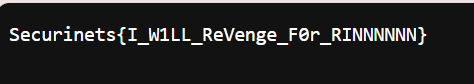

# Forensics Tổng Quan

**1. Forensics là gì**

Forensics (điều tra số) là một quá trình thu thập, phân tích và trình bày các dữ liệu kỹ thuật số để giải quyết các vấn đề pháp lý. Các chuyên gia forensics sử dụng các kỹ năng và công cụ khoa học để thu thập bằng chứng từ các nguồn dữ liệu số, chẳng hạn như máy tính, điện thoại di động, máy tính bảng, ổ cứng, thẻ nhớ, v.v.

Forensics đóng một vai trò quan trọng trong việc điều tra các tội phạm liên quan đến công nghệ, chẳng hạn như tội phạm mạng, trộm cắp dữ liệu, gian lận tài chính, v.v. Các chuyên gia forensics có thể giúp xác định thủ phạm của các tội phạm này, thu thập bằng chứng để buộc tội họ và ngăn chặn họ tái phạm.

**2. File Forensics (File Formats)**

Thường thì trong CTF, Forensics thường xuất hiện các định dạng như sau:
-   Định dạng hình ảnh (JPEG, PNG, GIF, TIFF,...)
-   Định dạng âm thanh và video (MP3, WAV, AVI, MP4, MKV,...)
-   Định dạng cơ sở dữ liệu (QSL, CSV, XML,...)
-   Định dạng Email: Đây là các định dạng như PST (Personal Storage Table) của Microsoft Outlook, EML và MBOX.
-   Định dạng hệ thống tập tin: Bao gồm các định dạng như NTFS (New Technology File System), FAT (File Allocation Table), và EXT (Extended File System)
-   Ngoài ra còn rất nhiều định dạng khác ví dụ như là định dạng .pcapng của Wireshark, ...

**3. Steganography**

Steganography (Kỹ thuật giấu tin) là nghệ thuật và khoa học về việc biểu diễn thông tin trong một thông điệp hoặc vật thể khác sao cho sự hiện diện của thông tin đó không bị phát hiện bởi con người
Steganography có nhiều ứng dụng trong việc bảo mật thông tin, truyền tin bí mật, và cả trong lĩnh vực tội phạm và quân sự. Tuy nhiên, nó cũng có thể được sử dụng với mục đích xấu như truyền tải thông tin bất hợp pháp hoặc tấn công mạng.
Ví dụ như, ta có 1 file ảnh như sau:

Nhìn thì khá là giống 1 file ảnh anime bình thường, thế nhưng khi ta sử dụng công cụ ``https://futureboy.us/stegano/decinput.html`` thì ta sẽ thu được thông tin như sau:

Đó chỉ là 1 kỹ thuật steganography đơn giản, còn rất nhiều kỹ thuật giấu tin khác khó và phức tạp hơn nữa

**4. Network Forensics**

Điều tra mạng là một danh mục con của điều tra kỹ thuật số, về cơ bản liên quan đến việc kiểm tra mạng và lưu lượng truy cập của nó đi qua mạng bị nghi ngờ có liên quan đến các hoạt động độc hại và việc điều tra mạng đó chẳng hạn như mạng đang phát tán phần mềm độc hại để đánh cắp thông tin đăng nhập hoặc để lấy cắp thông tin xác thực. mục đích phân tích các cuộc tấn công mạng. Khi Internet phát triển, tội phạm mạng cũng tăng theo và tầm quan trọng của việc điều tra mạng cũng tăng theo, cùng với sự phát triển và chấp nhận các dịch vụ dựa trên mạng như World Wide Web, e-mail và các dịch vụ khác.

Để xác định các cuộc tấn công, các nhà điều tra phải hiểu các giao thức và ứng dụng mạng như giao thức web, giao thức Email, giao thức mạng, giao thức truyền tệp, ...

Các nhà điều tra sử dụng network forensics để kiểm tra dữ liệu lưu lượng truy   cập mạng được thu thập từ các mạng có liên quan hoặc bị nghi ngờ có liên quan đến tội phạm mạng hoặc bất kỳ loại tấn công mạng nào. Các nhà điều tra có thể theo dõi tất cả các thông tin liên lạc và thiết lập các mốc thời gian dựa trên các sự kiện được ghi lại bởi NCS

**5. Memory Forensics**

Memory Forensics tập trung vào việc thu thập, phân tích và trình bày các dữ liệu được lưu trữ trong bộ nhớ của máy tính. Bộ nhớ máy tính được chi thành 2 loại là: Bộ nhớ chính và bộ nhớ phụ. Bộ nhớ chính là được lưu trữ trên RAM --> RAM rất là quan trọng

Các kỹ thuật memory forensics là:
-    Thu thập bộ nhớ dump: Bộ nhớ dump là 1 bản sao của bộ nhớ chính tại một thời điểm cụ thể. Bộ nhớ dump có thể được thu thập bằng cách sử dụng các công cụ chuyên dụng hoặc bắng công cụ khôi phục hệ thống
-   Phân tích nội dung: Các chuyên gia memory forensics sử dụng các công cụ để phân tích nội dung của bộ nhớ dump
-   Phân tích cấu trúc: Sử dụng các công cụ để phân tích cấu trúc bộ nhớ dump để tìm hiểu cách thức hoạt động của hệ thống
-   Phân tích thời gian: Sử dụng các công cụ để phân tích thời gian tạo, thời gian sửa và thời gian truy cập để lấy các dữ liệu có ích

Memory Forensics đóng vai trò quan trọng trong việc điều tra các tội phạm liên quan tới công nghệ. Bằng cách phân tích các dữ liệu được lưu trữ trong bộ nhớ, các chuyên gia có thể xác định thủ phạm bằng cách thu thập bằng chứng để buộc tội

**6. Disk Forensics**

Disk Forensics là việc thu thập phân tích dữ liệu được lưu trên phương tiện vật lý, nhằm trích xuất dữ liệu ẩn, khôi phục các tập tin bị xóa, qua đó có thể xác định người tạo ra những thay đổi dữ liệu trên thiết bị được phân tích