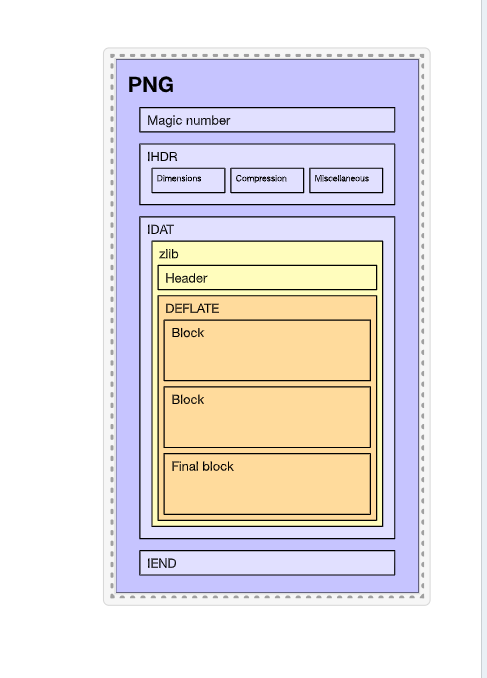
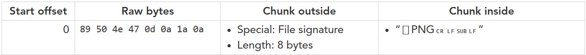
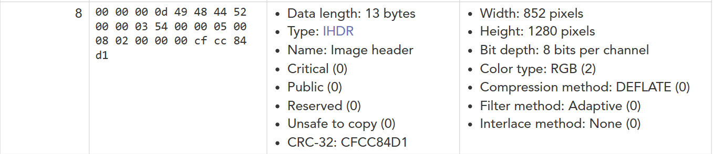
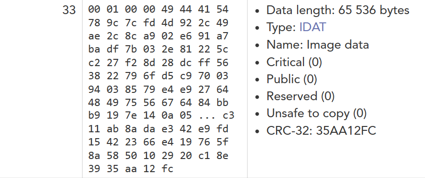
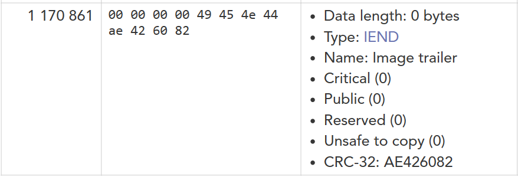
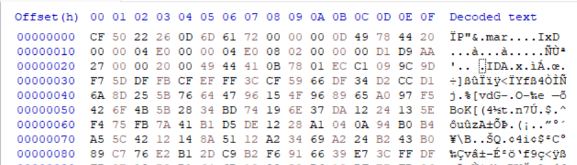
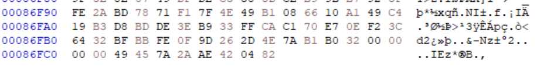
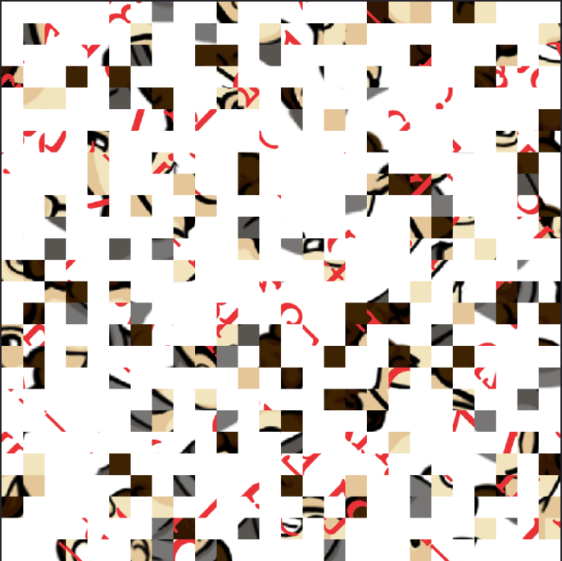

# PNG file chunk inspector

Portable Network Graphics (PNG) là một định dạng tệp phổ biến để truyền tải hình ảnh tĩnh. Nó được sử dụng trên web và trong các hệ thống tài liệu khác nhau

Tệp PNG có cấu trúc như sau:
-   Header hay còn gọi là signature (8 bytes) 
-   IHDR chunk (13 bytes)
-   IDAT chunk (nhiều bytes)
-   IEND chunk (4 bytes)

Có 1 web chia các phần của 1 file png là [this_site](https://www.nayuki.io/page/png-file-chunk-inspector)

Ta thử lấy 1 file png để coi nó như thế nào

Ta thấy rằng 8 bytes đầu tiên sẽ là kiểu định dạng của file (file PNG nào cũng phải có 8 byte đầu như thế)

Đây chính là 1 ví dụ về phần IHDR, 4 byte quan trọng là 49 48 44 52, nếu không có 4 byte này trong file thì cũng không thể xem được ảnh

Tiếp theo, ta sẽ phần IDAT, 1 file PNG thì sẽ có nhiều phần IDAT, thế nên trước 1 phần IDAT, file phải có 4 byte là 49 44 41 54

IEND là phần cuối cùng của file png, cũng như các phần trên, nếu không có 4 byte là 49 45 4e 44 thì file cũng sẽ không xem được

Cơ bản file PNG là như thế theo cách hiểu của bản thân mình

File của task này là 1 file ảnh, ta cần xem được file ảnh đó là gì
Trước hết, ta mở HxD coi ảnh đó như thế nào

Ta thấy vì là file ảnh mà lại không có các 8 byte header, thế nên ta sẽ phải sửa ``CF 50 22 26 0D 6D 61 72`` --> ``89 50 4e 47 0d 0a 1a 0a``

Tiếp theo, ta không thấy các byte IHDR mà lại chỉ thấy IxD, thế nên ta phải sửa 4 byte ``49 78 44 20`` --> ``49 48 44 52``

Còn nữa, IDA là cái gì ta, thì ra là phần đầu của 1 IDAT nhưng bị sai, ta cần sửa ``49 44 41 0B`` --> ``49 44 41 54``

Cuối cùng, ta check thử cuối file có IEND không, thì đúng thật là không có

Ta sửa ``49 45 7A 2A`` --> ``49 45 4e 44`` để nó thành IEND

Tadaaa, cuối cùng cũng mở được file ảnh rồiii

