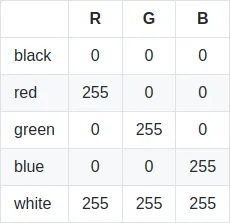
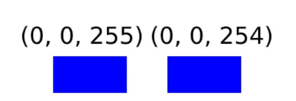
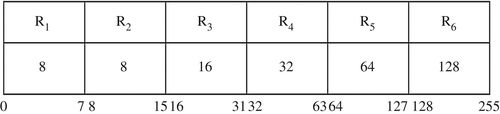
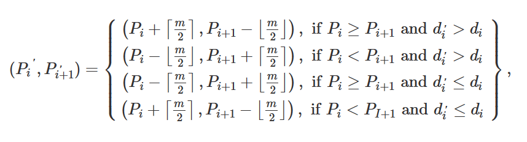
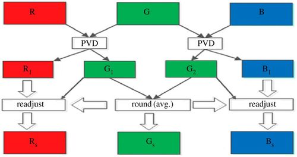
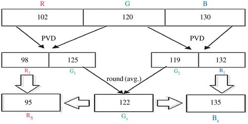

# LSB là gì

Để hiểu LSB là gì thì trước tiên ta cần phải hiểu cách hoạt động của pixel
Một pixel được xác định bởi 3 channels: Red, Green và Blue hay còn viết tắt là RGB
Mỗi channel thì có 1 giá trị từ 0 -> 255, giá trị càng cao thì màu càng đậm

Ta có 1 ví dụ về pixel blue (0,0,255), thì chuyển qua binary thì ta được (00000000, 00000000, 11111111), thế nhưng khi ta đổi bit cuối cùng của channel Blue, ta được (0,0,254)

Thế nhưng nhìn bằng mắt thường thì không phân biệt được đúng không nà =))

Thế nên, ta thường giấu các bit của thông điệp để thay thế byte cuối cùng (Least Significant Bit), cũng là bit không quan trọng. Đó chính là LSB

# Steganography

Steganography là một cơ chế bảo vệ tính bí mật của dữ liệu. Trong cơ chế này, dữ liệu bí mật được nhúng vào bất kỳ phương tiện truyền thông hoặc phương tiện che phủ không bị nghi ngờ như là hình ảnh, âm thanh, video,... dể tạo thành thông điệp có ý nghĩa gọi là stego-media. Dùng bằng các giác quan của con người, hầu như là không có khả năng phân biệt được.

Ngoài sử dụng LSB ra, ta còn có phương pháp PVD, một phương pháp phức tạp hơn và khó bị phát hiện hơn

### PVD Method
Phương pháp này mình không biết nói định nghĩa như thế nào cho dễ hiểu, nhưng mà mình sẽ giải thích bằng ví dụ nhaa

Ta có 1 message là 10111011100111...

Trước hết, ta có 1 bảng gồm 6 range lần lượt như trên

Số byte cần lấy sẽ tính bằng công thức như sau:    ``t = [log2(upperi − loweri + 1)]``, ví dụ ở trong range (16, 32) thì t sẽ bằng [log2 (32 - 16 + 1)] = 4 bits, tức là lấy 1011

Giờ ta lấy 2 pixels value là p1 = 102, p2 =
120, ta lấy hiệu của 2 số này là d = 18 và 18 thuộc range (16, 32) --> t = 4

Với t = 4 thì ta lấy trong message là 1011, chuyển qua decimal là secret = 11

Giá trị ``d' = loweri + secret``, trong trường hợp này sẽ bằng 16 + 11 = 27

Ta sẽ tính được giá trị m bằng công thức như sau: ``m = |d' - d|`` --> m = |27 - 18| = 9

Sau đó, ta sẽ được p1_new và p2_new theo công thức này

Do đó, p1_new = 98 và p2_new = 125

Đó là quá trình mã hóa, còn khi giải mã, ta cũng sẽ lấy hiệu của p1_new và p2_new. Ở ví dụ này, ta sẽ được giá trị là 27, và 27 thuộc range(16,32) (4 bíts), trừ đi lower thì ta được 11 chuyển sang binary là 1011.

Tương tự như rgb, ta sẽ có bảng như sau

Và chú ý:
-   Gs = round[(G1 + G2)/2]
-   Rs = R1 - (G1 - Gs)
-   Bs = B1 - (G2 - Gs)

Và khi giải mã thì ta cũng làm tương tự như ví dụ trên

Ta có 1 ví dụ về RGB như sau

Message = 10111011100111...

