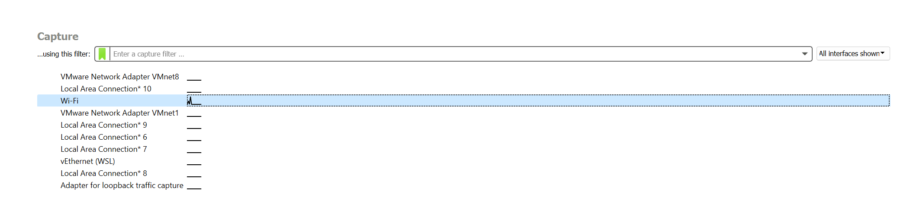
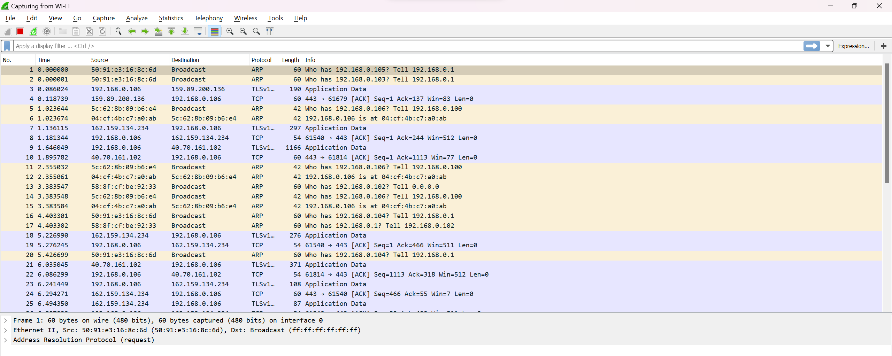
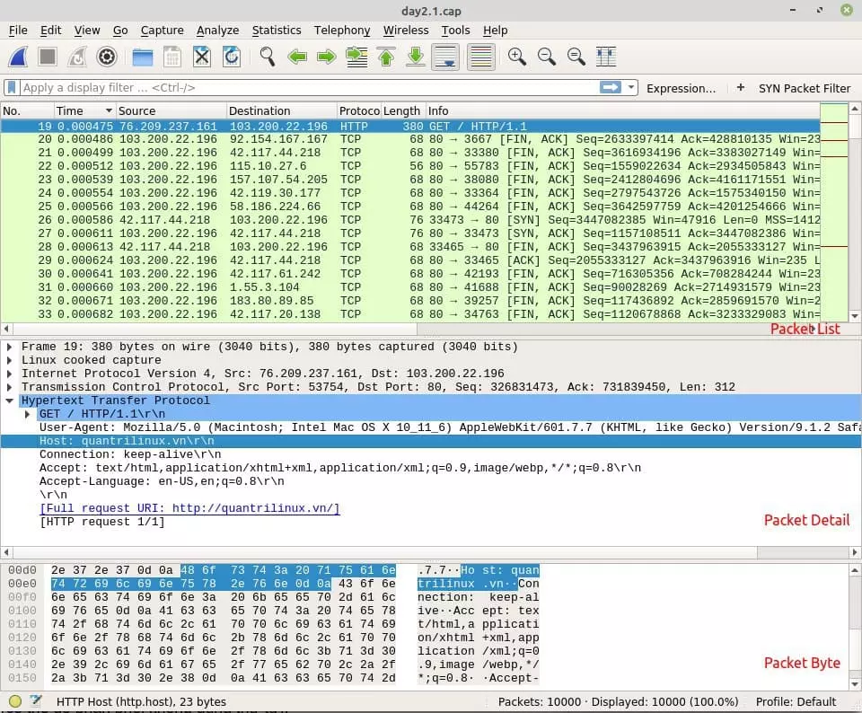

# WIRESHARK

### Wireshark là gì
Wireshark là 1 ứng dụng để bắt (capture), phân tích và xác định các vấn đề liên quan tới network như là rớt gói tin, kết nối chậm hoặc là các truy cập bất thường

### Wireshark hoạt động như thế nào

Đây là 1 công cụ dùng để capture và phân tích các packet. Nó capture các lưu lượng mạng trên mạng cục bộ, sau đso sẽ lưu trữ để phân tích offline. Nó có thê capture các lưu lượng mạng từ kết nối Ethernet, Bluetooth, Wireless,...

### Chức năng của Wireshark
Các tính năng của wireshark là:
-   Hỗ trợ phân tích hàng trăm giao thức và liên tục được cập nhật
-   Live capture và phân tích offline
-   Hoạt động trên đa nền tảng, hệ điều hành
-   Các gói tin đã capture có thể xem bằng giao diện hoặc sử dùng command line
-   Display filter mạnh mẽ
-   Hỗ trợ phân tích VoIP chuyên sâu
-   Hỗ trợ read/write nhiều định dạng đặc biệt là pcap và pcapng

# Cách sử dùng wireshark
### Sử dụng để bắt gói tin
Ta vào wireshark, ta sẽ thấy 1 giao diện như thế này

Khi ấn vào wifi thì ta sẽ được wireshark capture các packet của wifi và liên tục

### Giao diện của Wireshark

Chia thành 3 phần:
-   Packet List: Chứa toàn bộ các packet của file capture hiện lại. Nó thể hiện số thứ tự của gói tin, thời gian mà gói tin được bắt, source và destination IP, protocol của packet, chiều dài gói tin và các thông tin tổng quan khác
-   Packet Details: Khi chọn 1 gói tin ở phần Packet List, ta sẽ được các thông tin chi tiết cụ thể
-   Packet Bytes: Hiển thị dưới dạng raw và byte hoặc là binary.

### Tìm kiếm gói tin

Dùng công cụ Find Packet bằng cách dùng Ctrl + F