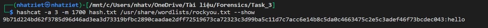

# John The Ripper

Tool này giúp ta sẽ crack password yếu hoặc là dễ bruteforce
Giờ ta sẽ có 1 file flag.zip có mật khẩu là ``summer``, tui sẽ hướng dẫn cách phá nhaaa
Cứ giả vờ là mình khum biếc mật khẩu đi nhaaa

Ta sẽ sử dụng lệnh ``zip2john flag.zip > hash.txt``, đây là lệnh chuyển file zip này về mã hash, sau đó mình dùng lệnh ``john hash.txt`` thì sẽ tìm được mật khẩu vì tool sẽ bruteforce trên file password.lst


JohnTheRipper còn rất nhiều mode nha nên mình sẽ làm 1 file rar nữa


Mình lấy 1 file flag.rar với pass là computer nha


# Hashcat

Đây là 1 tool có thể bẻ khóa được mật khẩu khá là nhanh và nhiều loại mật mã. Công dụng chính của nó là sẽ tìm lại mật mã khi biết mã hash của nó và bẻ khóa được các file nén mà có mật khẩu

Ta sẽ thử với 1 ví dụ là mã SHA-512 nha, mình thử hash "hello" thì được đoạn hash này "9b71d224bd62f3785d96d46ad3ea3d73319bfbc2890caadae2dff72519673ca72323c3d99ba5c11d7c7acc6e14b8c5da0c4663475c2e5c3adef46f73bcdec043"
Mình sẽ sử dụng bruteforce attack và sử dụng rockyou.txt nữa 
``hashcat -a 3 -m 1700 hash.txt /usr/share/wordlists/rockyou.txt``
và thu được kết quả 



Đấy là mã băm, giờ mình sẽ qua file zip nha

Mình sẽ để 1 file .zip có pass là ``v1i2e3`` và tương đương là ta sẽ có mặt nạ là ``?l?d?l?d?l?d``, ta sẽ sử dụng zip2john file đó.


Sau đó mình sẽ xóa phần thừa của file hash.txt để cả đầu và cuối là dạng ``$zip2$``

Mình dùng câu lệnh ``hashcat -a 3 -m 13600 hash.txt ?l?d?l?d?l?d``, sau khi chờ thì mình sẽ thu được password hehehe


# BkCrack

Để có thể dùng cách tấn công này, ta cần phải biết ít nhất 12 bytes, nếu có nhiều hơn thì ta sẽ crack zip này nhanh hơn.

Trước hết, ta phải tạo 1 file zip mà chứa ít nhất có 1 file có Compression là Store


Và ta cần phải biết ít nhất 12 bytes trong file Store đó, như của mình là file flag.svg, và mình đã biết là trong đó có "from Cry hello" (do mình tạo mà :v) 

Mình sẽ cho các byte đã biết vào 1 file là plain.txt, sau đó mình sẽ crack file zip này bằng câu lệnh
``./bkcrack -C test.zip -c flag.svg -p plain.txt``


Sau 1 thời gian thì sẽ được 3 cái key như này


Bây giờ ta sẽ có nhiều lựa chọn để mở được file đã bị zip 

**Lựa chọn 1: Chọn 1 mật khẩu mới**

Ta sẽ sử dụng key này, để cho sang 1 file zip mới và mật khẩu mới


Giờ mở file zip ``new_test.zip`` bằng pass ``new_pass`` là mở được các file nha

**Lựa chọn 2: Giải mã file trong zip**

Ta sẽ mã hóa file cần mở bằng đuôi .deflate, sau đó sẽ dùng tool inflate.py để convert lại đuôi là sẽ mở được file cần mở

Ví dụ như là file server.py này á


**Lựa chọn 3: Tìm lại mật khẩu của file zip**


Ta có hướng dẫn dùng các ký hiệu tương đương với loại biến, password ban nãy mình để toàn là lowercase nên mình sẽ dùng câu lệnh này


Qua đó ta sẽ tìm được password là ``nhatziet``


# PKCRACK

Để có thể dùng cách tấn công này, trước hết, bạn phải có 2 file zip. 1 file zip là file bạn muốn giải mã, và 1 file zip khác chứa ít nhất một trong các file trong file zip thứ nhất mà dưới dạng bản rõ

Ví dụ, ta có 1 file 
```
secret.zip  
|_ plain.txt
|_ secret.txt

plaintext.zip
|_ plaintext.txt (file này có nội dung giống file plain.txt)
```

Giờ ta sẽ sử dụng câu lệnh này
```
  pkcrack -C encrypted-ZIP -c ciphertextname -P plaintext-ZIP -p plaintextname -d decrypted_file -a
```

Với:
-   encrypted-ZIP: là file secret.zip như trên
-   ciphertextname: là file trong secret.zip mà ta đã biết được bản rõ cụ thể là plain.txt
-   plaintext-ZIP: là file plaintext.zip như trên
-   plaintextname: là file bản rõ mà trong plaintext.zip
-   decrypted_file: là file zip sau khi crack, có full file như trong secret.zip

Bây giờ mình sẽ crack file secret.zip nhaaaa


Sau khi crack xong thì mình unzip cracked.zip như bình thường thôi, còn nếu muốn có pass thì mình đã có 3 key của file rồi, mình dùng BkCrack thui hiihihihi

Lưu ý, file plain.txt và file plaintext.txt trong 2 file zip đó phải giống nhau, mình có thử giống nhau 1 đoạn và thử file plaintext.txt ngắn hơn so với file plain.txt thì đều không được nhaaa

# So sánh BkCrack và PkCrack

|**BkCrack**|**PkCrack**|
|:-----------|:-----------|
|- Cần 12 byte trở lên của bản rõ |- Cần 1 file mà biết hết bản rõ|
|- Không phải file nào cũng được mà phải là dạng Store|- File nào cũng có thể sử dụng được nếu biết hết bản rõ|
|- Có nhiều chức năng hơn, có thể tìm lại được cả mật khẩu của file zip|- Chỉ tìm được 3 key và nếu muốn biết mật khẩu thì phải cần BkCrack|

# Task Ví dụ

Đây là task của giải HCMUS, ta sẽ ứng dụng các kiến thức của Johntheripper, Pkcrack để làm chall này nha

Trước hết mình thử Bkcrack file để coi có gì


Nhìn vào thì ta thấy có 1 file zip, 1 file bookmarks.txt và README.txt

Giờ ta không biết được file bookmarks.txt và README.txt kia là gì, nên mình bỏ phương án là pkcrack, file zip kia là dạng store nhưng mà cũng không biết được byte nào nên bỏ luôn bkcrack, mình thử dùng john nha

Mình sẽ sử dụng rockyou để làm trước và nếu không có thì mình sẽ dùng password.lst của john sau nha


Thế password là ``MANCHESTERUNITED``, mình unzip nó ra thui nàoo


Có 3 file như trên, ta thử bkcrack file zip kia coi sao nha


Có 1 file bookmarks.txt, ta sẽ dùng pkcrack để unzip file zip thứ 2 này


Sau khi unzip mình thu được 5 file, trong đó có 1 file pdf, thử mở thì được như này


Nhìn là biết file này có vấn đề rùi, mình thử pdftotext thì được như này nha


**Flag: HCMUS-CTF{H0w_D1d_y0U_Kn0W_Th3_P@ssW0rd????}**