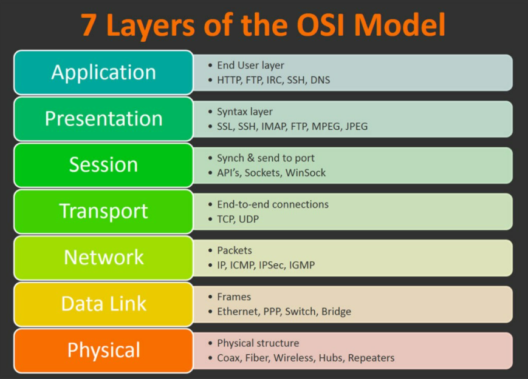

## OSI SYSTEM

Open Systems Interconnection là mô hình mô tả 7 lớp mà hệ thống máy tính sử dụng để giao tiếp
Internet hiện tại sử dụng mô hình TCP/IP đơn giản hơn nhưng mà mô hình 7 lớp OSI vẫn được sử dụng rộng rãi vì nó giúp ta trực quan hóa và truyền đạt cách thức hoạt động của mạng, đồng thời giúp cách ly và khắc phục sự cố mạng

---

**7. Application Layer**

Lớp ứng dụng được sử dụng bởi người dùng cuối như trình duyệt web và ứng dụng email. Nó cung cấp các giao thức cho phép phần mềm gửi và nhận thông tin cũng như trình bày dữ liệu có ý nghĩa cho người dùng. Một số ví dụ về các giao thức lớp ứng dụng là là Giao tiếp truyền siêu văn bản (HyperText Transfer Protocol HTTP), Giao thức truyền tệp (File Transfer Protocol FTP), Giao thức truyền thư đơn giản (Simple Mail Transfer Protocol SMTP) và Hệ thống tên miền (Domain Name System DNS).

**Chức năng của Application Layer:**

- Cung cấp phương tiện để người dùng có thể chuyển tiếp một số email và nó cũng cung cấp phương tiện lưu trữ
- Lớp này cho phép người truy cập từ xa, truy xuất và quản lý các tệp trong máy tính từ xa
- Nó cho phép người dùng đăng nhập như một máy chủ từ xa
- Lớp này cung cấp quyền truy cập vào thông tin toàn cầu về các dịch vụ khác nhau
- Lớp này cung cấp các dịch vụ bao gồm: e-mail, truyền tệp, phân phối kết quả cho người dùng, dịch vụ thư mục, tài nguyên mạng, ...
- Nó cung cấp các giao thức cho phép phần mềm gửi và nhận thông tin cũng như trình bày dữ liệu có ý nghĩa cho người dùng
- Nó xử lý các vấn đề như tính minh bạch của mạng, phân bổ tài nguyên
- Lớp này đóng vai trò như là 1 cửa sổ để người dùng và quy trình ứng dụng truy cập các dịch vụ mạng
- Lớp ứng dụng về cơ bản không phải là một chức năng mà nó thực hiện các chức năng của lớp ứng dụng
- Nói chung, Application Layer thực hiện khởi tạo máy chủ, sau đó đăng nhập từ xa vào máy chủ.

**Application Layer Protocols:**
Lớp ứng dụng cung cấp một số giao thức cho phép bất kỳ phần mềm nào dễ dàng gửi và nhận thông tin cũng như trình bày dữ liệu có ý nghĩa cho người dùng.
Sau đây là một số giao thức cung cấp:

- Telnet: Telnet viết tắt cho Telecommunications Network. Giao thức này cho phép các máy khách Telnet truy cập vào tài nguyên của máy chủ. Telnet sử dụng port 23.
- DNS: Viết tắt cho Domain Name System. Dịch vụ DNS dịch tên miền (do người dùng chọn) thành địa chỉ IP tương ứng. Ví dụ: Hiện bạn có tên miền là www.nhatziet.com thì DNS phải dịch nó thành 192.168.20.8 (IP này mình lấy đại). Giao thức DNS sử dụng port 53.
- DHCP: Viết tắt cho Dynamic Host Configuration Protocol. Nó cung cấp địa chỉ IP cho máy chủ. Bất cứ khi nào máy chủ cố gắng đăng ký địa chỉ IP cho máy chủ DHCP, máy chủ DHCP sẽ cung cấp nhiều thông tin cho máy chủ.
- FTP: FTP là File Transfer Protocol. Giao thức này giúp chuyển các tập tin khác nhau từ thiết bị này sang thiết bị khác. FTP thúc đẩy việc chia sẻ tập tin qua các thiết bị máy tính từ xa với khả năng truyền dữ liệu hiệu quả, đáng tin cậy. FTP sử dụng port 20 để truy cập dữ liệu và port 21 để kiểm soát dữ liệu.
- SMTP: Viết tắt cho Simple Mail Transfer Protocol. Nó được sử dụng để chuyển thư điện tử từ người dùng này sang người dùng khác. SMTP sử dụng port 25 và 587.
- HTTP: Hyper Text Transfer Protocol, là nền tảng của World Wide Web. HTTP hoạt động trên mô hình máy chủ người dùng. Giao thức này được sử dụng để truyền các tài liệu hypermedia như HTML. Giao thức này được thiết kế đặc biệt để liên lạc giữa trình web và máy chủ web, nhưng giao thức này cũng có thể được sử dụng cho một số mục đích khác. HTTP là một giao thức không trạng thái (stateless) (giao thức mạng mà người dùng yêu cầu đến máy chủ và phản hồi của máy chủ theo trạng thái nhất định), có nghĩa là máy chủ không chịu trách nhiệm duy trì của các yêu cầu của người dùng trước đó. HTTP dùng port 80.
- NFS: Viết tắt cho Network File System. Giao thức này cho phép các máy chủ từ xa gắn các tệp qua mạng và tương tác với các hệ thống tệp đó như thể chúng được gắn cục bộ. NFS dùng port 2049.
- SNMP: Viết tắt cho Simple Network Management Protocol. Giao thức này giúp thu nhập dữ liệu bằng cách thăm dò các thiết bị mạng đến trạm quản lý theo các khoảng thời gian cố định hoặc ngẫu nhiên, yêu cầu chúng tiết lộ một số thông tin nhất định. SNMP dùng port 161 (TCP) và 162 (UDP).

---

**6. Presentation Layer**

Lớp trình bàu là lớp thứ 6 trong mô hình OSI. Lớp này còn được gọi là lớp Translation, vì lớp này đóng vai trò là bộ dịch dữ liệu cho mạng. Dữ liệu mà lớp này nhận được từ Application Layer được trích xuất và xử lý ở đây theo định dạng được yêu cầu để truyền qua mạng. Trách nhiệm chính của lớp này là cung cấp hoặc xác định định dạng dữ liệu và mã hóa. Lớp trình bày còn được gọi là Systax layer vì nó chịu trách nhiệm duy trì systax thích hợp của dữ liệu mà nó nhận hoặc truyền đến lớp khác.

**Chức năng của Presentation Layer:**

- Định dạng lớp trình bày và mã hóa dữ liệu để gửi qua mạng.
- Lớp này đảm bảo rằng dữ liệu được gửi theo cách mà người nhận sẽ hiểu được thông tin và có thể sử dụng một cách hiệu quả.
- Lớp này thực hiện mã hóa ở máy phát và giải mã ở máy thu.
- Lớp này thực hiện nén dữ liệu để giảm băng thông của dữ liệu được truyền nhằm giảm số lượng bit được truyền đi.
- Chịu trách nhiệm về khả năng tương tác (trao đổi và sử dụng thông tin) giữa các phương thức mã hóa vì các máy tính khác nhau sử dụng phương thức mã hóa khác nhau.
- Lớp này về cơ bản xử lý phần trình bày của dữ liệu.
- Lớp này xử lý systax và ngữ nghĩa của tin nhắn.
- Đảm bảo rằng các thông báo được trình bày ở lớp trên cũng như lớp dưới phải được chuẩn hóa cũng như ở định dạng chính xác.
- Chịu trách nhiệm dịch, định dạng và cung cấp thông tin để xử lý hoặc hiển thị.
- Đóng vai trò quan trọng trong khi giao tiếp diễn ra giữa hai thiết bị mạng.

**Tính năng của Presentation Layer**

- Lớp trình bày áp dụng một số kỹ thuật nén phức tạp nhất định do đó cần ít byte hơn để thể hiện thông tin. Khi đó nó được gửi qua mạng.
- Nếu hai hoặc nhiều thiết bị liên lạc qua kết nối được mã hóa thì lớp trình bày này chịu trách nhiệm thêm mã hóa ở đầu người gửi cũng như giải mã mã hóa ở đầu người nhận để nó có thể biểu thị lớp ứng dụng bằng dữ liệu có thể đọc được.
- Chịu trách nhiệm nén dữ liệu mà nó nhận được từ lớp ứng dụng trước khi gửi đến Session Layer và do đó cả thiện tốc độ cũng như hiệu quả truyền thông bằng cách giảm thiểu lượng thông tin liên lạc.

**Presentation Layer Protocol:**
Là lớp thứ 6 nhưng lại là lớp quan trọng nhất trong OSI vì thực hiện một số chức năng, đảm bảo dữ liệu được truyền  haowjc nhận phải chính xác hoặc rõ ràng đối với tất cả các thiết bị có trong mạng kín.
Một số giao thức như sau:

- APP: Apple Filing Protocol là giao thức mạng độc quyền cung cấp dịch vụ cho macOS. Về cơ bản đây là giao thức kiểm soát tệp mạng được thiết kế đặc biệt cho nền tảng macOS.
- LPP: Lightweight Presentation Protocol là giao thức sử dụng để cung cấp các dịch vụ trình bày ISO trên đầu ngăn xếp dựa trên TCP/IP.
- NCP: NetWare Core Protocol là giao thức mạng được sử dụng để truy cập tệp, in, thư mục, đồng bộ hóa đồng hồ, tin nhắn, thực thi lệnh từ xa và các chức năng dịch vụ mạng khác.
- NDR: Netword Data Representation về cơ bản là việc triển khai lớp trình bày trong mô hình OSI, cung cấp hoặc xác định các loại dữ liệu nguyên thủy khác nhau, các kiểu dữ liệu được xây dựng và cả một số loại biểu diễn dữ liệu.
- XDR: External Data Representation là tiêu chuẩn để mô tả và mã hóa dữ liệu. Nó rất hữu ích cho việc truyền dữ liệu giữa các kiến trúc máy tính và đã sử dụng để truyền dữ liệu giữa các máy rất đa dạng.
- SSL: Secure Socket Layer cung cấp bảo mật cho dữ liệu đang được truyền giữa trình duyệt web và máy chủ. SSL mã hóa liên kết giữa máy chủ web và trình duyệt, đảm bảo rằng tất cả dữ liệu được truyền giữa chúng vẫn ở chế độ riêng tư và không bị tấn công.

---

**5. Session Layer**

Lớp session tạo ra các kênh liên lạc, được gọi là sessions giữa các thiết bị. Chịu trách nhiệm duy trì và quản lý các thông tin liên quan tới session như là duy trì, xử lý sự cố và cách kết thúc session. Trong trường hợp dữ liệu lớn, lớp Session có thể chia nhỏ chúng thành các phần nhỏ hơn để truyền tải và sau đó lắp ghép lại như ban đầu giúp quản lý tốt hơn về mặt hiệu suất và tính toàn vẹn của dữ liệu.

___
**4. Transport Layer**

Lớp vận chuyển lấy dữ liệu được truyền trong lớp Session và chia nó thành các segments ở đầu truyền. Nó chịu trách nhiệm tập hợp lại các segments ở đầu nhận và biến nó trở lại dữ liệu mà lớp session có thể sử dụng được. Lớp vận chuyển thực hiện kiểm soát luồng, gửi dữ liệu với tốc độ phù hợp với tốc độ kết nối của thiết bị nhận và kiểm soát lỗi, kiểm tra xem dữ liệu có được nhận chính xác hay không nếu không thì yêu cầu lại.

___
**3. Network Layer**

Lớp mạng có 2 chức năng chính. Một là chia các phận đoạn thành các gói mạng và tập hợp tại đầu nhận. Hai là định tuyến các gói bằng cách khám phá đường dẫn tốt nhất qua mạng vật lý. Lớp mạng sử địa chỉ mạng thường là các giao thức internet để định tuyến các gói đến nút đích.

___
**2. Data Link Layer**

Lớp liên kết dữ liệu thiết lập và kết thúc kết nối giữa 2 nút được kết nối vật lý trên mạng. Nó chia các gói thành các khung và gửi nó từ nguồn tới đích. Lớp này bao gồm 2 phần, Logical Link Control (LLC) xác định các giao thức mạng, thực hiện kiểm tra lỗi và đồng thời đồng bộ hóa các khung và Media Access Control (MAC) sử dụng địa chỉ MAC để kết nối và xác định quyền truyền và nhận dữ liệu.

___
**1. Physical Layer**

Lớp vật lý chịu trách nhiệm về cáp vật lý hoặc kết nối không dây giữa các nút mạng. Nó xác định đầu nối, cáp điện hoặc công nghệ không dây kết nối các thiết bị và chịu trách nhiệm dữ liệu thô, đơn giản là chuỗi nhị phân, đồng thời đảm nhiệm việc kiểm soát tốc độ bit.

___
**OSI Advantage**

- Xác định phần cứng và phần mềm cần thiết để xây dựng mạng.
- Hiểu và truyền đạt quá trình truyền thông, mỗi tầng là một tập hợp chức năng cụ thể, giúp người sử dụng và quản trị viên hiểu rõ hơn về lường dữ liệu và quá trình giao tiếp giữa các thành phần mạng.
- Sửa lỗi và xác định tầng gây ra vấn để, khi gặp vấn đề, người sử dụng và quản trị viên có thể xác định tầng nào bị sự cố giúp họ tập trung vào sửa chữa tầng đó hiệu quả.

___
**Độ dài của các trường dữ liệu và cấu trúc thành phần**

1. Physical Layer: 
-   Độ dài trường dữ liệu không giới hạn nhưng phụ thuộc vào phương tiện truyền thông sử dụng như cáp đồng trục, cáp xoắc đôi hoặc sóng vô tuyến.
-   Các thành phần gói tin ở lớp này bao gồm bit, đường truyền, tần số sóng, độ dài sóng, điện áp,...

2. Data Link Layer: 
-   Độ dài trường dữ liệu của tầng này là 46 đến 1500 byte.
-   Các thành phần gói tin ở lớp này bao gồm frame, địa chỉ MAC (Media Access Control), kiểm soát lỗi, chuyển tiếp gói tin, đồng bộ hóa.

3. Network Layer: 
-   Độ dài trường dữ liệu của tầng này là từ 20 đến 60 byte.
-   Các thành phần của gói tin ở lớp này bao gồm giao thức IP (Internet Protocol), địa chỉ IP, bảng định tuyến, giao thức truyền tải,...

4. Transport Layer: 
-   Độ dài trường dữ liệu này là từ 20 đến 60 byte
-   Các thành phần của gói tin ở lớp này bao gồm các giao thức như TCP (Transmission Control Protocol), UDP (User Datagram Protocol), port,...

5. Session Layer: 
-   Độ dài trường dữ liệu của tầng này là không giới hạn.
-   Lớp này thiết lập, quản lý và giải phóng các kết nối phiên làm việc giữa các ứng dụng trên các thiết bị khác nhau. Các thành phần của gói tin ở lớp này bao gồm các yêu cầu bắt đầu phiên, yêu cầu kết thúc phiên, yêu cầu đồng bộ hóa phiên, đồng hồ phiên.

6. Presentation Layer: 
-   Độ dài trường dữ liệu của tầng này là không giới hạn.
-   Thành phần của gói tin bao gồm dữ liệu được mã hóa và định dạng để có thể hiển thị trên các thiết bị khác nhau.

7. Application Layer: 
-   Độ dài trường dữ liệu của tầng này là không giới hạn.
-   Thành phần của gói tin bao gồm các dữ liệu và thông tin điều khiển của ứng dụng.