# Wireshark

1. Wireshark là gì?

- Wireshark là ứng dụng phân tích mạng (network packet analyzer). Công cụ của ứng dụng này là dùng để bắt, phân tích và xác định các vấn đề có liên quan đến network bao gồm: kết nối chậm, rớt gói tin hoặc các truy cập bất thường.
- Thông qua wireshark, quản trị viên có thể hiểu hơn về các Network Packets đang chạy trên hệ thống. Như vậy, việc xác định nguyên nhân gây ra lỗi cũng sẽ dễ dàng hơn.

2. Ứng dụng Wireshark dùng để làm gì?

- Trước hết, wireshark được network administrators sử dụng trong việc khắc phục sự cố về mạng.
- Bên cạnh đó, wireshark còn được các kỹ sư network security dùng để kiểm tra các vấn đề liên quan đến bảo mật.
- Trong khi đó, Wireshark lại được các kỹ sư sử dụng để xác minh các network applications.
- Còn đối với người dụng mạng máy tính bình thường thì wireshark giúp chúng ta học internals giao thức mạng.
- Ngoài ra, wireshark còn được sử dụng trong rất nhiều tình huống thực tế khác nữa mà chỉ những người trong giới chuyên môn mới biết được.

3. Tính năng của Wireshark

- Ứng dụng này giúp người dùng có thể chụp dữ liệu gói trực tiếp từ giao diện mạng.
- Thực hiện mở các tệp có chứa dữ liệu gói bằng tcpdump/Windump, wireshark cũng như một số chương trình packet capture khác.
- Nhập các gói từ các tệp văn bản có chứa các hex dump của packet data.
- Xuất một số hoặc tất cả các gói thông qua định dạng capture file.
- Dựa vào các tiêu chí khác nhau để lọc các gói tin.

4. Phân tích bằng Wireshark

- Tìm kiếm gói tin (Find Packet)

  - Để tìm kiếm gói tin, chúng ta dùng Find Packet
  - Ta sẽ dùng Ctrl + F để mở giao diện này
    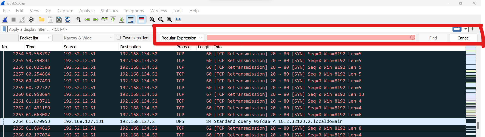
  - Ta có các mục là Display Filter, String, Hex value, Regular Expression
  - Display Filter: Nhập vào một biểu thức (expression-based filter), Wireshark sẽ tìm kiếm các gói tin khớp với biểu thức này. Ví dụ, ta mở bài netlab5 ra, ta thử ``tcp.segment_data != 0`` thì sẽ tìm được các dòng tcp mà data không bị rỗng
    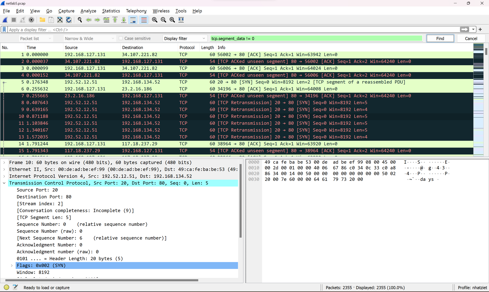
  - Hex: Tìm kiếm giá trị hex. Ví dụ, mình biết trong file này có 1 dòng tcp mà segment_data có giá trị là "where", nên mình tìm giá trị hex của nó và tìm được thui
  - String: Tìm kiếm dựa trên chuỗi dữ liệu. Mình thử tìm chứ "We" mà không hiểu sao lại không tìm được, cái này tự tìm hiểu nha =)))
    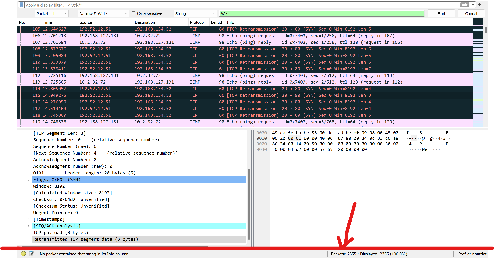
  - Regular Expression: Tìm kiếm theo biểu thức Regex. Ví dụ về 1 biểu thức chính quy là như này: ``^\d{3}-\d{3}-\d{4}$`` thì là  dạng XXX-XXX-XXXX, trong đó X là chữ số từ 0 đến 9. 123-456-7890 sẽ khớp, nhưng abc-123-4567 sẽ không khớp. Ví dụ trong wireshark như sau
    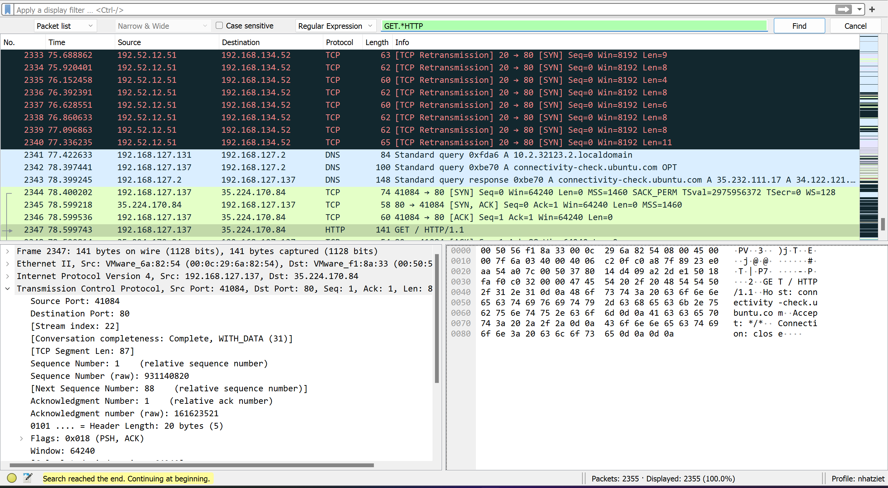
- Một số Expression thường gặp là:

  | Expression                                | Ý nghĩa                                                                                                |
  | ----------------------------------------- | -------------------------------------------------------------------------------------------------------- |
  | host 172.18.5.4                           | Wireshark filter by IP: Bắt gói tin liên quan đến IP 172.18.5.4                                     |
  | src 192.168.0.10                          | Wireshark filter source IP: Bắt gói tin có source IP là 192.168.0.10                                 |
  | dst 192.168.0.1                           | Wireshark filter destination IP: Bắt các gói tin có destination IP là 192.168.0.1                   |
  | net 192.168.0.0/24                        | Bắt gói tin liên quan đến subnet 192.168.0.0/24                                                     |
  | src net 192.168.0.0/14                    | Bắt gói tin có source IP thuộc subnet 192.168.0.0/24                                                 |
  | dst net 192.168.0.0/24                    | Bắt các gói tin có destination IP thuộc subnet 192.168.0.0/24                                       |
  | port 53                                   | Bắt gói tin DNS                                                                                        |
  | port 67 or port 68                        | Bắt gói tin DHCP                                                                                       |
  | host 192.168.1.1 and not (port 80 or 443) | Capture tất cả traffic liên quan tới IP 192.168.1.1 nhưng không liên quan tới traffic HTTP/HTTPS |
  | tcp portrange 1501-1549                   | Capture các packet trong range port từ 1501-1549                                                       |
  | ip                                        | Wireshark IPv4 filter                                                                                    |
  | ip6                                       | Wireshark IPv6 filter                                                                                    |
  | tcp                                       | Bắt gói tin TCP                                                                                        |
  | udp                                       | Bắt gói tin UDP                                                                                        |
  | icmp                                      | Bắt gói tin ICMP                                                                                       |
  | http                                      | Wireshark HTTP filter                                                                                    |
  | https                                     | Wireshark HTTPS filter                                                                                   |
  | tcp[13] & 32 == 32                        | TCP packets với cờ URG được bật                                                                    |
  | tcp[13] & 16 == 16                        | TCP packets với cờ ACK được bật                                                                    |
  | tcp[13] & 8 == 8                          | TCP packets với cờ PSH được bật                                                                    |
  | tcp[13] & 4 == 4                          | TCP packets với cờ RST được bật                                                                    |
  | tcp[13] & 2 == 2                          | TCP packets với cờ SYN được bật                                                                    |
  | tcp[13] & 1 == 1                          | TCP packets với cờ FIN được bật                                                                    |
  | icmp[0:2] == 0x0301                       | ICMP destination unreachable, host unreachable                                                           |
- Display Filter

  - Display Filter giúp lọc ra những packet thỏa điều kiện trong file capture để thể hiện lên cho người dùng. Display Filter chỉ lọc và thể hiện packet thỏa điều kiện chứ không xóa bỏ những packet khác, dữ liệu trong file capture hoàn toàn không bị ảnh hưởng.
  - Sử dụng Display Filter bằng cách nhập biểu thức (expression) vào Filter textbox trên phần Packet List.
  - Ví dụ, mình mở bài netlab5, mình nhập Display Filter là ``not tcp`` thì sẽ lọc hết tất cả các packet không phải là tcp
    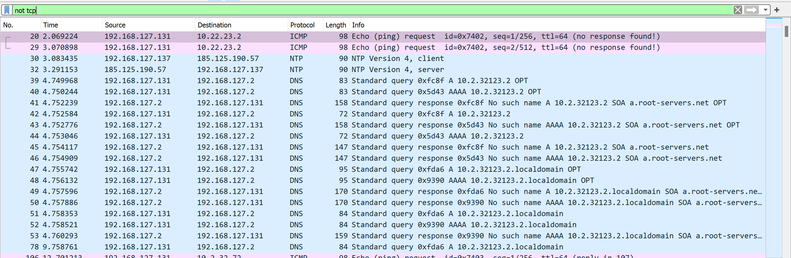 hoặc là filter ``tcp.stream eq 2`` thì sẽ hiển thị các gói thuộc luồng TCP 2 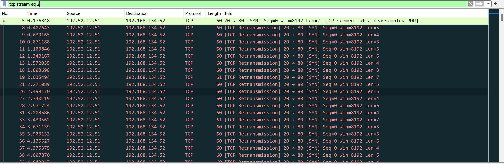
  - Một số Display Filter nên tham khảo:
  - | Expression                                                                  | Ý nghĩa                                                                             |
    | --------------------------------------------------------------------------- | ------------------------------------------------------------------------------------- |
    | tcp.port eq 25 or icmp                                                      | Lọc gói tin TCP liên quan tới port 25 hoặc sử dụng giao thức ICMP             |
    | ip.src == 192.168.0.0/16 and ip.dst == 192.168.0.0/16                       | Lọc traffic trao đổi trong mạng LAN của subnet 192.168.0.0/16                    |
    | tcp.window_size == 0 && tcp.flags.reset != 1                                | TCP buffer full và source kết nối báo hiệu cho Destination ngừng gửi dữ liệu |
    | udp contains 81:60:03                                                       | UDP packet chứa 3 bytes 81:60:03 ở vị trí bất kỳ trong header hoặc payload     |
    | http.request.uri matches "gl=se$"                                           | HTTP request có URL tận cùng bằng chuỗi "gl=se"                                  |
    | ip.addr == 192.168.0.1 hoặc ip.src == 192.168.0.1 or ip.dst == 192.168.0.1 | Wireshark filter by ip: Lọc tất cả các traffic liên quan đến IP 192.168.0.1    |
    | ! (ip.src == 192.168.0.1 or ip.dst == 192.168.0.1)                          | Lọc tất cả traffic không liên quan tới IP 192.168.0.1                           |
    | tcp.flags.syn == 1                                                          | Các gói tin TCP có cờ SYN được bật                                            |
    | tcp.flags.syn == 1 && tcp.flags.ack == 1                                    | Các gói tin TCP có cờ SYN/ACK được bật                                        |
    | http.host == "quantrilinux.vn"                                              | HTTP request có Host header là "quantrilinux.vn"                                    |
    | http.reponse.code == 404                                                    | Các HTTP request có reponse status code là 4-4                                     |
    | smtp or imap or pop                                                         | Traffic liên quan đến email (SMTP, IMAP, POP)                                      |
    | !tcp.port == 22                                                             | Loại bỏ traffic SSH                                                                 |
    | ! arp                                                                       | Loại bỏ traffic ARP                                                                 |
    | ip.version == 4                                                             | Wireshark IPv4 filter: Lọc tất cả các gói tin IP version 4                       |
    | tcp.srcport == 80                                                           | Wireshark port filter: Lọc tất cả gói tin TCP có source port là 80              |
    | tcp.port == 80                                                              | Lọc tất cả các gói tin có liên quan tới port 80                               |
    | udp.port == 67 or udp.port == 68                                            | Traffic DHCP                                                                          |
    | dns                                                                         | Filter traffic liên quan DNS                                                         |
    | http                                                                        | Wireshark http filter                                                                 |
    | https                                                                       | Wireshark https filter                                                                |
    | ip.src == 192.168.0.1                                                       | Wireshark filter source ip 192.168.0.1                                                |
    | ip.dst == 192.168.0.1                                                       | Wireshark filter destination ip                                                       |
- Follow

  - Một tính năng khác khá hay là ``follow``. Ví dụ ta chọn 1 packet TCP, ta chọn Follow TCP stream thì một hộp thoại sẽ hiện ra cho thấy dữ liệu trao đổi giữa Client và Server trong luồng tương ứng và các packet liên quan. Ta có thể click vào các giao thức khác trong menu Follow để xem đầy đủ các đoạn hội thoại nếu có thể.
    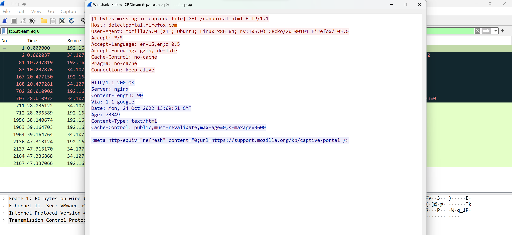
  - Ở mỗi khung cửa sổ của Packet List, thì ta sẽ được các thông tin như sau:

    - No: Số thứ tự của gói tin trong file capture hiện tại.
    - Time: Thời gian tương đối mà gói tin này bắt được, tính từ lúc bắt đầu quá trình bắt gói tin.
    - Source: địa chỉ destination IP của kết nối.
    - Destination: địa chỉ destination IP của kết nối.
    - Length: Chiều dài của gói tin.
    - Protocol: Giao thức của gói tin.
    - Info: Các thông tin tổng quan liên quan tới gói tin.

    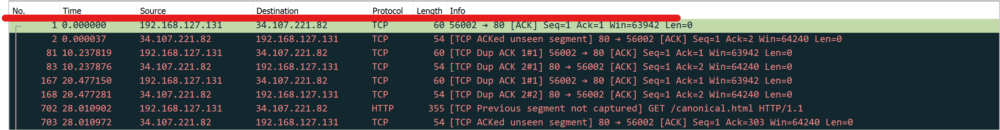
  - Ở khung cửa sổ của Packet Details sẽ cho ta thông tin chi tiết từng Layer của packet như:

    - Frame: Interface.
    - Ethernet: Destination, Source, Mac Address.
    - Internet: Source IP, Destination IP, TTL, Protocol, Flags, Checksum, Identification, Total Length,...
    - TCP/UDP/ICMP: Source Port, Destination Port, Sequence Number, ACK Number, Flags, TCP Options,...
    - Application Layer: HTTP, DNS, SMTP,...
      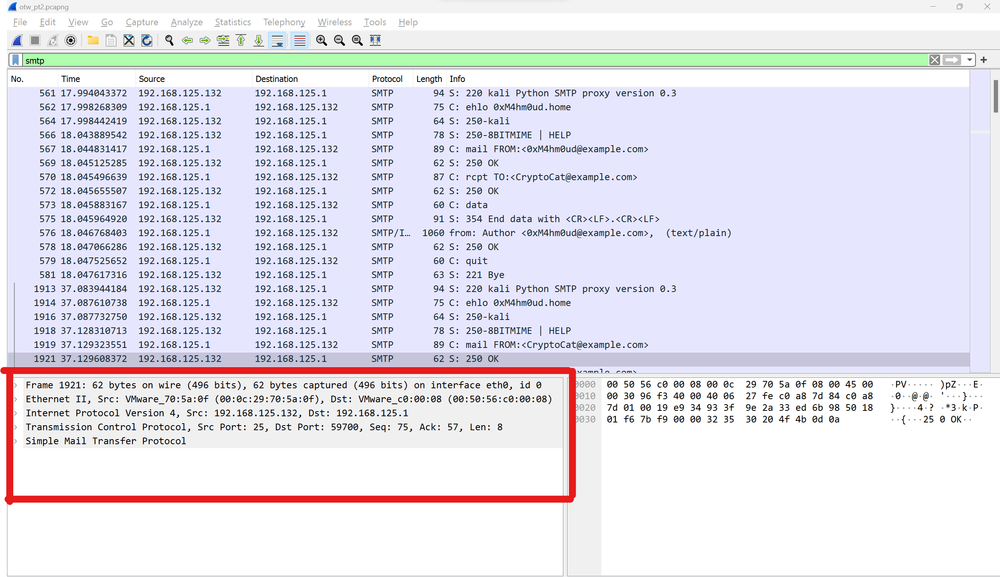
- Wireshark Statistics

  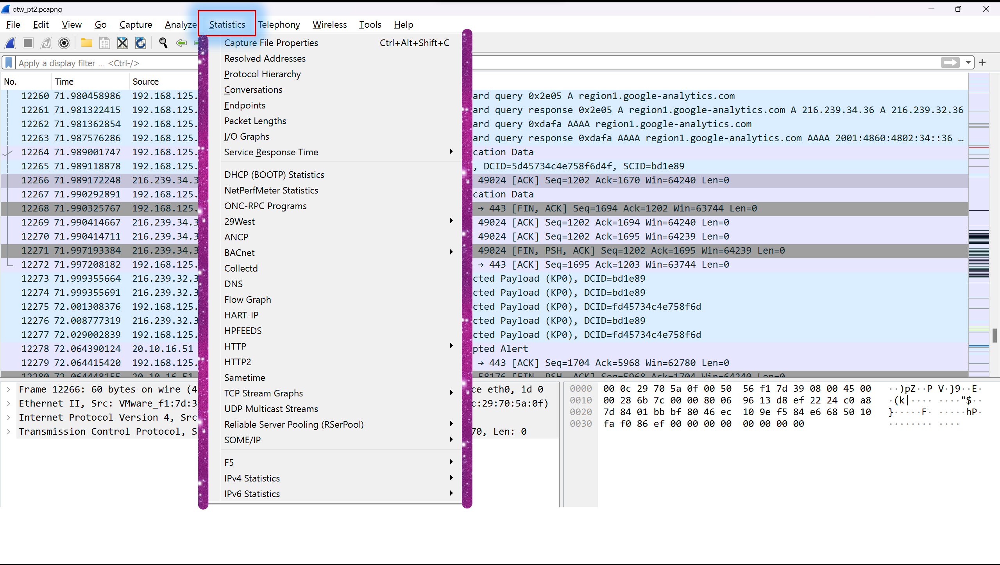
  - Phần Statistics cũng sẽ cung cấp những thông số thống kê có giá trị liên quan đến packet capture hiện tại như là:
    - Capture File Properties: Các thông số tổng quan của file capture.
      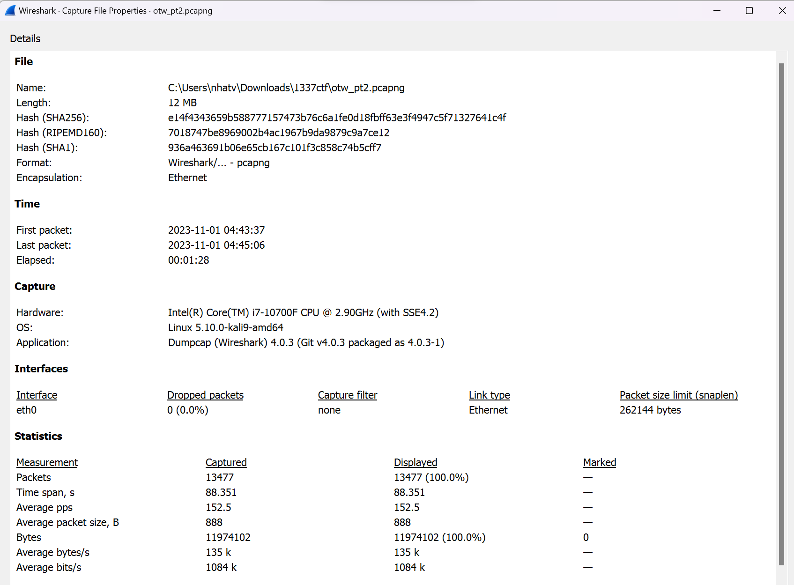
    - Protocol Hierarchy: Tổng quan về Protocol.
      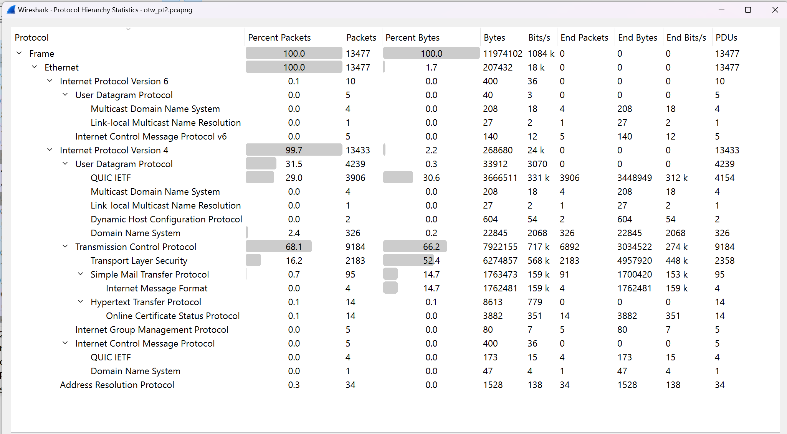
    - Conversation: Thông tin về các luồng trao đổi giữa client và server.
      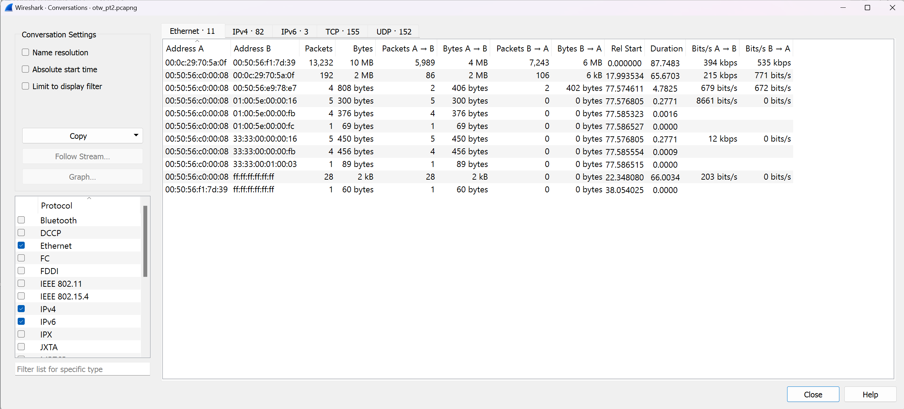
    - Endpoints: Danh sách những IP tham gia kết nối, số lượng packets và bytes tương ứng.
    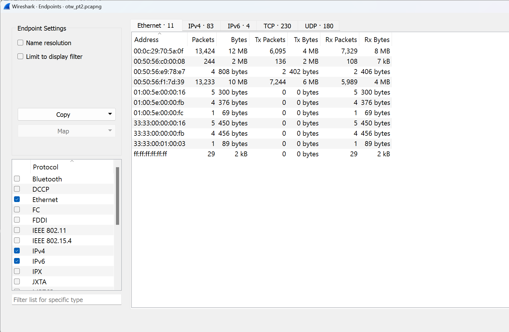
    - Packet Lengths: Thống kê về chiều dài của các gói tin tham gia kết nối.
    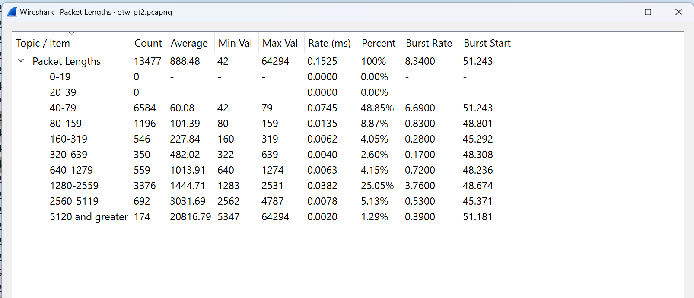
    - I/O Graph: Biểu đồ kết nối.
    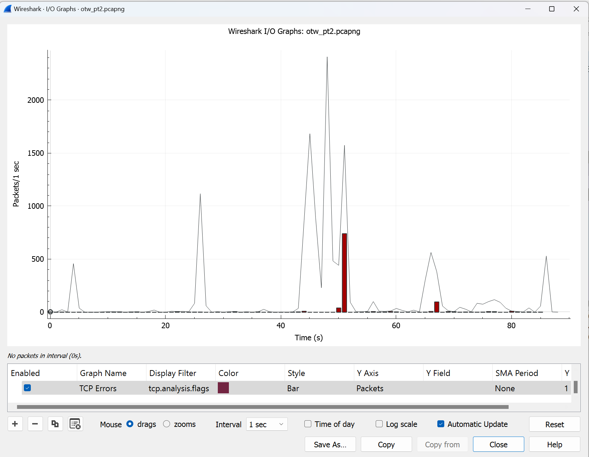
    - Thống kê liên quan tới các giao thức như là HTTP, HTTP2, DNS, DHCP,...
    - IPv4, IPv6 Statistics: Thống kê về danh sách IP, số lượng packet, tần số kết nối.

5. Thư Viện Scapy
- Scapy là một thư viện Python được sử dụng để tạo, gửi và nhận các gói tin mạng. Nó được sử dụng để phân tích gói tin mạng, kiểm tra và thử nghiệm tính bảo mật hệ thống mạng, tạo các công cụ mạng tùy chỉnh và phát triển các ứng dụng mạng.
- Scapy có thể tạo, gửi và nhận các gói tin TCP, UDP, ICMP, DNS, DHCP, ARP và nhiều giao thức khác. Nó cũng cho phép bạn thực hiện các hoạt động như quét mạng, giả mạo địa chỉ MAC, thu thập thông tin từ các gói tin mạng và nhiều hơn nữa.
- Một số tính năng của Scapy bao gồm:
  - Tạo và tùy chỉnh các gói tin mạng.
  - Tương tác với các giao thức mạng khác nhau.
  - Phân tích gói tin mạng.
  - Thực hiện các hoạt động kiểm tra bảo mật mạng.
  - Ghi lại và phân tích các hoạt động mạng.
  - Scapy cung cấp một giao diện dòng lệnh và một API Python cho phéo bạn tích hợp nó vào ứng dụng mạng của mình.
- Ví dụ, ta có 1 packet như thế này
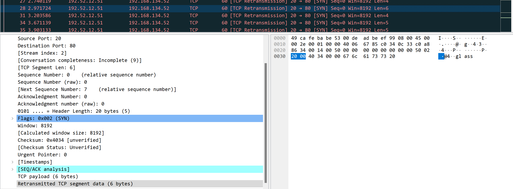
Ta muốn lấy giá trị TCP segment data (là chữ "glass "), ta sẽ dùng ``packet.getlayer(TCP)[Raw].load``.

- Ví dụ khác
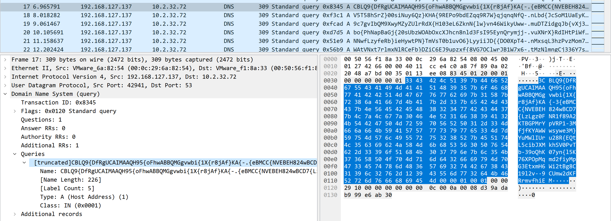
ta muốn lấy giá trị DNS Query thì ta dùng thư viện Scapy và dùng lệnh truy vấn ``packet.getlayer(DNS)[DNSQR].qname`` thì sẽ lấy được các bytes query của DNS.

6. Logs Web
- Logs web là các tập tin ghi lại các thông tin về hoạt động của một trang web, bao gồm các yêu cầu HTTP, địa chỉ IP của người dùng, thông tin về trình duyệt và các trang được truy cập. Để đọc hiểu thông tin ghi trong log, bạn cần hiểu các thuật ngữ và khái niệm sau:
  - Yêu cầu HTTP: Là các yêu cầu được gửi đến máy chủ web bởi trình duyệt của người dùng, bao gồm các phương thức GET, POST, PUT, DELETE,...
  - Địa chỉ IP: Là địa chỉ số dạng nhị phân hoặc thập phân được sử dụng để xác định máy tính của người dùng truy cập vào trang web.
  - User agent: Là thông tin về trình duyệt hoặc phần mềm mà người dùng sử dụng để truy cập vào trang web.
  - Referrer: Là trang web hoặc tài nguyên trên trang web mà người dùng đã truy cập trước đó và dẫn đến trang web hiện tại.
  - Status code: Là mã trả về từ máy chủ web để chỉ ra kết quả của yêu cầu HTTP, ví dụ như 200 OK (Yêu cầu thành công) hoặc Not Found 404 (Không tìm thấy trang).
  - Thời gian truy cập: Là thời điểm mà người dùng truy cập vào trang web.
  - URL: Là địa chỉ của trang web hoặc tài nguyên được truy cập của trang web.

- Để có thể hiểu thông tin trong log web, ta có thể sử dụng công cụ như là ``Apache Logs Viewer`` hoặc là ``GoAccess``.
