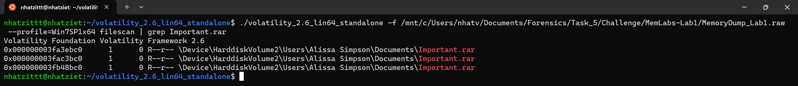

# Memlab 1

Ta dùng vol2 nha, trước tiên tìm profile của file .raw này.

Profile của file này là ``Win7SP1x64``.

Ta sẽ dùng ``pslist`` coi xem có gì nha.

Ta thấy có 3 file .exe chú ý là ``cmd.exe``, ``mspaint.exe``, ``WinRAR.exe``. Mình sẽ dùng  ``cmdline`` với các PID đó nha.

Ta phân tích cmd.exe trước nha. Ta sẽ dùng các lệnh của bài warmup trước để thử nha.

Dùng ``consoles`` để hiển thị các lệnh đã được thực thi trên consoles nha.

Ta thấy người dùng đã chạy 1 chương trình tên là ``St4G3$1`` và hiển thị output là một mã base64

Ta decode thì thu được flag thứ nhất.

**First Flag: flag{th1s_1s_th3_1st_st4g3!!}**

Ta phân tích tiếp theo tới ``mspaint.exe``. Dùng ``memdump`` để kết xuất bộ nhớ xử lý của mspaint để trích xuất hình ảnh trở lại và thành 1 file .dmp.

Ta sẽ đổi đuôi file thành .data, và rồi dùng GIMP để mở lại cái file này.

Sau khi mò các chỉ số 1 lúc, thì mình thấy 1 nét viết có thể đọc được, nhưng mà bị ngược.

Mình sẽ chụp màn hình và dùng Powerpoint để xoay lại nha.

**Second FLag: flag{G00d_BoY_good_girL}**

Còn lại WinRAR.exe, ban nãy ta cmdline với PID của WinRAR.exe, thì ta thấy đang mở file ``Important.rar``.

Ta sẽ dùng ``filescan`` và lệnh ``grep Important.rar`` để lấy được phyoffset của file rar này nha.

Ta có phyoffset của Important.rar là  ``0x000000003fa3ebc0`` rùi, ta sẽ dumpfiles để lấy hết các data của các file trong file rar thành 1 file .dat nha.

Giờ mình sẽ đổi đuôi của file này, unar nó ra nha.

File rar này cần phải có password thì mới extract được, thấy tên người dùng là ``Alissa Simpson``, thế nên mình sẽ hashdump để lấy được hàm băm NTLM của Alissa Simpson nha.

Password của file rar này chính là ``F4FF64C8BAAC57D22F22EDC681055BA6``. Ta extract file rar thôi.

**Third Flag: flag{w3lL_3rd_stage_was_easy}**