# Memlab 2

Trước hết mình phải lấy được profile của file này đã. Vẫn là lệnh như cũ ``imageinfo``.

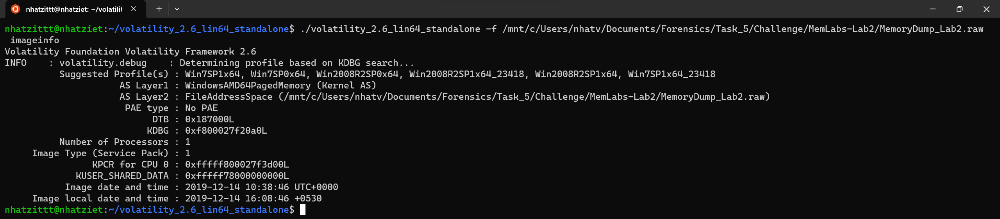

Profile của file .raw này là ``Win7SP1x64``

Ta nhìn thấy đề miêu tả có cụm từ ``environmental``, ta nghĩ ngay đến các biến môi trường, ta sẽ dùng plugin ``envars`` để coi coi có gì nha.

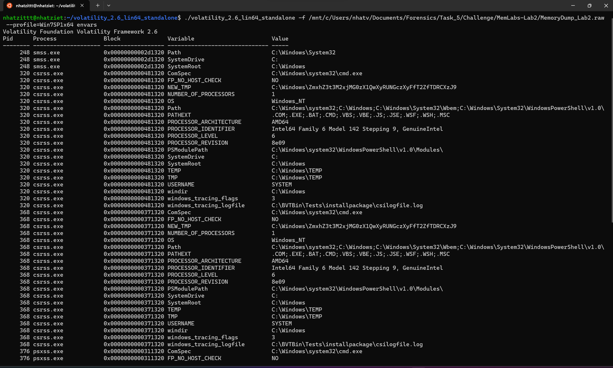

Nhìn biến ``NEW_TEMP``, ta thấy có giá trị ``C:\Windows\ZmxhZ3t3M2xjMG0zX1QwXyRUNGczXyFfT2ZfTDRCXzJ9``, ta sẽ decode đoạn mã base64 đó coi sao.

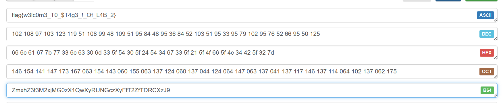

**First Flag: flag{w3lc0m3_T0_$T4g3_!_Of_L4B_2}**

Tiếp theo, ta thử ``pslist`` để coi RAM đang chạy những tiến trình nào.

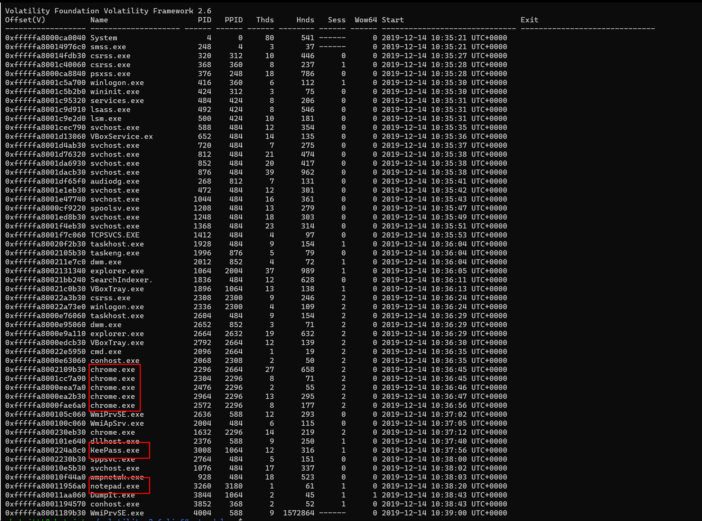

Ta thấy được 3 tiến trình có thể có thông tin hữu ích đó là ``chrome.exe``, ``KeePass.exe`` và ``notepad.exe``.

Mình sẽ dùng ``cmdline`` với PID của notepad.exe nhaaaa.

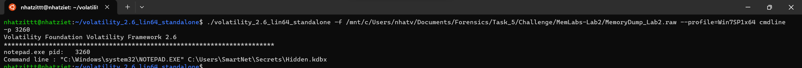

Thì notepad đang chạy file ``Hidden.kdbx``

Thử lun KeePass.exe lun thì cũng được file như thế =)))
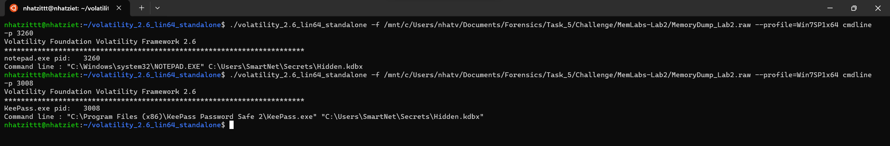

Giờ mình sẽ filescan để lấy giá trị phyoffset của Hidden.kdbx rồi mình dumpfiles nha.

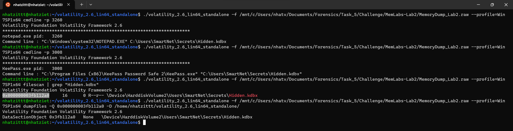

Giờ đổi tên file và kiếm Masterkey nữa thuiii.

Ban đầu, mình dùng plugin ``hashdump`` và lấy NTLM của SmartMen thì mình tìm được 1 cái pass như này
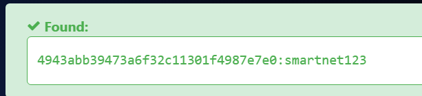

Thế nhưng nhập vào thì lại không được, thế nên mình phải tìm lại thuii =(((

Theo như mô tả của bài, là sẽ có từ ``password``, thế nên mình filescan típppp
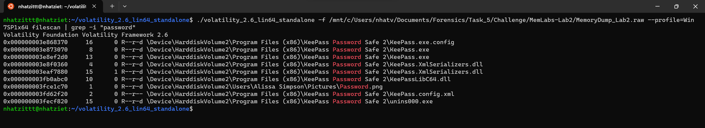

Thấy 1 file ``Password.png``, ta lấy phyoffset rồi dumpfile thôi nàoo

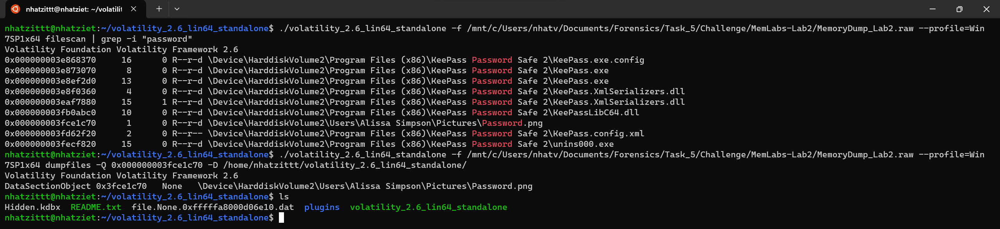

Đổi tên rồi mở file nàooo

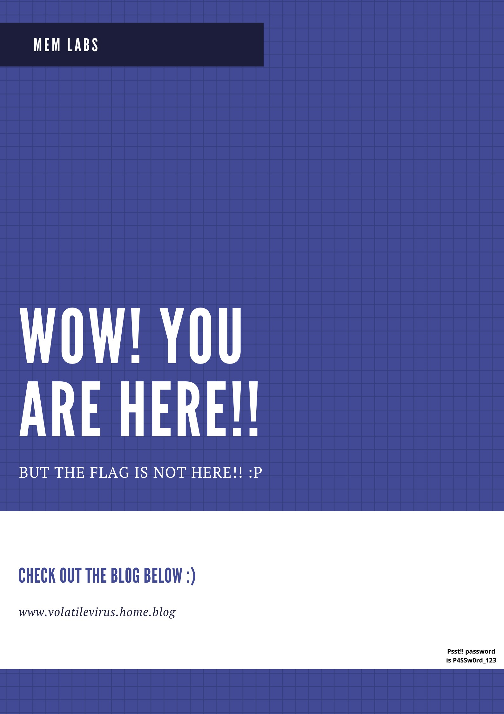

Nhìn kỹ thì ở góc có password là ``P4SSw0rd_123``
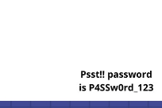

Nhập vào KeePass thôi nào.

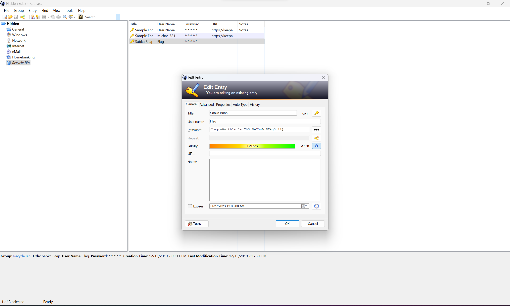

Lụm Flag nàoo

**Second Flag: flag{w0w_th1s_1s_Th3_SeC0nD_ST4g3_!!}**

Giờ còn lại trình duyệt ``chrome.exe``, mình có tìm hiểu thì Google Chorme, sau khi sử dụng, thì sẽ log lại Lịch sử tìm kiếm của mình lại. Mình có thử tải Chorme về, và đúng là như thế thật. Như của mình sẽ có location là ``C:\Users\nhatv\AppData\Local\Google\Chrome\User Data\Default\History``
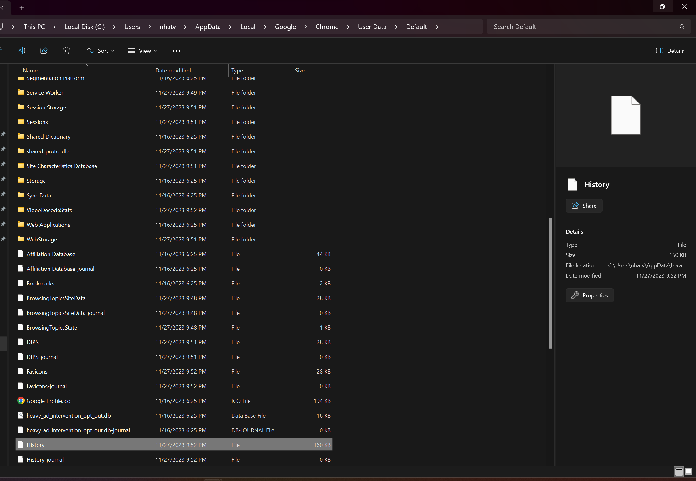

Mình sẽ mở file này bằng AutoSpy thì sẽ thu được History của nó.

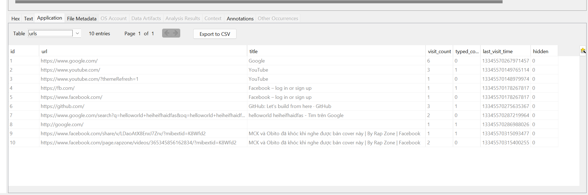

Thế nên, mình sẽ dùng filescan kết hợp với grep để tìm file nào có History mà có location giống của mình rồi dumpfiles lại nha.

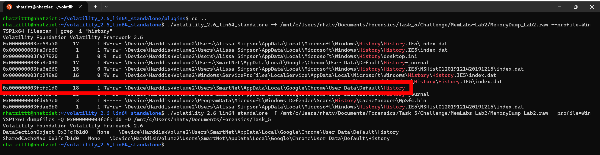

Đổi tên và lên AutoSpy thôi nào.

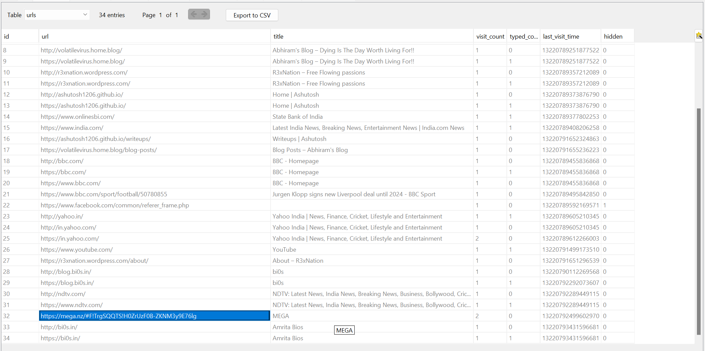

Mình thấy 1 đường link Mega (https://mega.nz/folder/TrgSQQTS#H0ZrUzF0B-ZKNM3y9E76lg) lạ, mình có được 1 file Important.rar.

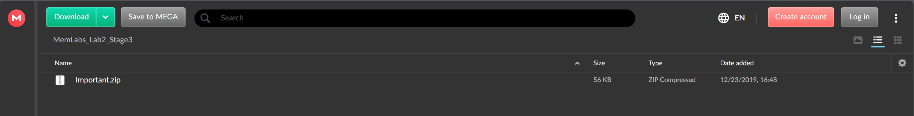

Thử unrar thử thì có pass, thế nhưng, mình lại thu được 1 quả comment rất hữu ích.

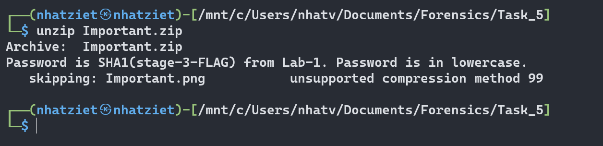

Giờ mình sẽ SHA1 Flag Stage 3 MemLab1 rồi nhập pass vào thôi nha.

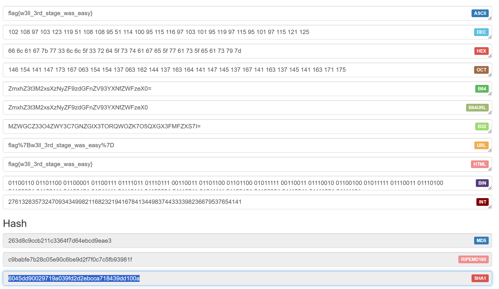

Pass sẽ là:  ``6045dd90029719a039fd2d2ebcca718439dd100a``

Giờ thì unzip thuii

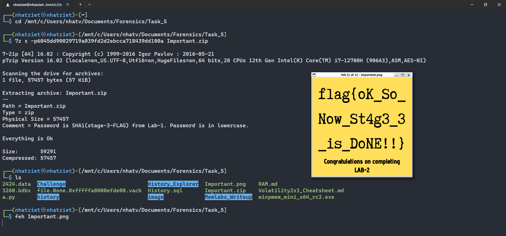

**Third Flag: flag{oK_So_Now_St4g3_3_is_DoNE!!}**