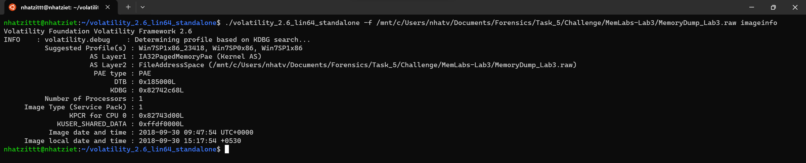
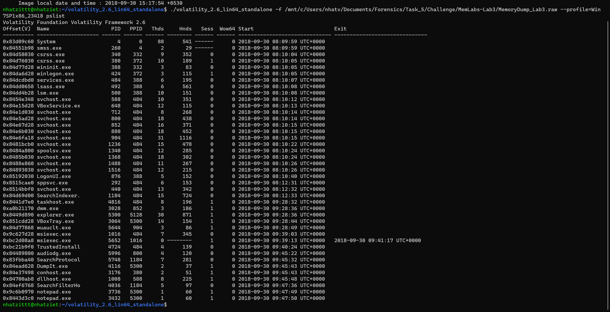
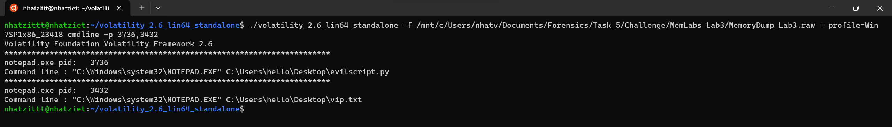
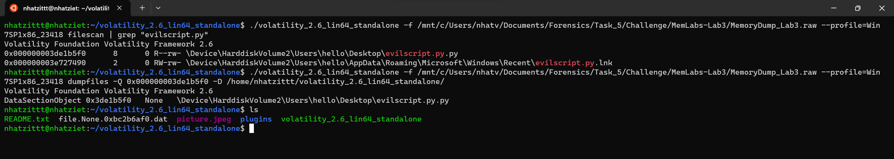
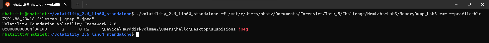
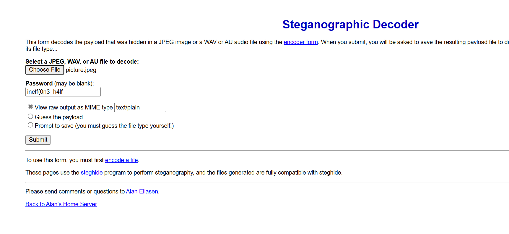

# Memlab 3

Ta vẫn imageinfo để tìm profile thui =)))



Dùng pslist thui nafooo 



Ta thấy có chạy 2 notepad.exe, ta thử ``cmdline`` 2 tiến trình đó với PID




Ta thấy được nó đang chạy file ``evilscript.py`` và ``vip.txt``, ta sẽ filescan để lấy phyoffset và rồi dumpfiles nha.



Sau khi đổi đuôi, ta mở file ra thì được đoạn script và output như sau:
```
import sys
import string

def xor(s):

	a = ''.join(chr(ord(i)^3) for i in s)
	return a


def encoder(x):
	
	return x.encode("base64")


if __name__ == "__main__":

	f = open("C:\\Users\\hello\\Desktop\\vip.txt", "w")

	arr = sys.argv[1]

	arr = encoder(xor(arr))

	f.write(arr)

	f.close()

#Output: am1gd2V4M20wXGs3b2U=
```

Sau khi đọc hiểu thì mình đã viết được đoạn script solution như sau:
```
from base64 import*

def xor(s):

	a = ''.join(chr((i)^3) for i in s)
	return a

data = "am1gd2V4M20wXGs3b2U="
print(xor(b64decode(data)))

```

Thu được output là nửa flag đầu: ``inctf{0n3_h4lf``

Ngoài ra, chall còn có cho mình một dữ kiện là mình phải sudo steghide, thế nên chắc chắn là sẽ có 1 file .jpg hoặc là .jpeg.

Filescan tiếp thôi. Thử .jpeg thì được như này



Dumpfiles và đổi tên thui nào.

Ta thu được cái ảnh này.


Thay vì dùng steghide, thì mình dùng [web](https://futureboy.us/stegano/decinput.html) này

Vất file vào và nhập nửa flag đầu vào vì mô tả có cho ta hint.


Ta thu được nửa thứ 2 là: ``_1s_n0t_3n0ugh}``

**Flag: inctf{0n3_h4lf_1s_n0t_3n0ugh}**