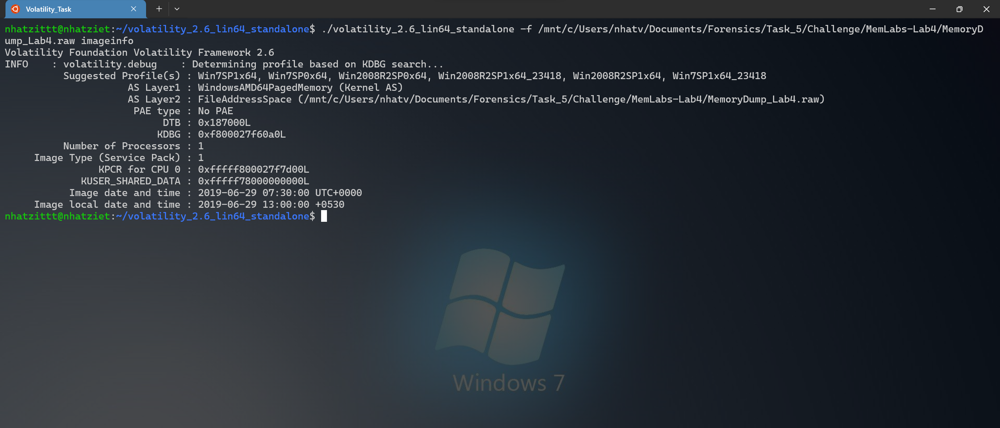
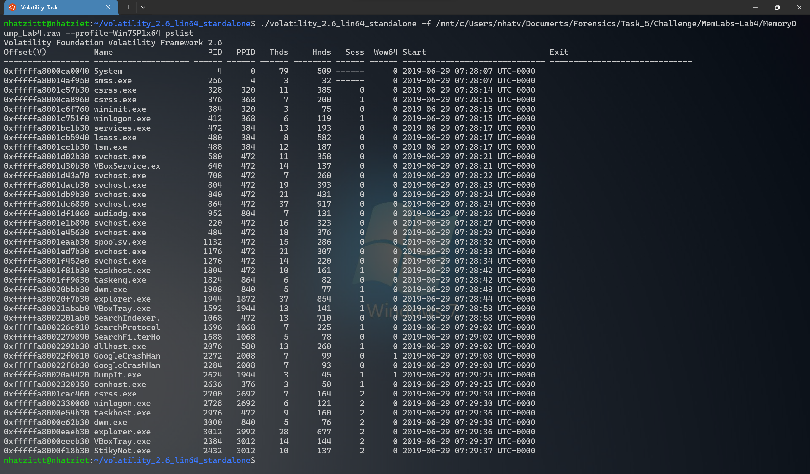
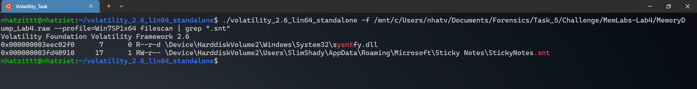
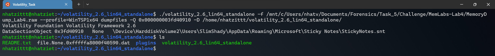
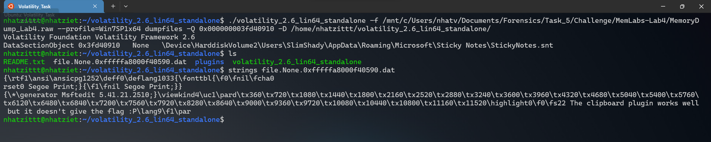
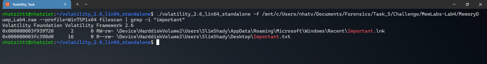
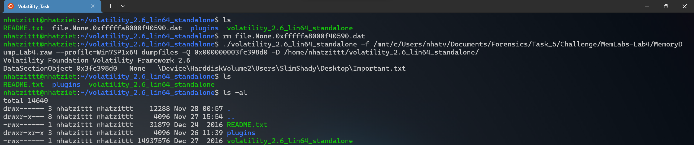
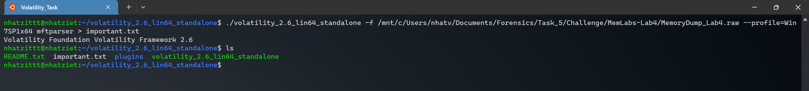
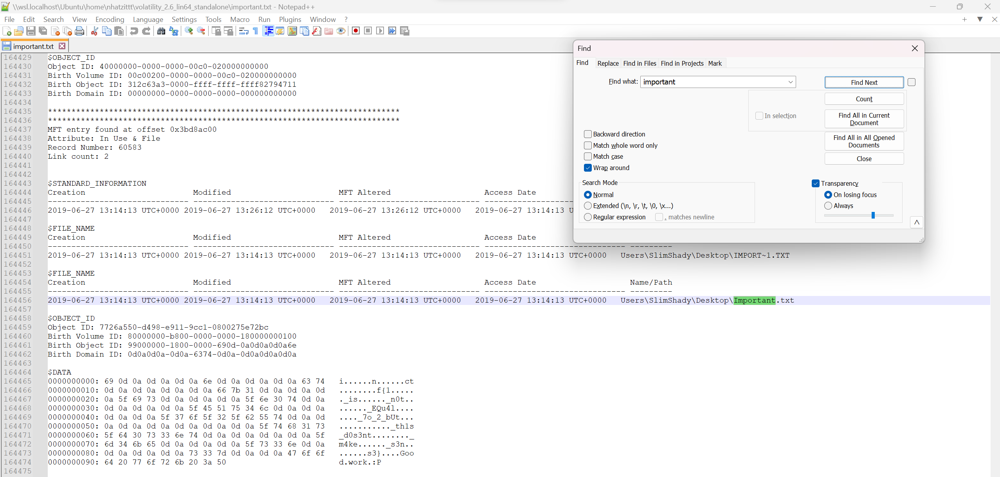
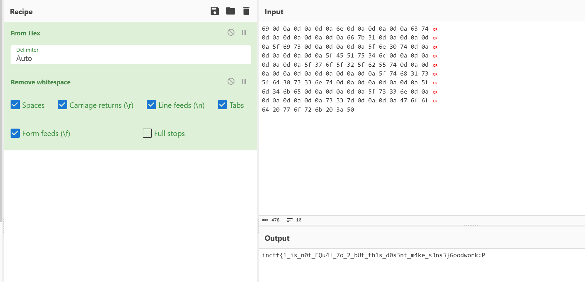

# Memlab 4

Ta tìm profile bằng imageinfo như bình thường thui =)))



Ta thử tiếp pslist coi xem có tiến trình nào đang chạy nha.



Mình thấy đang chạy 1 cái StickyNot.exe, tìm hiểu thì đuôi của các file mà ứng dụng này dùng là ``.snt``, thế nên mình filescan nha.



Mình sẽ dumpfile cái ``StickyNotes.snt`` kia nhaaa.



Giờ mình strings thử xem trong file có ký tự nào không để đỡ phải đổi tên nha.


Bị lừa rồi, cay quá, file ghi ``The clipboard plugin works well but it doesn't give the flag :P`` 

Giờ mình đọc kỹ đề thì thấy có đoạn là  ``important file``, thử filescan với từ ``important`` coi sao.




Cay vãi, bài này nó lừa =))))

Giờ dumpfiles coi có gì trong mà ghi quan trọng nha =)))



Dumpfiles không được bà con ơi, sau khi tìm hiểu, thì mình sẽ dùng plugin ``mftparser`` nha

Hệ thống tệp NTFS chứa một tệp được gọi là ``Master File Table``, hay còn gọi là MFT. Có ít nhất một mục trong MFT cho mỗi tệp trên ổ đĩa hệ thống. Tất cả thông tin bao gồm tên, kích thước, thời gian, dấu thời gian và ngày, quyền và nội dung dữ liệu.

Khi các tệp được thêm vào ổ đĩa hệ thống tệp NTFS, nhiều mục nhập sẽ thêm vào MFT và MFT sẽ tăng kích thước. Khi các tệp bị xóa khỏi ổ đĩa hệ thống tệp NTFS, các mục nhập MFT của chúng sẽ được đánh dấu là có thể sử dụng lại. Tuy nhiên, dung lượng ổ đĩa đã được phân bổ cho các mục này không được phân bố lại và kích thước MFT không giảm.

Có nghĩa trong bài này, Hacker đã xóa 1 file quan trọng, thì file đó sẽ được lưu lại trong file mft, và ta có thể đọc được lại dữ liệu của file này trong có gì.

Giờ thì sử dụng plugin này thuii



Giờ thì dùng notepad để tìm tên file thì sẽ kiếm hơn vì cũng có rất nhiều file đã bị xóa.



Ta đã thu được 1 đoạn data, nhìn như flag.

```
0000000000: 69 0d 0a 0d 0a 0d 0a 6e 0d 0a 0d 0a 0d 0a 63 74   i......n......ct
0000000010: 0d 0a 0d 0a 0d 0a 0d 0a 66 7b 31 0d 0a 0d 0a 0d   ........f{1.....
0000000020: 0a 5f 69 73 0d 0a 0d 0a 0d 0a 5f 6e 30 74 0d 0a   ._is......_n0t..
0000000030: 0d 0a 0d 0a 0d 0a 5f 45 51 75 34 6c 0d 0a 0d 0a   ......_EQu4l....
0000000040: 0d 0a 0d 0a 5f 37 6f 5f 32 5f 62 55 74 0d 0a 0d   ...._7o_2_bUt...
0000000050: 0a 0d 0a 0d 0a 0d 0a 0d 0a 0d 0a 5f 74 68 31 73   ..........._th1s
0000000060: 5f 64 30 73 33 6e 74 0d 0a 0d 0a 0d 0a 0d 0a 5f   _d0s3nt........_
0000000070: 6d 34 6b 65 0d 0a 0d 0a 0d 0a 5f 73 33 6e 0d 0a   m4ke......_s3n..
0000000080: 0d 0a 0d 0a 0d 0a 73 33 7d 0d 0a 0d 0a 47 6f 6f   ......s3}....Goo
0000000090: 64 20 77 6f 72 6b 20 3a 50                        d.work.:P
```
Dùng vscode để xóa các dòng cho nhanh nha.
```
69 0d 0a 0d 0a 0d 0a 6e 0d 0a 0d 0a 0d 0a 63 74 
0d 0a 0d 0a 0d 0a 0d 0a 66 7b 31 0d 0a 0d 0a 0d 
0a 5f 69 73 0d 0a 0d 0a 0d 0a 5f 6e 30 74 0d 0a 
0d 0a 0d 0a 0d 0a 5f 45 51 75 34 6c 0d 0a 0d 0a 
0d 0a 0d 0a 5f 37 6f 5f 32 5f 62 55 74 0d 0a 0d 
0a 0d 0a 0d 0a 0d 0a 0d 0a 0d 0a 5f 74 68 31 73 
5f 64 30 73 33 6e 74 0d 0a 0d 0a 0d 0a 0d 0a 5f 
6d 34 6b 65 0d 0a 0d 0a 0d 0a 5f 73 33 6e 0d 0a 
0d 0a 0d 0a 0d 0a 73 33 7d 0d 0a 0d 0a 47 6f 6f 
64 20 77 6f 72 6b 20 3a 50  
```             


Dùng Cyberchef thui nàoo




**Flag: inctf{1_is_n0t_EQu4l_7o_2_bUt_th1s_d0s3nt_m4ke_s3ns3}**