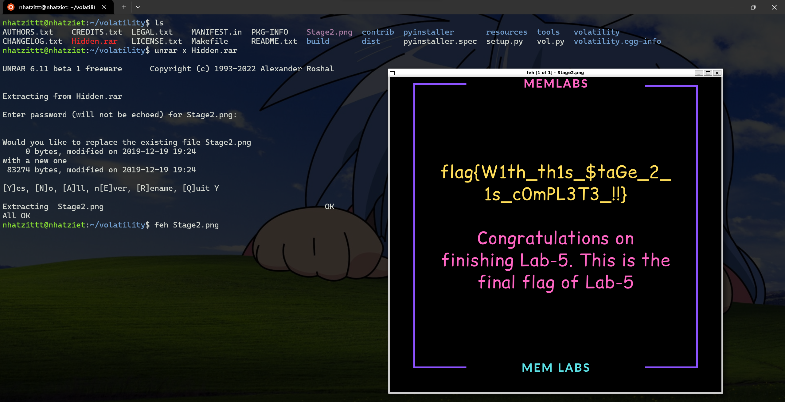

# Memlab 5

Giờ mình vẫn imageinfo để biết profile của nó như nào thui.

Profile của file này là ``Win7SP1x64``

Giờ mình sẽ dùng pslist để coi xem có gì đang chạy nhaaa

Ta thấy là đang chạy ``WinRAR.exe`` và ``NOTEPAD.exe``.

Giờ mình filescan kết hợp grep để tìm các file .rar thôi.

Tìm thì được 1 file ``SW1wb3J0YW50.rar``, ta lấy phyoffset ``0x000000003eed56f0`` rồi dumpfile thôi.

Đổi tên rồi unrar coi có gì nha.

Có pass rồi, mà đây là stage 2 thế thì phải đi tìm flag stage 1 trước đã.

Sau khi mất một khoảng thời gian mò thì mình đã chịu và đi coi wu thì thấy họ dùng plugin ``iehistory``.

Plugin ``iehistory`` sẽ giúp ta khôi phục các đoạn của tệp bộ nhớ đệm index.dat lịch sử Internet Explorer. Nó có thể tìm các liên kết được truy cập cơ bản (thông qua FTP hoặc HTTP). Nó áp dụng cho mọi quy trình tải và sử dụng thư viện wininet.dll, không chỉ riêng Internet Explorer. Thông thường sẽ bao gồm cả File Explorer và các phầm mềm độc hại.

Sau khi dùng plugin này, ta thấy được 1 file .bmp mà có tiêu đề là mã base64 là ``ZmxhZ3shIV93M0xMX2QwbjNfU3Q0ZzMtMV8wZl9MNEJfM19EMG4zXyEhfQ``

Decode thì thu được flag đầu tiên.

**First Flag: flag{!!_w3LL_d0n3_St4g3-1_0f_L4B_5_D0n3!!}**

Giờ có flag đầu rồi, extract file rar kia thui, vì theo mô tả thì có flag 1 thì mới có flag 2 được.

**Second FLag: flag{W1th_th1s_$taGe_2_1s_c0mPL3T3_!!}**

Mình tưởng là chỉ có 2 flag tại vì trong ảnh bảo là final, thế nhưng mô tả thì lại bảo có flag thứ 3.

Nhìn kỹ lại pslist thì cũng có 1 file ``WerFault.exe`` lạ quá, thế nên là mình thử phân tích nó coi sao.

Mình sẽ thử ``cmdline`` để coi xem người dùng đã gõ những lệnh nào trên cmd.

Ái chà chà, chương trình lạ này có sử dụng PID, mình thử pslist lại thì PID này chính là của NOTEPAD.exe. Mình nghi là tệp ``WerFault.exe`` sẽ giả mạo ``NOTEPAD.exe`` để tấn công máy người dùng.

Giờ mình sẽ dùng plugin ``procdump`` để kết xuất tệp thực thi tiến trình của file .exe độc này. Khác với plugin ``memdump``, plugin trích xuất tất cả các trang lưu trữ trong bộ nhớ của một quy trình, thì ``procdump`` sẽ giúp ta kết xuất file .exe này. Vì có thể đây không phải là ``NOTEPAD.exe`` chính gốc mà là một phần mêm khác mạo danh.

Giờ mở IDA lên coi có thể reverse lại exe này không.

Sau khi mở IDA, vào phần WinMainCRTStartup, thì mình thu được flag nha cả nhà iu của em.

**Third Flag: bi0s{M3m_l4B5_OVeR_!}**
