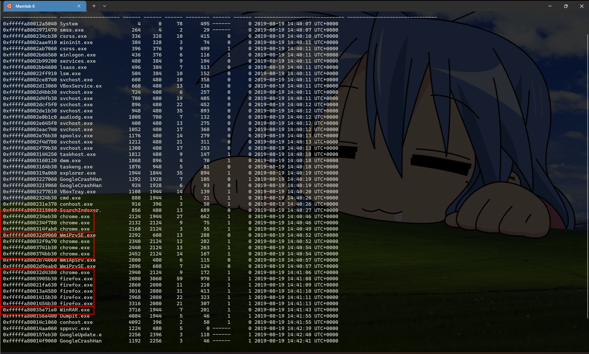
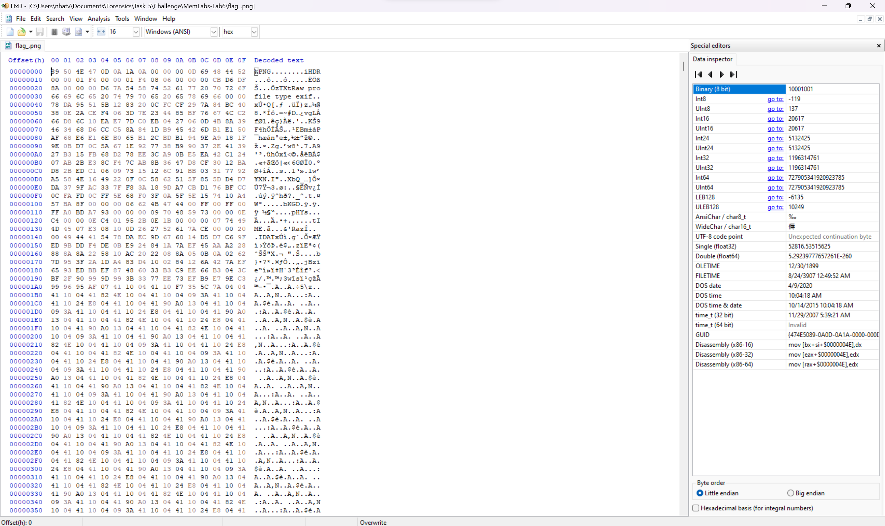
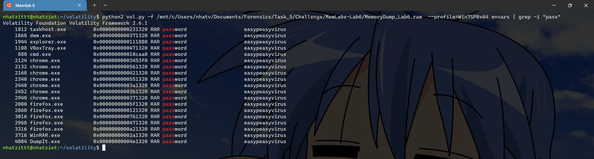

# Memlab 6

Giờ mình imageinfo để lấy profile thôi


Profile của chall này là ``Win7SP1x64``, giờ mình pslist coi đang chạy tiến trình gì nha.



Mình thấy người dùng đang chạy tiến trình ``chrome.exe``, ``firefox.exe``, ``WinRAR.exe``, giờ mình đi lấy lịch sử truy cập của Chrome và Firefox coi có gì nha. 

Bài trước thì mình dùng AutoSpy để mở, cũng oki thui nhưng mà mình đã tìm hiểu được thêm 1 vài [plugins](https://github.com/superponible/volatility-plugins) mới ở đây giúp ta nhanh hơn trong việc lấy lịch sử trình duyệt nhanh hơn nha.


Sau một thời gian tìm kiếm thì mình tìm được quả link pastebin.com `` https://pastebin.com/RSGSi1hk`` ở dòng 169.


Sau khi vào link, ta được 1 đoạn link nữa.

   

```
https://www.google.com/url?q=https://docs.google.com/document/d/1lptcksPt1l_w7Y29V4o6vkEnHToAPqiCkgNNZfS9rCk/edit?usp%3Dsharing&sa=D&source=hangouts&ust=1566208765722000&usg=AFQjCNHXd6Ck6F22MNQEsxdZo21JayPKug
```

Vào thì được 1 file doc ``Important``, tìm 1 hồi thì thấy 1 đường link ``https://mega.nz/#!SrxQxYTQ`` nữa.


Vào thì lại phải nhập mật khẩu ở mega.


Giờ ta đi tìm mật khẩu đã =(((

Sau khi lục lọi một lúc, thì mình thấy có 1 wu là dùng plugin ``screenshot``, thì mình dùng thử thì ngỡ ngàng ngạc nhiên và bật ngửa là nó có thật.


Sau khi thu được các ảnh, mình mở ra thì thấy ảnh ``session_1.WinSta0.Default.png``, có chụp lại gmail của David lại.


Giờ mình có gmail là ``davidbenjamin939@gmail.com``, mình thử coi nó có gửi password không nha.

Tìm thì nhiều quá, thế nên mình lại grep ``Mega Drive Key``, thì mình tìm được key ``THE KEY IS zyWxCjCYYSEMA-hZe552qWVXiPwa5TecODbjnsscMIU``.


Mở ra thì lại không được, mình dùng HxD để coi xem nó bị làm sao.



Mình tìm lại [writeup cũ](https://github.com/trananhnhatviet/Forensics_Train/blob/main/Task_2/Bai_1/PNG_Chunk.md) của mình thì thấy là ``IHDR chunk`` phải viết hoa hết thay vì viết thường chữ i, đổi lại thành Hoa thui.


Mở được rùi nè. Mình có nửa flag đầu tiên.

**Fisrt Part Flag: inctf{thi5_cH4LL3Ng3_!s_g0nn4_b3_?_**

Giờ mình thử tìm hiểu firefox xem có lịch sử gì không nha.


Không có gì thật, giờ mình xem cái WinRAR.


Đây rồi, flag.rar đây rồi, giờ dumpfiles thôi nào.


Đổi tên rồi unrar thôi nàoo


Còn phải có pass nữa =(((

Mình thử hết các lệnh hay dùng như là ``cmdline``, ``cmdscan``, ``consoles`` thì mình được cái này.


Mình nghĩ ngay đến plugin ``envars``. Việc gì mà không thử nào. Ghép thêm ``grep -i "pass"`` coi sao.

Tadaaa, mình dã có được password hihiihihi



Đó là ``easypeasyvirus``.

Giờ thì unrar thôi nào.


**Flag: inctf{thi5_cH4LL3Ng3_!s_g0nn4_b3_?_aN_Am4zINg_!_i_gU3Ss???_}**