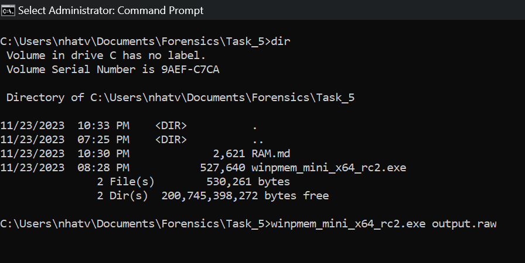
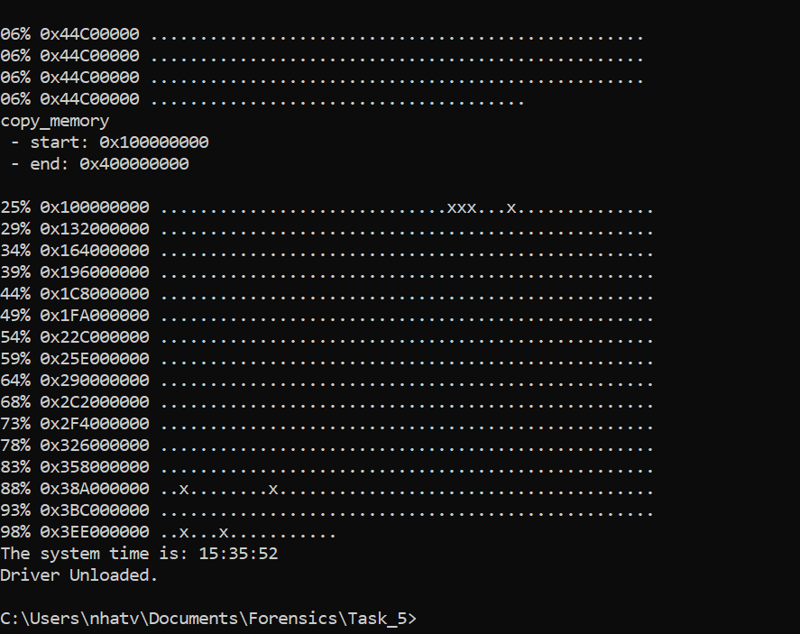
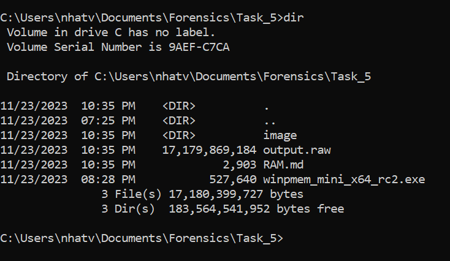
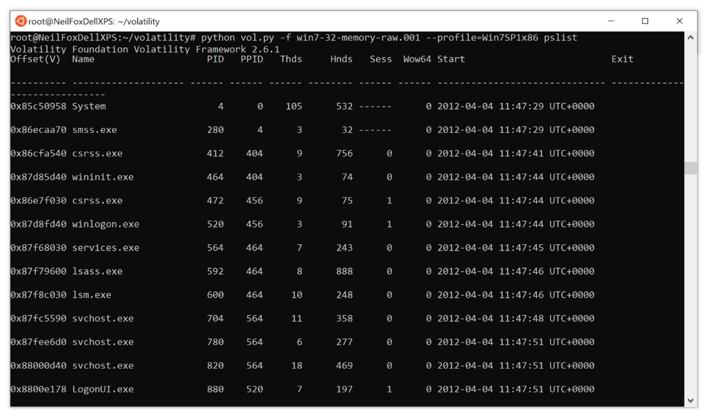
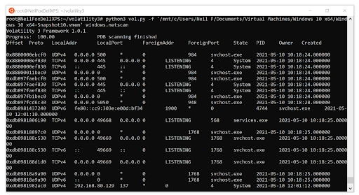
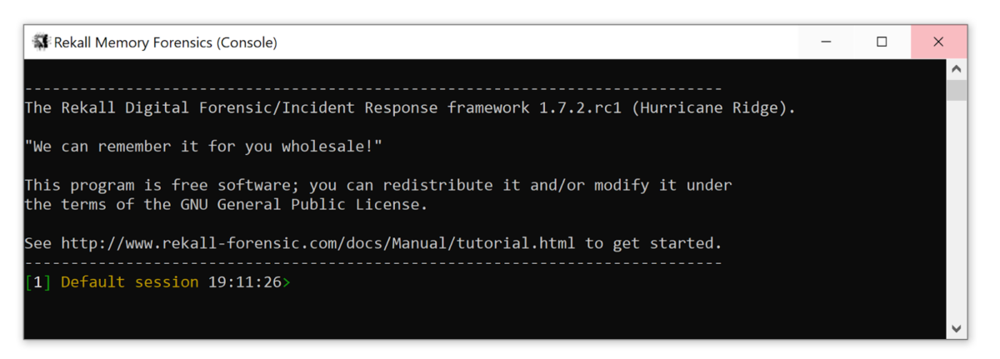
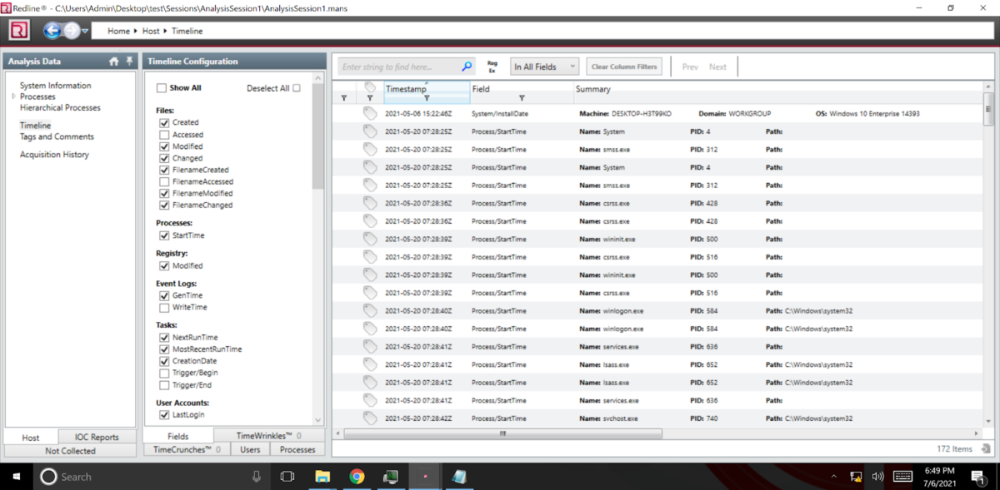

# Random Access Memory

Trên máy tính của chúng ta, đều có một thiết bị phần cứng vật lý được gọi là RAM (Random Access Memory). Là một loại bộ nhớ máy tính cho phép truy cập dữ liệu ở bất kỳ vị trí nào trong bộ nhớ mà không cần phải truy cập tuần tự. Ram được sử dụng để lưu trữ dữ liệu mà đang được sử dụng bởi CPU và các ứng dụng.

Ram rất là quan trọng lun. Giả sử bạn mở bất kỳ trang web bảo mật nào trong Chorme như là gmail.com. Mọi thông tin bạn nhập vào Gmail, bao gồm tên người dùng và mật khẩu, đều được gửi qua internet tới máy chủ do Google điều hành. Dữ liệu đã được mã hóa hoàn toàn và việc bẻ khóa mật khẩu sẽ là bất khả thi.

Nhưng để nhập mật khẩu, thì phải nhập bằng bàn phím. Sau đó, một số chương trình sẽ mã hóa dữ liệu và gửi lên internet. Điều này có nghĩa là, ngay từ ban đầu, dữ liệu đã có trong RAM rồi. Nhưng mà RAM sẽ mất hết dữ liệu khi mình tắt máy. Vậy thì làm cách nào để kiểm tra lại ???. Ta hãy tìm hiểu RAM DUMP

# RAM DUMP

Ram dump là quá trình thu giữ tất cả các dữ liệu RAM. Là quá trình lấy tất cả nội dung thông tin trong RAM và ghi nó vào ổ lưu trữ dưới dạng dump file *.DMP.

Lợi ích của việc sử dụng Memory Dump đối với việc phân tích:

- Việc ứng phó với sự cố an ninh mạng không phải lúc nào cũng đơn giản. Vì vậy như một phần của kế hoạch ứng phó sự cố, làm cách nào để có thể bắt đầu điều tra thiết bị và bắt đầu thu thập bằng chứng kịp thời
- Việc lấy 1 image của thiết bị rất tốn thời gian và tốn nhiều dung lượng (có thể lên tới 100gb và hơn thế nữa). Và sau đó mình sẽ gặp vấn đề mỗi khi di chuyển image này. Và đặc biệt, đội phân tích sẽ mất bao lâu để phân tích được nó.
- Đây là lúc việc phân tích bộ nhớ có thể mang lại lợi ích lớn cho team phân tích. RAM của thiết bị sẽ nhỏ hơn nhiều, điển hình là 16 - 32 gb. Điều này có nghĩa là việc thu thập kết xuất RAM từ thiết bị sẽ nhanh hơn rất nhiều và có kích thước nhỏ hơn rất nhiều khi truyền đầu ra.

# Làm thế nào để Capture RAM

### Lấy Ram từ thiết bị vật lý

Để lấy Ram từ một thiết bị vật lý, ta có dùng công cụ ``WinPmem``.

Để chạy được công cụ này, ta cần sử dụng quyền Admin nha.

Câu lệnh là ``winpmem_mini_x64_rc2.exe <file_name>.raw``

Khi chạy xong thì sẽ như thế này.

Máy mình RAM 16GB nên là sẽ thu được output.raw với dung lượng như sau

### Lấy RAM từ máy ảo

Việc thu thập bộ nhớ từ máy ảo thì dễ hơn, đây là một thông tin tuyệt vời khi bạn đang ứng phó với một sự cố trong đó thời gian là một yếu tố.

Taking a snapshot trên máy ảo sẽ tạo 1 tệp vmem, sau đó chúng có thể được phân tích bằng 1 số công cụ mà bây giờ ta sẽ tìm hiểu.

# Memory Forensics Tools

### Volatility

Volatility là công cụ để phân tích bộ nhớ và có sẵn cho Windows và Linux. Volatility là một công cụ dòng lệnh cho phép bạn nhanh chóng lấy ra thông tin hữ ích như là những tiến trình đang chạy trên thiết bị, kết nối mạng và các tiến trình có chứa mã được chèn. Bạn thậm chí có thể kết xuất Dynamic Link Library và xử lý để phân tích thêm.

Volatility cũng hỗ trợ việc phân tích kết xuất bộ nhớ từ các thiết bị Unix và một loạt plugin đã được cộng đồng forensics thiết kế.

Một vấn đề với Volatility là nó yêu cầu 1 profile phù hợp với hệ điều hành của thiết bị mà nó được ghi lại để công cụ hoạt động. Tuy nhiên, vấn đề này đã được giải quyết trong Volatility 3 và việc cài đặt cấu hình không còn cần thiết nữa, khiến việc sử dụng công cụ trở nên dễ dàng hơn.

Hình ảnh dưới đây cho thấy cách mà Volatility có thể được sử dụng để phân tích tệp memory và cũng như cách không cần khai báo cấu hình hệ điều hành.

Mình sẽ tìm hiểu kỹ hơn về công cụ này sau nha.

### Rekall

Rekall tương tự như Volatility vì đây là một công cụ dòng lệnh khác, việc bạn sử dụng tùy thuộc vào sở thích.

### Redline

Redline thì là một công cụ không giống như là Volatility hay Rekall vì công cụ này có giao diện, thế nhưng nhược điểm của Redline thì chỉ phân tích các thiết bị của Windows.

Nhìn rất là dễ sử dụng đúng không nà.

Nhưng mà thường chúng ta sẽ dùng Volatility để phân tích thế nên mình sẽ tìm hiểu kỹ hơn về các plugins của volatility trong writeup tiếp theo nha.
