# BUS Challenge

Trước khi vào giải chall, ta cần tìm hiểu Modbus là gì.
Modbus là một giao thức ở tầng Application theo mô hình OSI, hỗ trợ giao tiếp theo mô hình client/server giữa các thiết bị kết nối trong nhiều loại bus hoặc mạng khác nhau.

Modbus TCP/IP hoặc Modbus TCP thực hiện việc truyền thông qua mạng TCP/IP, kết nối qua port 502.

Cấu trúc của một Modbus TCP/IP

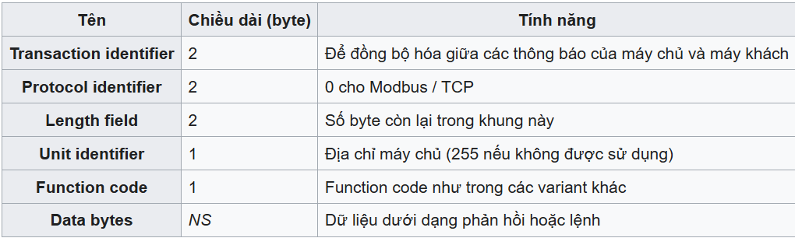

Modbus TCP/IP là một phiên bản của Modbus được sử dụng trên mạng Ethernet. Modbus TCP/IP sử dụng giao thức TCP/IP để truyền dữ liệu giữa các thiết bị Modbus. Tuy nhiên Modbus TCP/IP vẫn là một giao thức Modbus, chứ không phải là giao thức TCP/IP.

Quay trở lại bài bus của mình nào.

Mở wireshark ra, ta thấy được như sau

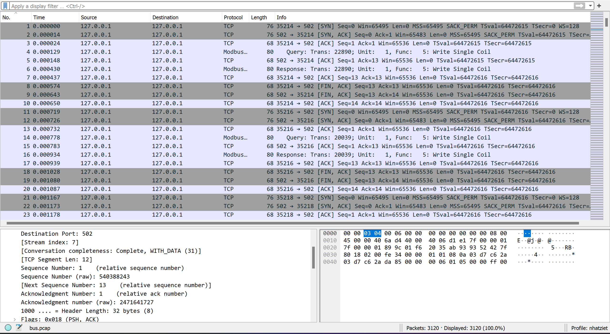

Vì bài này có tên là bus nên là mình nghĩ ngay tới các Modbus.

Vì Modbus TCP/IP dùng port 502, thế nên ta sẽ lọc các giao thức TCP mà sử dụng port 502 và Modbus.data để lấy.

Nhìn qua thì ta thấy giá trị của Modbus chỉ có 2 giá trị là ``ff00`` và ``0000``, thế nên ta nghĩ ngay tới binary code. Việc của ta là sẽ dùng scapy để lọc lấy các tcp có source port == 502 hoặc destination port == 502 cũng được.

```
from scapy.all import *

packets = rdpcap('bus.pcap')

for packet in packets:
    if packet.haslayer(TCP):
        tcp_packet = packet.getlayer(TCP)
        if tcp_packet.sport == 502:
            print(tcp_packet)
```

Ngoài ra, các phần tcp mà có port 502 ở chall này thì không có phần Raw, những packet mà có phần Raw đó chính là các Modbus, thế nên ta sẽ lấy 2 byte cuối của phần Raw đó, ta sẽ thu được các byte ``ff00`` và ``0000``.

```
from scapy.all import *

out = ""

packets = rdpcap('bus.pcap')

for packet in packets:
    if packet.haslayer(TCP):
        tcp_packet = packet.getlayer(TCP)
        if tcp_packet.sport == 502:
            print(tcp_packet)
            if tcp_packet.haslayer(Raw):
                data = (tcp_packet[Raw].load)[-2:]
                if (data == b'\xff\x00'):
                    out += "1"
                else:
                    out += "0"
print(out)
```

Sau khi chạy thì ta thu được output là ``011110010110111101110101011100100010000001000110010011000100000101000111001000000110100101110011001110100010000001001101011011110110010001100010011101010111001101011111011010010111001101011111011001010110000101110011011110010101111101100001011001100111010001100101011100100101111101100001011011000110110000100001``, decode ra được flag.

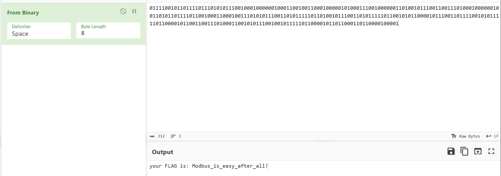

**Flag: Modbus_is_easy_after_all!**

---

# USB Wireshark

Trước khi vào bài, ta nên tìm hiểu về khái niệm HID là gì.

HID (viết tắt của Human Interface Device) - “Thiết bị Giao diện Con người” - là một thuật ngữ nghe có vẻ xa lạ, nhưng trên thực tế lại rất quen thuộc và mang đến nhiều ý nghĩa đối với người dùng máy tính nói chung.

Nói theo cách đơn giản, HID là một tiêu chuẩn cho các thiết bị máy tính được vận hành bởi con người. Tiêu chuẩn này cho phép các thiết bị được sử dụng và tương tác với nhau một cách dễ dàng mà không cần bất kỳ phần mềm hoặc trình điều khiển (driver) bổ sung nào.

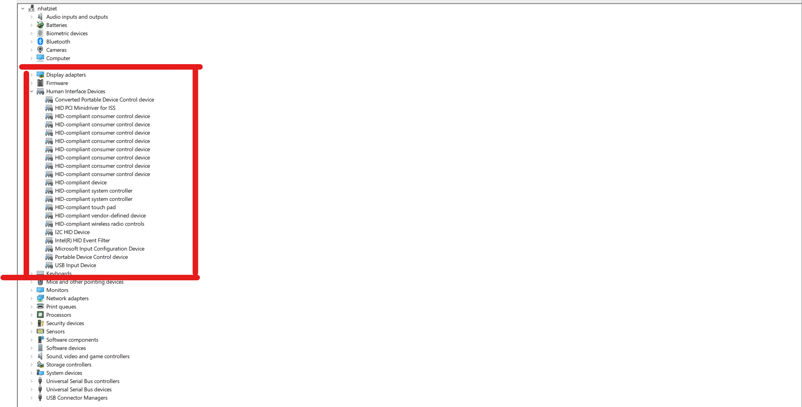

Sử dụng HID, ta cần phải cắm cổng USB vào máy tính của mình ví dụ như là chuột, bàn phím, dụng cụ âm thanh,...

Vào bài nàoooo

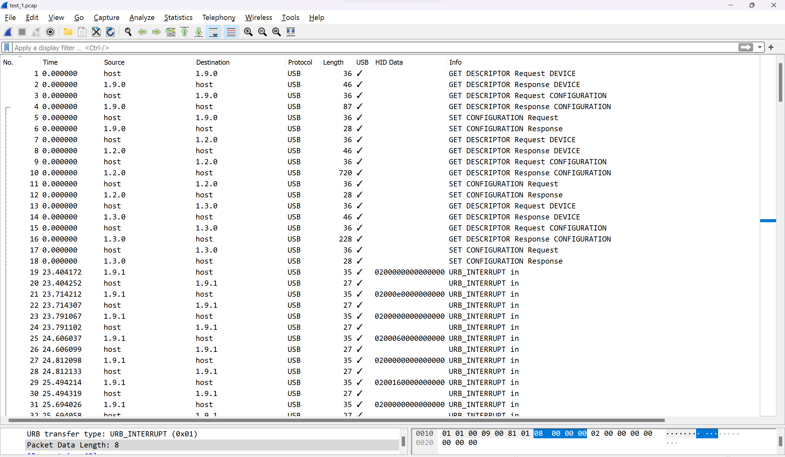

Sau khi mở wireshark, ta thấy tất cả đều là protocol USB, vì chưa học về USB nên là mình có lên google tìm kiếm và tìm được đường [Link](https://res260.medium.com/usb-pcap-forensics-barcode-scanner-nsec-ctf-2021-writeup-part-1-3-b0a5392c9313) này

Mình lọc hết source 1.9.1 thì được như thế này

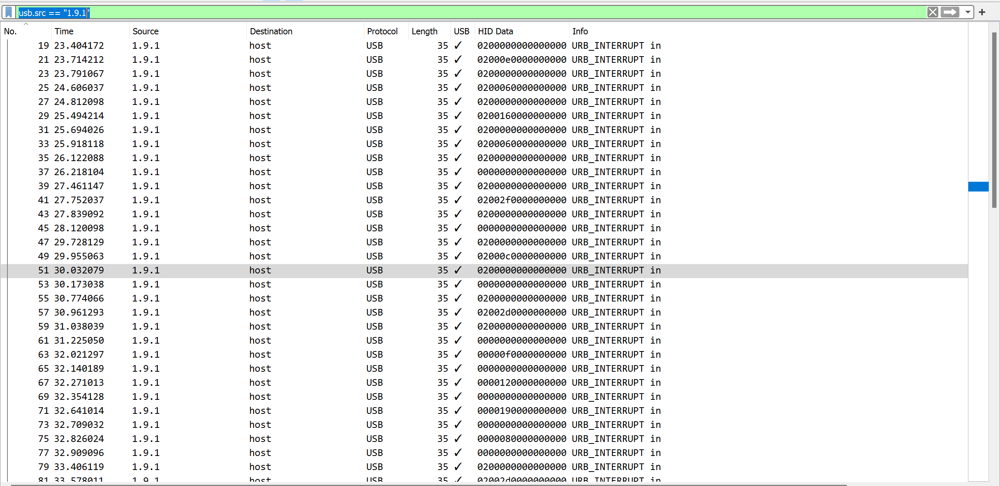

Sau khi đọc writeup thì mình thấy cần phải lấy hết các giá trị HID. Giờ mình sẽ export nó ra file .txt rồi lọc các giá trị HID ra nha.

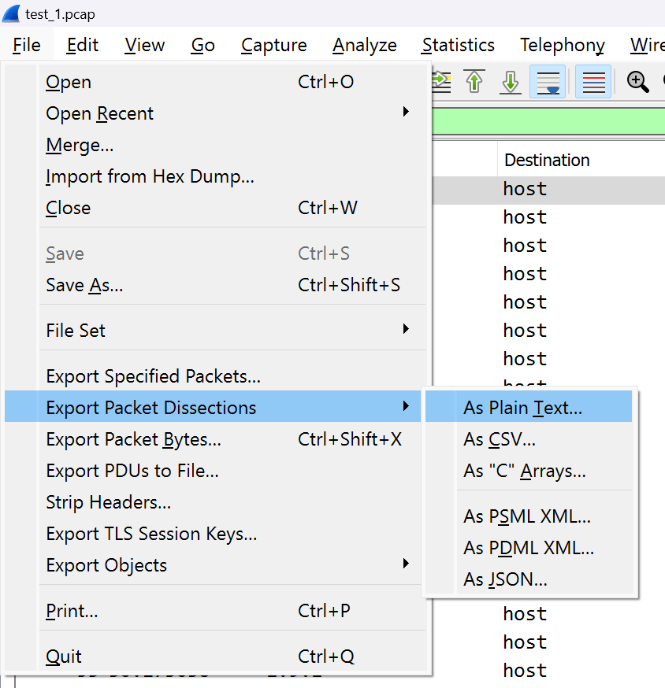

Khi export xong, ta sẽ được dữ liệu của từng packet

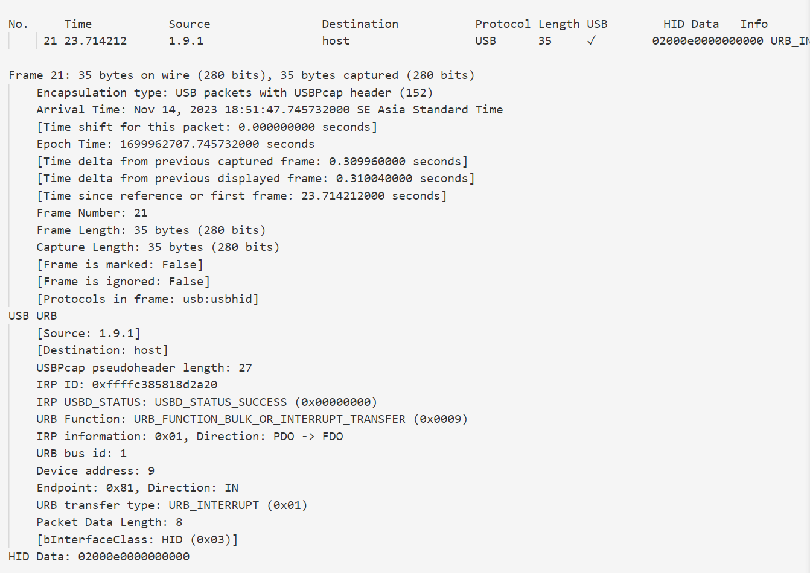

Giờ ta sẽ dùng python để lấy những dòng có "HID Data" ra và lấy các giá trị của nó nha

```
with open("output_hid.txt","rb") as file:
    data = file.read().decode()

data = data.split("\n")
hid_value = []
for i in data:
    if "HID Data:" in i:
        hid_value.append(i.replace("HID Data: ",""))

print(hid_value)
```

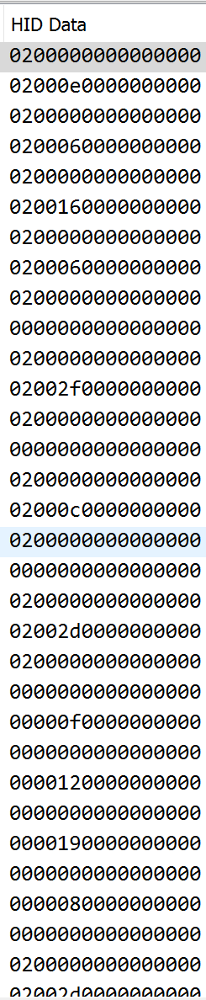

Nhìn các giá trị HID, ta thấy rằng chỉ có byte thứ nhất và thứ ba có giá trị, thế nhưng mà byte thứ nhất trông hơi vô tri vì chỉ có là '00' và '02' thế nên là mình sẽ lọc lấy byte thứ 3

Nói thế chứ byte thứ nhất không vô tri đâu =)))

Nếu '00' thì là viết thường còn nếu '02' thì là viết hoa á

```
usage_id = []

for i in hid_value:
    usage_id.append(str(i[0:2])+ " " + str( i[4:6]))
```

Đến đoạn này mình bí rồi, tuy đọc wu ở trên nhưng mà không hiểu cái bảng chữ cái kia ở đâu, thế nên mình có hỏi anh Kai và anh có đưa cho 1 đường [link](https://www.usb.org/sites/default/files/documents/hut1_12v2.pdf) và đọc từ trang 53 - 59.
Hoặc là [ở đây](https://gist.github.com/ekaitz-zarraga/2b25b94b711684ba4e969e5a5723969b)

Mình đã hiểu và copy alphabet của wu trên, thêm 1 vài ký tự và hoàn thành nốt code của mình thui.

```
with open("output_hid.txt","rb") as file:
    data = file.read().decode()

data = data.split("\n")
hid_value = []
for i in data:
    if "HID Data:" in i:
        hid_value.append(i.replace("HID Data: ",""))

usage_id = []

for i in hid_value:
    usage_id.append(str(i[0:2])+ " " + str( i[4:6]))

map = {
    "04": "a",
    "05": "b",
    "06": "c",
    "07": "d",
    "08": "e",
    "09": "f",
    "0A": "g",
    "0B": "h",
    "0C": "i",
    "0D": "j",
    "0E": "k",
    "0F": "l",
    "10": "m",
    "11": "n",
    "12": "o",
    "13": "p",
    "14": "q",
    "15": "r",
    "16": "s",
    "17": "t",
    "18": "u",
    "19": "v",
    "1A": "w",
    "1B": "x",
    "1C": "y",
    "1D": "z",
    "1E": "1",
    "1F": "2",
    "20": "3",
    "21": "4",
    "22": "5",
    "23": "6",
    "24": "7",
    "25": "8",
    "26": "9",
    "27": "0",
    "2C": " ",
    "28": "\n",
    "2F": "{",
    "30": "}",
    "2D": "-",
    "34": "'",
    "36": ",",
    "2E": "=",
    "33": ";",
}

flag = ""
for i in usage_id:
    char = i[-2:].upper()
    if char != "00":
        if i[:2] == "00":
            flag += map[char]
        else:
            if char == "2D":
                flag += "_"
            else:
                flag += map[char].upper()

print(flag)
```

**Flag: KCSC{I_love_you}**

---

# TCP Challenge

Mở wireshark ra và nhìn thấy như sau

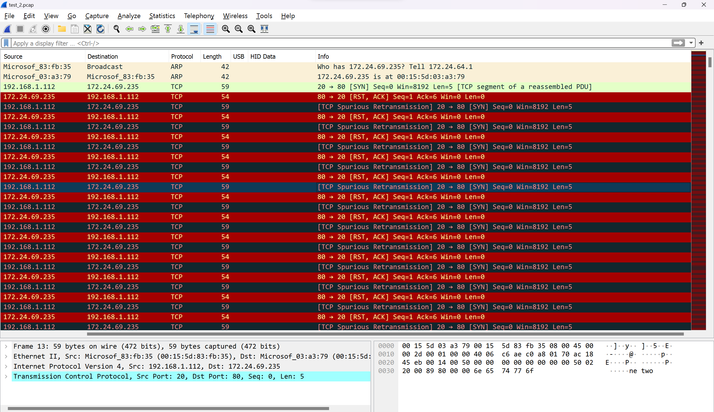

Ta nhìn thấy phần Packet Byte thì thấy lạ quá

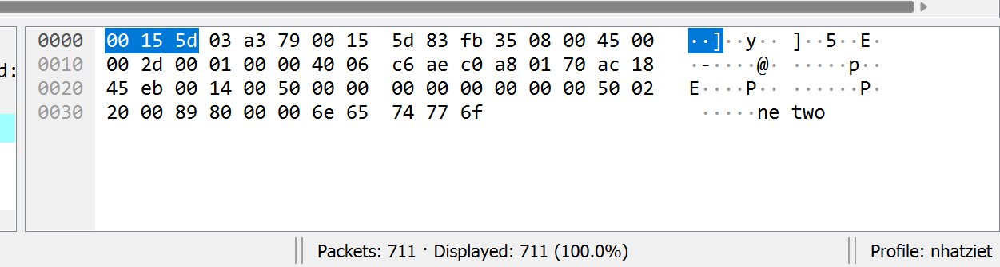

Nhìn dạng này quen quen, ta sẽ lấy hết các phần Raw của từng packet rồi ghép lại với nhau, ta sẽ thu được 1 văn bản.

Đoạn code sẽ như sau:

```
from scapy.all import *

def process_packet(packet):
    result = ""
    if packet.haslayer(TCP):
        tcp_packet = packet.getlayer(TCP)
        if tcp_packet.haslayer(Raw):
            data = packet.getlayer(TCP)[Raw].load
            try:
                data = data.decode()
                result += data
            except UnicodeDecodeError:
                pass
    return result

packets = rdpcap('test_2.pcap')

flag = ""
for packet in packets:
    flag += (process_packet(packet))
print(flag.replace("\n",""))
```

Ta thu được 1 đoạn văn bản như sau

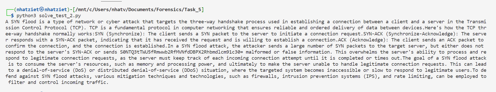

Nhìn thấy có mã base64, ta decode thì thu được flag

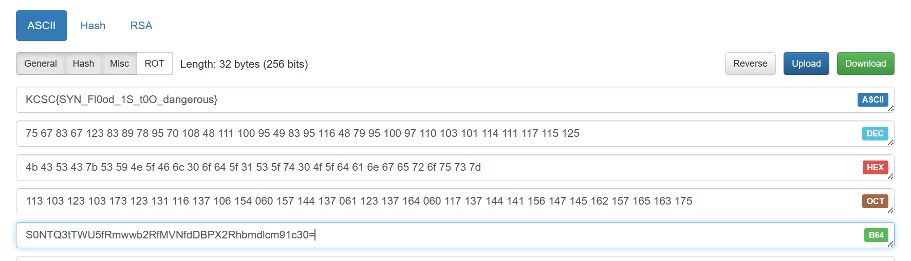

**Flag: KCSC{SYN_Fl0od_1S_t0O_dangerous}**
